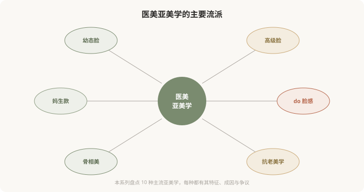
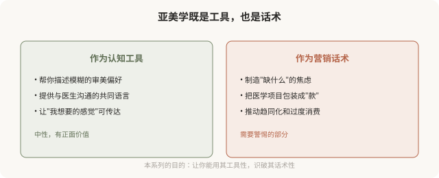

# 医美亚美学：审美是如何被分类、命名和推销的

## 三个备选标题

1. 幼态脸、高级脸、妈生款：医美审美是怎么被分成“流派”的
2. 当审美变成菜单：盘点医美行业的各种“美学”
3. 你追求的“美”，是谁定义的：医美亚美学入门

## 封面介绍（100字以内）

医美行业把审美分类成“幼态脸”“高级脸”“妈生款”等流派。这些命名既是认知工具，也是营销话术。理解亚美学，是看清欲望来源的第一步。

## 正文

先说结论：**医美行业存在一系列被命名、分类、推销的“亚美学”——幼态脸、高级脸、妈生款、do 脸感、骨相美、抗老美学等等。**它们既是帮助人描述审美偏好的认知工具，也是机构用来激发欲望、引导消费的营销话术。**理解这些亚美学如何形成、被谁推动、背后预设了什么，是消费者看清自己“为什么想做”的第一步。**这个系列会用 10 篇盘点主要的医美亚美学，既客观介绍，也反思其文化机制。

### 什么是“医美亚美学”

“亚美学”（sub-aesthetics）指的是在“美”这个大概念之下，被进一步细分、命名、赋予特定特征的审美流派。就像音乐有古典、爵士、摇滚等亚类型，医美审美也被分成了诸多“款”“系”“脸”。

### 这些命名从哪来

医美亚美学的命名有几个来源：

- **社交媒体传播**：小红书、抖音、微博上，用户和博主用简短标签描述审美偏好，“幼态脸”“高级脸”这类词迅速流行。
- **机构营销包装**：机构把复杂的医学项目包装成易懂的“款”，降低决策门槛——“妈生款双眼皮”比“自然宽度重睑术”更好卖。
- **日韩审美输入**：不少亚美学受日韩医美审美影响（如“童颜”“透明感”），再本土化。
- **明星效应**：某些明星的脸成为某种亚美学的“代言人”，引发模仿潮。

**这些命名不是中性的——它们在被创造出来的同时，也塑造着人们对“什么算美”的认知。**

### 亚美学的双重性

同一个“幼态脸”，可以是“我喜欢这种圆润柔和的感觉”（工具），也可以是“你的脸不够幼态，需要做项目”（话术）。**差别在于：它是帮你表达真实偏好，还是替你制造本来没有的欲望。**

### 盘点这 10 篇要讲什么

接下来的 9 篇，会逐一盘点主要的医美亚美学，每篇结构类似：

- **特征**：这种亚美学的视觉特征是什么。
- **成因**：它为什么流行、被什么推动。
- **医学化**：医美如何“实现”这种审美（哪些术式/注射）。
- **争议**：它预设了什么、忽略了什么、可能带来什么问题。
- **反思**：作为消费者如何清醒地看待它。

### 一个贯穿全系列的视角

**没有哪种亚美学是“正确”的。**幼态脸不比高级脸更对，妈生款不比 do 脸感更高雅。每种亚美学都是特定文化、商业、心理因素交织的产物。理解它们，不是为了选一个“对的”去追求，而是为了：

- **看清自己的欲望来源**：我追求这个，是因为我真的喜欢，还是被种草？
- **识别营销话术**：这个“款”是在描述我，还是在制造我的焦虑？
- **保留选择自由**：知道有不同审美存在，才不会觉得“必须变成某种样子”。
- **减少不可逆后悔**：冲着某种流行亚美学做了不可逆手术，潮水退去后可能后悔。

### 为什么把“反思”放进科普

有人可能觉得：科普就客观介绍医学知识就好，为什么要反思文化？原因在于——**医美消费的决策，从来不只是医学决策，更是审美和心理决策。**一个人决定做某个项目，背后几乎总有某种“亚美学”在驱动。如果不审视这个驱动，纯粹的医学科普反而可能被用来服务于盲目的审美追求。

**所以这个系列的立场是“盘点 + 反思”：既尊重每个人追求美的权利，也帮助看清这种追求是如何被塑造的。**这不反对医美，而是主张一种更清醒、更自主的医美消费。

### 给这个系列的读者

如果你正在考虑某个医美项目，希望这 10 篇能帮你：

- 分清“我喜欢的”和“被告诉该喜欢的”。
- 识别机构用亚美学包装的话术。
- 理解每种审美背后的预设和代价。
- 在充分知情下，做出真正属于自己的选择。

**美是多元的，但只有当你看清了“多元”是如何被呈现给你的，你才能真正自由地选择属于自己的一种。**

> 本文用于健康教育与文化反思，不构成对任何审美选择的否定；具体医美决策须结合个体情况与具备资质的医师面诊。

## 参考资料

- 中华医学会整形外科学分会：医美审美与心理相关共识（以现行版本为准）
  https://www.cma.org.cn/
- American Society of Plastic Surgeons: Patient psychology & aesthetic goals
  https://www.plasticsurgery.org/patient-safety
