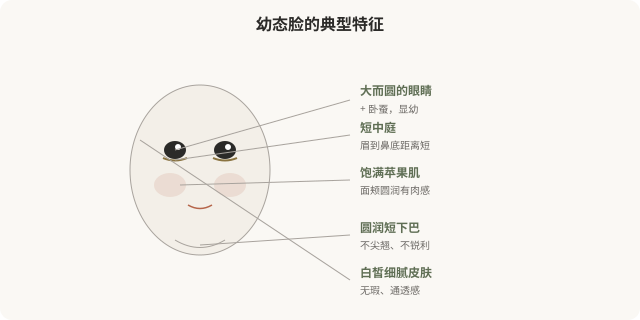

# 幼态脸：当“少女感”成为一种可购买的标准

## 三个备选标题

1. 幼态脸为什么火：少女感审美的医学化与代价
2. 圆眼、短中庭、婴儿肥：幼态脸是怎么被定义的
3. 追求“显小”的背后：幼态脸审美到底在追什么

## 封面介绍（100字以内）

幼态脸以圆眼、短中庭、饱满面颊为特征，是近年最流行的医美审美之一。它既是审美偏好，也暗含“年轻=有价值”的文化预设，值得清醒看待。

## 正文

先说结论：**幼态脸（baby face）是近年最流行的医美亚美学之一，以圆润、饱满、幼态化的面部特征为美——大而圆的眼睛、短中庭、饱满苹果肌、圆润下巴、皮肤白皙细腻。**它可以通过双眼皮、卧蚕、填充、皮肤管理等医美手段部分实现。但幼态脸的流行不只有审美原因，它还暗含“年轻=有价值”“幼态=被保护”的文化预设，并且正在让大量女性趋同成同一张脸。追求它之前，值得看清它在追什么。

### 幼态脸的视觉特征

幼态脸的核心是“保留婴儿期的面部比例”——相对大的眼睛、相对短的中下庭、饱满的皮下脂肪、圆润的轮廓。这些特征在进化心理学上与“幼小、需要保护”相关联，所以会触发观者的柔情反应。

### 医美如何“实现”幼态脸

| 特征 | 常见医美手段 |
|---|---|
| 大眼、卧蚕 | 双眼皮、开眼角、卧蚕填充 |
| 饱满苹果肌 | 透明质酸/自体脂肪填充 |
| 短中庭、圆润鼻 | 鼻综合（保守、圆润型） |
| 圆润下巴 | 下巴填充（适度） |
| 皮肤白皙细腻 | 光电、刷酸、注射护肤 |

**这些手段本身没有对错**——它们是工具。问题在于：当“幼态脸”被塑造成唯一的“美”的标准时，工具就变成了规训。

### 幼态脸为什么流行

### 幼态脸的争议

**第一，趋同化。**当所有女性都追求同一套幼态特征，结果就是大量面孔趋于相似——“网红脸”的批量生产。**真正多元的美，不应该是所有人都长成一张脸。**

**第二，年龄歧视的强化。**幼态脸的流行隐含一个前提：年轻的样子比成熟的样子更有价值。这反过来加重了对“显老”的恐惧和歧视——而每个人都会老。

**第三，不可逆风险。**有些幼态化手段（如骨骼手术）是不可逆的。冲着某种流行审美做了不可逆改变，潮流退去后可能后悔。

**第四，对“少女感”的过度消费。**把“少女感”作为女性美的最高标准，实际上窄化了女性审美——成熟、知性、凌厉、沧桑等都被边缘化。

### 一个更深的问题

幼态脸的流行，某种程度上反映了**社会对女性的期待：被保护、无害、年轻**。当一个女性拼命追求“显小”，她追求的可能不只是审美，还有这种审美背后的社会位置——被接纳、被喜欢、不被淘汰。

**这不是说追求幼态脸是错的**——每个人都有权喜欢任何审美。但值得问自己：我追求这个，是因为我真的喜欢这种样子，还是因为我害怕不这样就会被评判？

### 如何清醒地看待幼态脸

- **区分偏好与规训**：我喜欢圆润柔和，vs 我必须显小才有价值。
- **理解潮流会变**：今天的“标准脸”，五年后可能过时。不可逆决定要慎重。
- **保留多元可能**：成熟、凌厉、知性也是美，不必挤进同一个模子。
- **审视营销话术**：当机构说“你的脸不够幼态”，它在制造焦虑，不是描述事实。
- **警惕群体趋同**：如果所有人都做成了同一张脸，那张脸还“美”吗？

### 一个反思

幼态脸不邪恶，追求它也不可耻。**但当一种审美被包装成“标准”，当医美变成实现这个标准的流水线，值得停下来想想：是我在选择美，还是美在选择我？**真正自主的审美，是在充分了解各种可能后，从容选择属于自己的样子——哪怕那个样子不在任何“流行款”里。

> 本文用于健康教育与文化反思，不构成对任何审美选择的否定；具体医美决策须结合个体情况与具备资质的医师面诊。

## 参考资料

- 中华医学会整形外科学分会：医美审美与心理相关共识（以现行版本为准）
  https://www.cma.org.cn/
- American Society of Plastic Surgeons: Patient psychology & trends
  https://www.plasticsurgery.org/patient-safety
