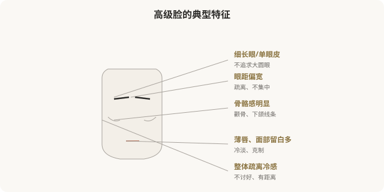
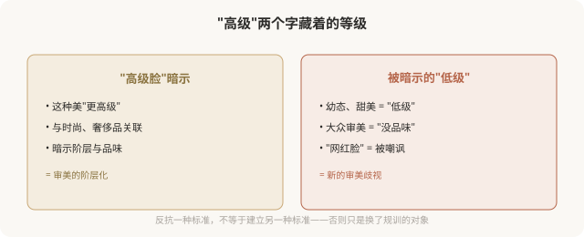

# 高级脸：当“反甜美”成为新的标准答案

## 三个备选标题

1. 高级脸真的更“高级”吗：厌世审美的逻辑与陷阱
2. 骨骼感、单眼皮、冷感：高级脸是怎么火起来的
3. 反甜美也是一种规训：高级脸审美的反思

## 封面介绍（100字以内）

高级脸以骨骼感、疏离感、不讨好为特征，被视为“反甜美”的审美。它曾是对幼态脸的反抗，但也正在变成新的标准答案，值得清醒看待。

## 正文

先说结论：**高级脸（又称厌世脸、鲶鱼脸等）是作为幼态脸的“反面”流行起来的医美亚美学，以骨骼分明、眼距偏宽、单眼皮或内双、面部留白多、气质疏离冷感为美。**它的流行有其反抗价值——打破了“只有幼态甜美才算美”的单一标准。但“高级”这个命名本身就暗含新的阶层与审美等级，当它成为新的“标准答案”时，反抗就变成了新的规训。追求它之前，值得看清这层。

### 高级脸的视觉特征

高级脸的核心是“反甜美”——不追求让人立刻喜欢的大眼圆脸，而是疏离、克制、有距离感。它常与“鲶鱼脸”（眼距宽、嘴唇厚）、“厌世脸”（气质冷淡）等词混用。

### 高级脸的反抗价值

高级脸流行的初期，有其积极意义：

- **打破单一审美**：在幼态脸一统天下时，它证明了骨骼分明、单眼皮、眼距宽也可以美。
- **为非标准面孔正名**：很多被传统审美认为“不够美”的特征（单眼皮、宽眼距、高颧骨），在高级脸语境里被重新肯定。
- **反抗讨好式审美**：它不追求“让所有人喜欢”，而追求独特的辨识度。

**这是高级脸的有益之处——它拓宽了“美”的定义，让更多元的面孔被看见。**

### 但“高级”这个词本身的问题

**问题在于：当“高级”成为美的形容词，它就隐含了“低级”的存在。**原本为了反抗单一标准的审美，本身变成了新的等级制度——“高级脸”瞧不起“幼态脸”，本质上和“幼态脸”排斥其他审美，是同一种审美霸权，只是方向相反。

### 医美如何“实现”高级脸

| 特征 | 常见医美手段 |
|---|---|
| 骨骼感、轮廓分明 | 下颌角、颧骨手术（不可逆，慎重） |
| 单眼皮保留 | 拒绝割双眼皮，或修复双眼皮 |
| 高鼻梁、骨骼鼻 | 鼻综合（直挺、有骨点） |
| 面部留白、不饱满 | 减少/拒绝填充，保持骨骼感 |
| 皮肤质感 | 光电、护肤，追求哑光质感 |

**注意一个矛盾**：高级脸崇尚“天然骨骼感”，但实现它的手段（尤其骨骼手术）往往是最不可逆、最高风险的。**冲着“反甜美”去做不可逆骨骼手术，需要格外慎重——你反抗的是一种审美，付出的却是身体的永久代价。**

### 一个更深的问题

高级脸的流行，与时尚界、奢侈品文化、精英审美紧密相关。它常被关联到“有文化、有品味、有阶层”的形象。**这意味着追求高级脸的人，追求的可能不只是面孔的样子，还有这种样子所象征的阶层身份。**

这并非指责——每个人都被文化塑造。但值得问自己：我喜欢高级脸，是因为真的欣赏这种疏离克制的美，还是因为它代表着我想靠近的某种身份？

### 如何清醒地看待高级脸

- **反抗不是新标准**：高级脸的价值在于多元，不在于取代幼态脸成为新标准。
- **“高级”不是事实**：它是命名，不是客观等级。没有哪种脸天然更“高级”。
- **不可逆要慎重**：为实现高级脸做骨骼手术，风险与潮流变化都要考量。
- **不必反甜美**：甜美不低级，疏离不高级——两者都是审美，没有高下。
- **多元共存才是反抗**：真正反抗单一审美的，是允许各种脸存在，而不是确立新的“正确脸”。

### 一个反思

高级脸的兴起，让更多元的面孔被看见，这是好事。**但当它从“也可以美”变成“才叫美”，从反抗变成新的标准，它就走向了自己最初反对的东西。**真正多元的审美，是幼态脸、高级脸、骨相脸、皮相脸、方形脸、圆脸……都各有其美，而不是任何一种统治其他。

> 本文用于健康教育与文化反思，不构成对任何审美选择的否定；具体医美决策须结合个体情况与具备资质的医师面诊。

## 参考资料

- 中华医学会整形外科学分会：医美审美与文化研究相关资料（以现行版本为准）
  https://www.cma.org.cn/
- American Society of Plastic Surgeons: Aesthetic diversity & patient goals
  https://www.plasticsurgery.org/patient-safety
