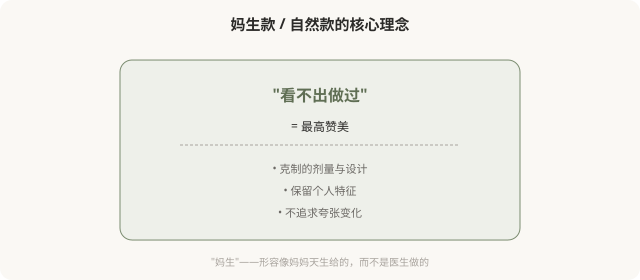
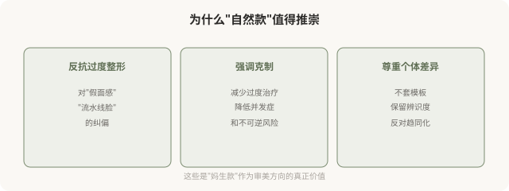

# 妈生款：“看不出做过”为什么成了最高赞美

## 三个备选标题

1. 妈生款、自然款：当“看不出做过”成为医美的金标准
2. “像天生的一样”背后：自然审美的逻辑与悖论
3. 追求自然没错，但别让它变成新的焦虑

## 封面介绍（100字以内）

妈生款、自然款以“看不出医美痕迹”为最高标准。它是对过度整形的反抗，但也暗含“医美可耻”的羞耻感，值得反思。

## 正文

先说结论：**妈生款、自然款、伪素颜款，是近年医美里被推崇的审美方向——以“看不出做过”“像天生的一样”为最高标准。**它作为对“网红脸”“过度整形”的反抗，有其积极意义：提醒人们克制、追求协调。但“自然”成为金标准的同时，也暗含一个新的悖论——做了医美却必须隐藏医美痕迹，否则就是“失败”。这种“必须看不出”的压力，可能变成新的焦虑来源。

### “妈生款”在说什么

“妈生款”原本用来形容双眼皮——宽度窄、形态自然，像天生的一样。后来这个词扩展到鼻综合、填充、皮肤管理等所有医美项目，成为“看不出医美痕迹”的统称。

它的几个核心追求：

- **保留个人特征**：不套模板，保留你原有的辨识度。
- **克制的剂量**：宁可少做，不追求一次到位的夸张变化。
- **协调优先**：整体协调比某个局部精致更重要。
- **动态自然**：笑、说话、做表情时也不突兀。

### 妈生款的积极意义

### 但“自然”也有它的悖论

**悖论一：做了医美却必须隐藏医美。**“妈生款”的最高赞美是“看不出做过”——这意味着做了医美的人，最怕被看出做过。**当“做过”成为需要隐藏的事，本身就强化了对医美的羞耻感。**真正坦然的态度，或许是“我做了，效果自然，那又怎样”，而不是“千万不能让人看出来”。

**悖论二：“自然”也可能是新的表演。**有些“伪素颜”“妈生款”实际投入了大量医美和妆造——所谓的“自然”，是精心营造出来的“看似自然”。**当“自然”成为审美标准，它反而催生了大量“制造自然”的消费。**

**悖论三：不是所有人都能“自然”。**有些基础（如明显的先天畸形、外伤后、衰老严重）很难通过“自然款”解决，需要更明显的医学介入。**过度推崇“自然”，可能让这些本需要治疗的人感到“不自然可耻”。**

**悖论四：“自然”被神化成道德优越。**有些人用“我的是妈生款”贬低“你的是网红脸”——这又变成新的审美等级制，和前一篇“高级脸”的问题类似。

### 医美如何“实现”自然

| 项目 | “妈生款”实现方式 |
|---|---|
| 双眼皮 | 窄宽度、平扇形、保留眼裂长度 |
| 鼻综合 | 低山根、圆润鼻尖、保留特征 |
| 填充 | 少量、深层、不饱满 |
| 皮肤 | 光电 + 护肤，不追求无瑕 |
| 肉毒 | 保留表情活力，不全消除纹路 |

**核心原则是“克制”和“尊重基础”——这恰恰是注射和手术篇反复强调的安全原则。**所以“妈生款”在医学层面是值得推崇的方向：它对应的就是“不过度治疗”。

### 一个更深的问题

“妈生款”的流行，反映了人们一种微妙的矛盾心理：**既想变美（所以做医美），又不愿被看作做了医美（所以要“看不出”）。**这种矛盾本身没有错，但它指向一个值得思考的问题——为什么社会对“做医美”这件事有羞耻感？为什么“看得出做过”会变成贬义？

**如果医美是一种正常的、合法的个人选择，为什么“被发现做过”会让人尴尬？**这个尴尬从哪来？是来自“自然天生才真实”的浪漫主义？还是来自“医美=虚荣”的偏见？反思这一层，比追求“妈生款”本身更接近问题的核心。

### 如何清醒地看待“自然款”

- **追求自然没错**：克制、协调、保留特征，是医学层面也推崇的方向。
- **但“必须自然”是新的规训**：做了医美不丢人，不必为“被看出”焦虑。
- **“自然”不等于“没做”**：很多“自然”是精心营造的，不必神话。
- **不是所有问题都能“自然”解决**：有些情况需要更明确的治疗。
- **警惕用“自然”贬低他人**：自然款不比其他款更高尚。

### 一个反思

真正坦然的美，或许是：**做了医美，效果协调，既不必刻意炫耀“我做了”，也不必拼命隐藏“我做了”。**“妈生款”作为审美方向有价值（克制、协调、个体化），但当它变成“必须看不出来否则失败”的压力，就走向了反面。坦然面对自己的选择，比追求任何“款”都更接近真正的自在。

> 本文用于健康教育与文化反思，不构成对任何审美选择的否定；具体医美决策须结合个体情况与具备资质的医师面诊。

## 参考资料

- 中华医学会整形外科学分会：医美审美与自然化相关共识（以现行版本为准）
  https://www.cma.org.cn/
- American Society of Plastic Surgeons: Natural-looking results & patient goals
  https://www.plasticsurgery.org/patient-safety
