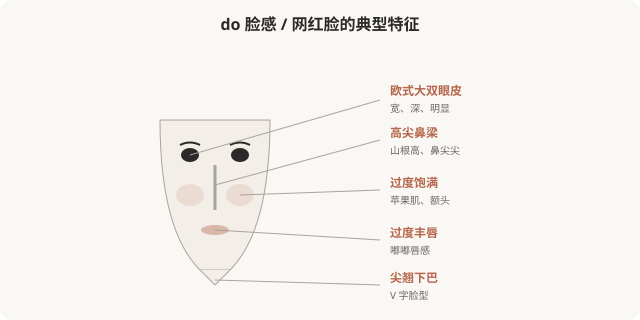

# do 脸感与网红脸：当“精致饱满”变成可识别的标签

## 三个备选标题

1. do 脸感、网红脸：饱满精致是怎么变成“贬义”的
2. 一眼看出“做过”：do 脸感的特征与争议
3. 当一种审美成为嘲讽对象：网红脸的兴衰

## 封面介绍（100字以内）

do 脸感、网红脸以饱满、精致、可识别为特征，曾是最流行的医美审美，现在却常被嘲讽。它的兴衰揭示了审美潮流的快速变迁。

## 正文

先说结论：**do 脸感（指“一眼能看出做过医美”的面孔）、网红脸（社交媒体流行的饱满精致面孔），是 2015–2020 年代最主流的医美审美。**它们以高鼻梁、尖下巴、饱满苹果肌、大眼睛、白皙皮肤为特征，曾被视为美的标准。但近年来，“do 脸感”逐渐从赞美变成嘲讽——“一眼假”“流水线脸”成为贬义。它的兴衰，揭示了审美潮流的快速变迁，也提醒冲着流行做不可逆手术的风险。

### do 脸感的视觉特征

do 脸感的特征往往是“过度”——每个局部都做到了极致饱满、精致，但整体缺乏协调，形成“一眼看出做过”的辨识度。

### do 脸感是怎么形成的

do 脸感的核心问题不是“做了医美”，而是**“过度 + 趋同”**——每个局部都做到了不符合个人基础的极致，且大量人做成同一套，形成可识别的“类型脸”。

### 从赞美到嘲讽的转向

值得注意的是：**do 脸感、网红脸在它流行的时代，是被赞美的。**那时高鼻梁、尖下巴、饱满苹果肌就是“美”的代名词，做这些项目的人被认为是“精致”“上心”。

但近几年，随着“妈生款”“高级脸”等审美兴起，网红脸迅速变成被嘲讽的对象——“一眼假”“流水线”“塑料感”成为贬义词。**这种转向说明：审美潮流变化极快，今天被赞美的，明天可能被嘲笑。**

### 这带来的现实风险

**这是冲着流行做医美最大的风险——潮流会变，但骨骼不会自己长回来。**do 脸感从赞美到嘲讽不过五六年，那些冲着当年“标准”做了不可逆手术的人，现在可能面临尴尬。

### “do 脸感”被嘲讽是否公平

也需要反思：**嘲讽“do 脸脸”本身，是否也是一种审美霸权？**

- 当年做网红脸的人，很多是真心喜欢那种审美，或在那个审美语境里被肯定。
- 用今天的标准嘲笑昨天的选择，对当事人并不公平。
- 嘲讽“do 脸”背后，常隐含对医美本身的污名——“做过”= 廉价、虚荣。

**真正多元的审美，不应该是“今天笑昨天的脸”**，而是理解每种审美都是时代的产物，每个人都可能在时代审美里做选择。批判“过度趋同”和“机构推销”，比嘲笑具体的人更接近问题核心。

### 医美如何避免“do 脸感”

如果确实想避免过度治疗造成的“do 脸感”：

- **整体协调优先**：不追求每个局部极致，看整体是否协调。
- **尊重个人基础**：不套模板，保留自己的辨识度。
- **克制剂量**：填充、肉毒宁可少，分次评估。
- **警惕“全套套餐”**：机构推荐的“全套”，往往是不顾个体的趋同方案。
- **不可逆慎之又慎**：尤其骨骼手术，潮流变化风险最大。

### 一个反思

do 脸感的兴衰告诉我们：**审美潮流会变，而且变得很快。**今天被推崇的“标准脸”，五年后可能就是被嘲讽的“过时脸”。所以，**与其追逐当下的“标准”，不如找到真正适合自己的、经得起时间考验的样子**——那种协调、自然、有辨识度的美，不会因为潮流改变而变得尴尬。冲着流行做不可逆手术，等于把自己的脸押在一个会变的赌局上。

> 本文用于健康教育与文化反思，不构成对任何审美选择的否定；具体医美决策须结合个体情况与具备资质的医师面诊。

## 参考资料

- 中华医学会整形外科学分会：医美审美潮流相关研究（以现行版本为准）
  https://www.cma.org.cn/
- American Society of Plastic Surgeons: Aesthetic trends & reversibility
  https://www.plasticsurgery.org/patient-safety
