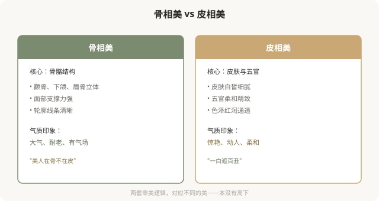

# 骨相美 vs 皮相美：东方审美的两套底层逻辑

## 三个备选标题

1. 骨相美和皮相美：东方审美是怎么分两派的
2. “骨相好看”真的比“皮相好看”高级吗
3. 骨相 vs 皮相：一场没有胜负的审美之争

## 封面介绍（100字以内）

骨相美与皮相美是东方审美的两大底层逻辑。前者重骨骼结构，后者重皮肤五官。两者各有审美价值，不存在高下，但常被赋予阶层意味。

## 正文

先说结论：**骨相美与皮相美，是东方（尤其中国、日本）审美里两套底层的、常被对举的美学逻辑。**骨相美强调骨骼结构——颧骨、下颌、眉骨的立体与支撑，被认为“耐老”“有气场”；皮相美强调皮肤、五官、色泽——白皙、细腻、柔和，被认为“惊艳”“动人”。两者各有审美价值，没有客观高下，但“骨相 > 皮相”的说法常暗含新的审美等级，值得看清。

### 骨相美与皮相美的区别

### “骨相美”为什么被推崇

近年来，“骨相美”常被赋予更高评价，原因有几个：

- **“耐老”叙事**：骨骼支撑好的人，软组织下垂慢，被认为“经得起时间”。这契合抗老焦虑。
- **“高级”关联**：骨相美常与高级脸、超模脸关联，带有阶层与品味暗示。
- **对“皮相美”的反拨**：在过度填充、滤镜审美泛滥后，骨相的“真实结构感”被重新推崇。
- **摄影表现力**：骨相分明的人上镜，适合时尚和影视语境。

**这些原因有一定道理，但“骨相 > 皮相”的结论，本身是一种审美等级制。**

### “骨相 > 皮相”的问题

**需要警惕的是**：当“骨相美”被神化，它可能变成对扁平脸、圆脸、皮相型面孔的贬低——而这恰恰是很多东方人天然的面部特征。**推崇骨相到极端，可能变成一种自我东方主义的审美——用西方立体标准否定东方面部特征。**

### 医美如何“实现”两者

| 审美方向 | 医美手段 | 风险提示 |
|---|---|---|
| 骨相美 | 骨骼手术（颧骨、下颌、鼻基底）、填充塑形 | 骨骼手术不可逆，慎重 |
| 皮相美 | 皮肤管理（光电、刷酸、注射）、五官精修 | 相对可逆，但过度也会不自然 |
| 骨皮兼修 | 综合方案，先结构后肤质 | 整体协调最重要 |

**骨相美的“实现”往往涉及不可逆的骨骼手术**——这是最大的风险。冲着“骨相美”做削骨、截骨，潮流变化和并发症风险都要充分考量。

### 一个更深的问题

“骨相美”的流行，背后是**对“耐老”和“高级”的双重欲望**——既想美，又想美得久；既想美，又想美得有阶层感。这种欲望本身没有错，但当它被包装成“骨相才是真美”时，就窄化了审美。

**真正的事实是**：骨相和皮相是面部的两个维度，绝大多数人两者兼有，只是比例不同。一张面孔的美，是骨骼结构、皮肤状态、五官形态、气质神态综合作用的结果——把它简化成“骨相 vs 皮相”的对立，本身就是对美的窄化。

### 如何清醒地看待骨相 vs 皮相

- **两者没有高下**：骨相不比皮相高级，皮相也不比骨相浅薄。
- **不必非此即彼**：绝大多数人是混合型，追求协调即可。
- **警惕审美等级化**：任何“X 才是真美”的说法，都是一种规训。
- **警惕人种偏见**：推崇骨相立体时，反思是否在否定自己的天然特征。
- **不可逆慎重**：为追求骨相做骨骼手术，风险与潮流变化都要考量。

### 一个反思

骨相美和皮相美的对举，本身是东方审美的丰富之处——它承认美的多种维度。**但当其中一种被神化为“高级”，丰富就变成了新的单一。**真正欣赏东方审美，是允许骨相、皮相、兼修型各有其美，而不是确立一种新的“正确脸”。你的脸不必非“骨相”或“皮相”——它可以是协调的、属于你自己的样子。

> 本文用于健康教育与文化反思，不构成对任何审美选择的否定；具体医美决策须结合个体情况与具备资质的医师面诊。

## 参考资料

- 中华医学会整形外科学分会：东方审美与面部解剖相关研究（以现行版本为准）
  https://www.cma.org.cn/
- American Society of Plastic Surgeons: Facial aesthetics & ethnic considerations
  https://www.plasticsurgery.org/patient-safety
