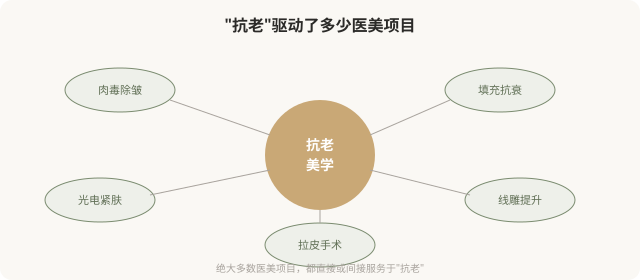
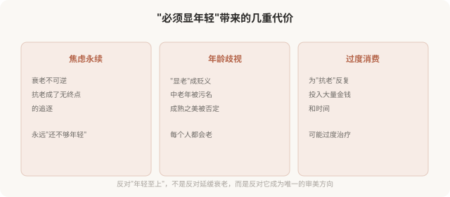

# 抗老美学：当“年轻”成为美的唯一方向

## 三个备选标题

1. 抗老美学：为什么“显年轻”成了医美的最高目标
2. “抗老”背后的预设：年轻才是美吗
3. 与时间和解：反思抗老焦虑的审美陷阱

## 封面介绍（100字以内）

抗老美学把“显年轻”作为美的核心方向，驱动了大量医美消费。但“年轻=美”的预设本身值得反思——它强化了对衰老的恐惧，窄化了美的维度。

## 正文

先说结论：**抗老美学（anti-aging aesthetics）是当今医美最大的驱动力——它把“显年轻”“抗衰老”作为审美和医学的核心目标。**填充、肉毒、光电、手术，绝大多数医美项目都直接或间接服务于“抗老”。但“年轻=美”这个预设本身值得反思：它把美的维度窄化为“年轻态”，强化了对衰老的恐惧与歧视，也让大量人在永无止境的“抗老”中焦虑。这一篇反思抗老美学的预设，并非反对延缓衰老，而是主张更清醒地看待它。

### 抗老美学是医美最大的引擎

**可以说，没有“抗老焦虑”，就没有今天医美行业的规模。**抗老美学把“衰老”从一个自然过程，重新定义为“需要对抗的问题”，从而创造了巨大的消费市场。

### “年轻=美”这个预设从哪来

抗老美学的底层预设是：年轻的样子比成熟的样子更美、更有价值。这个预设由多股力量共同强化：

- **进化心理学叙事**：年轻意味着生育力，所以“被编程为美”。这种解释有争议，但广为流传。
- **消费文化**：抗老产品（护肤、医美、保健品）需要“衰老是问题”的叙事来卖货。
- **媒体与娱乐**：影视、广告里中老年角色被边缘化，年轻面孔占据视觉中心。
- **职场与婚恋**：年龄歧视真实存在，“显年轻”在某些场合有实际好处。
- **社交媒介比较**：社交媒体让人无时无刻不在与“比自己年轻/显年轻”的脸比较。

**这些力量共同塑造了一个感觉“自然”的结论：年轻才美，衰老可怕。**但这个结论并不天然——它是特定文化和商业利益塑造的。

### 抗老美学的代价

### 一个关键的区分：抗老 vs 恐老

需要区分两种态度：

- **抗老（理性延缓）**：通过健康生活方式、适度医美、防晒护肤，延缓衰老带来的功能下降和外观变化。承认衰老是自然过程，但选择让这个过程更健康、更从容。
- **恐老（恐惧对抗）**：把衰老当作敌人，把任何衰老迹象视为必须消灭的缺陷，在永恒的焦虑中追逐“回到年轻”。无法接受自己正在老去这个事实。

**抗老本身没有错，甚至值得推崇——它是对健康的合理关注。但当抗老滑向恐老，问题就出现了。**很多人嘴上说“抗老”，实际处于“恐老”的焦虑中，这种焦虑驱动的医美消费，往往后悔率高。

### 抗老医美的合理边界

抗老医美在什么情况下是合理的？

- **功能改善**：如眼睑松垂遮挡视线、显著影响生活质量。
- **合理预期内的外观改善**：理解无法“回到 20 岁”，只是改善某些具体迹象。
- **可逆优先**：优先选择可逆手段（填充、肉毒、光电），不可逆手术慎重。
- **健康前提**：在健康的基础上追求外观，不为外观牺牲功能。
- **自我接纳**：能接受“自己正在老去”，医美是助力，不是对抗时间的武器。

**不合理的抗老追求**：要求“完全无皱”“永远年轻”、在焦虑中反复过度治疗、把衰老视为耻辱。

### 一个更深的问题

为什么我们的文化如此恐惧衰老？为什么“显年轻”是赞美，“显老”是侮辱？

部分原因在于：**我们的文化把价值与青春绑定了。**尤其是女性——一个女性的价值，似乎随年龄增长而“贬值”，所以“抗老”成了维护价值的生存策略。这种绑定本身是不公正的——它让一半人口在永恒的年龄焦虑中度日。

**反思抗老美学，某种程度上是在反抗这种不公正。**不是要放弃健康和美，而是要重新定义“成熟也美”“老去也可以从容”。

### 如何清醒地看待抗老

- **区分抗老与恐老**：合理延缓 vs 恐惧对抗，前者健康，后者焦虑。
- **接受衰老是自然过程**：没有人能逆转时间，过度追求注定失望。
- **可逆优先**：优先可逆手段，不可逆手术慎重。
- **健康优于外观**：不为“显年轻”牺牲功能和健康。
- **反思动机**：我抗老，是因为想更健康，还是因为恐惧被淘汰？
- **重新定义美**：成熟、从容、有阅历也是美，不只是“显年轻”。

### 一个反思

衰老是每个人都会经历的、不可逆的自然过程。**抗老美学的问题，不在于“抗老”本身，而在于它把衰老定义成了敌人，把“显年轻”定义成了唯一的美。**真正健康的态度，或许是与时间和解——在合理范围内延缓衰老，同时接受每个年龄阶段的美。一个 50 岁的人不必看起来像 30 岁，才能被认可为“美”。成熟本身，就是一种值得被尊重的状态。

> 本文用于健康教育与文化反思，不构成对任何审美选择的否定；具体医美决策须结合个体情况与具备资质的医师面诊。

## 参考资料

- 中华医学会整形外科学分会、老年医学分会：抗衰老医学相关共识（以现行版本为准）
  https://www.cma.org.cn/
- American Society of Plastic Surgeons: Aging & aesthetic medicine
  https://www.plasticsurgery.org/patient-safety
