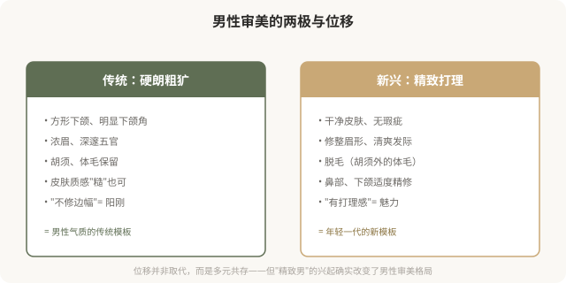

# 男性医美美学：从“硬朗”到“精致”的位移

## 三个备选标题

1. 男生也开始 do 脸：男性医美审美的兴起与纠结
2. 硬朗 vs 精致：男性审美正在发生什么位移
3. 男性医美的耻感与释放：一场静悄悄的变化

## 封面介绍（100字以内）

男性医美正在兴起，审美从“硬朗”向“精致”位移。但男性 do 脸仍承受较强的耻感压力，这种纠结本身就是性别审美的镜子。

## 正文

先说结论：**男性医美正在快速增长，男性审美也在从传统的“硬朗、粗犷”向“精致、洁净、有打理感”位移。**常见的男性医美项目包括皮肤管理、脱毛、鼻综合、下颌塑形、发际线调整等。但与女性不同，男性 do 脸仍承受较强的耻感压力——“男人不该在意这些”。这种纠结本身，反映了性别审美的双重标准，也让男性医美消费者面临独特的心理困境。这一篇盘点男性医美美学，也反思它背后的性别规训。

### 男性医美审美的两极

### 男性医美的主要项目

| 项目 | 审美诉求 |
|---|---|
| 皮肤管理（光电、刷酸） | 干净、无痘印、肤色均匀 |
| 脱毛（络腮胡修整、体毛） | 清爽、有打理感 |
| 鼻综合 | 高挺、立体、男性化鼻 |
| 下颌塑形 | 清晰下颌线、方形感 |
| 发际线调整/植发 | 年轻、精神 |
| 痤疮治疗 | 皮肤健康 |
| 眼袋/双眼皮 | 精神、不疲惫（保守） |

**男性医美有一个重要特点：通常追求“看不出来”的保守改善**——这与男性 do 脸的耻感有关。多数男性不希望被看出“做过”，所以男性医美往往比女性更克制（这本身也是个值得反思的现象）。

### 男性 do 脸的耻感

男性 do 脸的耻感，本质是**性别刻板印象对男性的束缚**——它规定“男性应该怎样”，把在意外表打成“不够男人”。这种束缚和女性承受的审美压力是一体两面：**两性都被困在各自的“应该”里。**

### 一个值得反思的双重标准

观察一个有趣的现象：

- 女性做医美：被评价为“正常”（甚至“应该”），但做得过度会被嘲讽。
- 男性做医美：被评价为“奇怪”（甚至“丢人”），但做得克制可能被认可。

**这种双重标准说明：社会对两性的审美规训方式不同，但都在规训。**女性被要求“必须美”，男性被要求“不能太在意美”。两者都是束缚。

### 男性医美的合理边界

男性如果考虑医美，几个原则：

- **明确诉求**：解决具体问题（如痤疮、脱发、明显不对称），而非追逐流行模板。
- **保守优先**：男性审美通常追求“看不出”，克制剂量、保留男性特征。
- **避免女性化模板**：男性五官、轮廓有自身美学（如方形下颌、男性鼻），不应套用女性模板。
- **警惕营销**：男性医美市场正在扩张，机构话术也在制造男性焦虑（如“油腻男”“邋遢男”）。
- **不可逆慎重**：尤其骨骼手术，男性审美潮流变化同样快。

### 一个更深的问题

男性医美的兴起，是**男性从“硬朗规训”中部分释放的过程**——允许男性在意仪表、允许男性追求精致。这本身有积极意义：它松动了对男性的单一期待。

但也要警惕：**男性医美可能复制女性医美的问题——焦虑驱动、趋同化、过度消费、不可逆后悔。**男性不必走女性踩过的坑。如果男性 do 脸最终也走向“必须精致”“不能邋遢”的新规训，那不过是换了一种束缚。

### 如何清醒地看待男性医美

- **释放不必内疚**：男性在意外表不丢人，是个人选择的权利。
- **但不必过度**：克制和健康优先，不为“精致”焦虑。
- **保留多元**：硬朗、精致、粗犷、清爽都是男性美的可能，不必挤进一种。
- **警惕新规训**：不要从“必须硬朗”跳到“必须精致”。
- **反思性别偏见**：无论男女，审美选择都不该被性别标签绑架。

### 一个反思

男性医美的兴起，是性别审美多元的一步。**真正健康的状态，是每个人——无论男女——都能自由地选择自己在意外表的程度和方式，不被“应该怎样”的性别标签束缚。**男性 do 脸不丢人，男性不 do 脸也不丢人；女性爱美不肤浅，女性不爱美也不反常。当审美选择真正属于个人，而不是属于性别规训，才是真正的解放。

> 本文用于健康教育与文化反思，不构成对任何审美选择的否定；具体医美决策须结合个体情况与具备资质的医师面诊。

## 参考资料

- 中华医学会整形外科学分会：男性医美相关研究（以现行版本为准）
  https://www.cma.org.cn/
- American Society of Plastic Surgeons: Male aesthetic procedures
  https://www.plasticsurgery.org/cosmetic-procedures
