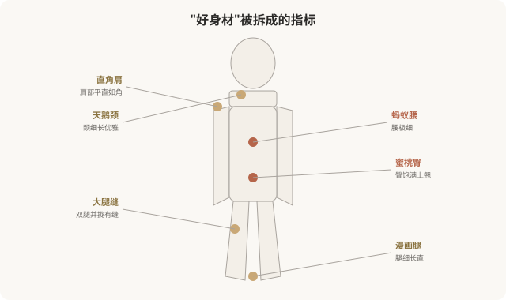

# 身体美学：直角肩、蚂蚁腰与身体焦虑

## 三个备选标题

1. 直角肩、蚂蚁腰、大腿缝：身体审美是怎么变成指标的
2. 当身体被分解成“标准”：身体美学与身体焦虑
3. 追求“完美身材”的背后：身体美学的陷阱

## 封面介绍（100字以内）

身体美学把身体拆解成直角肩、蚂蚁腰、大腿缝等可量化指标。它驱动了身体医美消费，也加剧了身体焦虑与对自然身体的否定。

## 正文

先说结论：**身体美学（body aesthetics）是医美亚美学里重要的一支——它把“好身材”拆解成一系列可命名、可量化的指标：直角肩、天鹅颈、蚂蚁腰、蜜桃臀、大腿缝、腕线过裆等。**这些指标驱动了吸脂、填充、隆胸、隆臀等身体医美消费，也加剧了普遍的身体焦虑。当自然身体被分解成“达标/不达标”的零件，每个人几乎都能找出“不合格”的部分——这正是身体美学的核心陷阱。这一篇盘点身体美学，反思它如何塑造我们对身体的态度。

### 身体美学的“指标清单”

这些指标有几个共同特点：

- **可量化**：肩的角度、腰的围度、腿的间隙——都能被测量和比较。
- **与基因强相关**：很多指标（如肩的形状、腰的骨架）主要由基因决定，难以通过后天彻底改变。
- **与自然功能矛盾**：有些指标（如大腿缝、过度细腰）在自然身体上并不常见，甚至与健康相悖。
- **永远“不够”**：指标是无限的，达标一个又出现新的“不达标”。

### 身体医美如何“实现”这些指标

| 指标 | 医美手段 | 风险与限制 |
|---|---|---|
| 蚂蚁腰 | 吸脂、肋骨切除（极端） | 吸脂有限，肋骨切除风险极高且罕见 |
| 蜜桃臀 | 自体脂肪移植、假体 | 手术风险、不可逆 |
| 直角肩 | 肩部填充、肉毒 | 多数肩型由骨骼决定，改善有限 |
| 大腿缝 | 大腿吸脂 | 骨架决定，吸脂未必形成 |
| 漫画腿 | 吸脂、肉毒（瘦小腿肌） | 可能影响功能 |

**重要事实**：很多身体指标主要由骨骼和基因决定，医美能改变的部分有限。**冲着主要由基因决定的指标做医美，往往效果有限、风险却真实。**

### 身体美学如何制造焦虑

**这是身体美学最隐蔽的陷阱：它通过无限拆分和标准化，让自然身体几乎必然“不合格”，从而创造无限消费需求。**一个不拆解身体、不设单一标准的文化里，大多数人对自己的身体是满意的——身体美学的兴起，恰恰摧毁了这种满意。

### 一个关键问题：健康 vs 审美

身体医美有一个需要严肃区分的问题：**它是在改善健康，还是在追逐审美？**

- **健康导向**：如病态肥胖影响健康，减重是合理的；如乳房过度肥大引起疼痛，缩小术是功能性的。
- **审美导向**：如为了“蚂蚁腰”做吸脂，为了“蜜桃臀”做脂肪移植——这些主要服务审美，与健康无关。

**问题在于：审美导向的身体医美，常被包装成“为了健康/自信”。**这种模糊让消费者难以清醒判断自己真正的动机。诚实地问自己：我做这个，是为了健康，还是为了符合某种身体标准？

### 身体正向运动的启示

近年来，“身体正向”（body positivity）运动兴起，主张：

- 各种身材都值得被接纳。
- 健康比尺寸更重要。
- 自然身体的多样性是正常的，不是缺陷。
- 美不局限于单一标准。

**这与本系列的立场一致——不是反对健身、塑形或医美，而是反对把单一标准强加于多元身体。**一个人可以健身、可以适度医美，同时不必把自己的身体当成“永远不够格”的项目。

### 如何清醒地看待身体美学

- **区分健康与审美**：明确自己追求的是健康还是某种审美标准。
- **理解基因限制**：很多身体特征由基因决定，医美改变有限。
- **警惕无限拆分**：身体是整体，不必每个零件都“达标”。
- **可逆优先**：身体医美（尤其手术）多不可逆，慎重。
- **接受自然多样**：自然身体的差异是正常的，不是缺陷。
- **反思动机**：我追求这个身材，是因为我真喜欢，还是因为不这样就被评判？

### 一个反思

身体美学的核心问题，不在于“追求好身材”，而在于**它把“好身材”定义得如此狭隘、如此与基因对抗，以至于几乎所有人都注定“不够好”。**真正健康的关系，是与自己的身体和解——欣赏它的功能，接纳它的形态，在合理范围内改善，而不是把它当成永恒的敌人。一个能让你行走、拥抱、感受世界的身体，本身就值得感谢——而不是被拆解成“不达标”的零件。

> 本文用于健康教育与文化反思，不构成对任何审美选择的否定；具体医美决策须结合个体情况与具备资质的医师面诊。

## 参考资料

- 中华医学会整形外科学分会：身体塑形与心理相关共识（以现行版本为准）
  https://www.cma.org.cn/
- American Society of Plastic Surgeons: Body contouring & body image
  https://www.plasticsurgery.org/patient-safety
