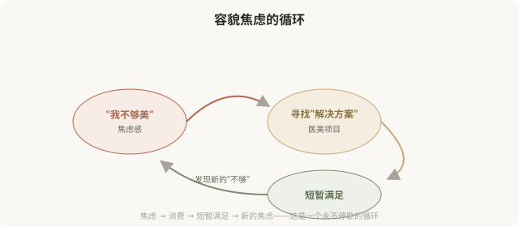
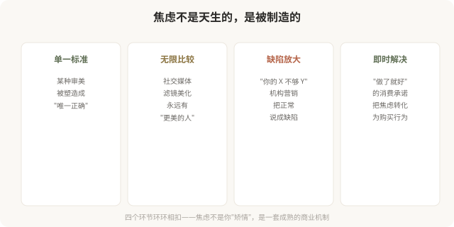

# 容貌焦虑美学：当“不够美”本身成为欲望的发动机

## 三个备选标题

1. 容貌焦虑：医美亚美学最终的底层燃料
2. “我还不够美”：这种不满足感是怎么被制造出来的
3. 当焦虑成为美学：医美消费最难觉察的陷阱

## 封面介绍（100字以内）

容貌焦虑是医美亚美学的底层燃料——它把“不够美”变成持续的欲望。认识焦虑的机制，是所有审美反思的终点，也是真正自主选择的起点。

## 正文

先说结论：**容貌焦虑（appearance anxiety）是医美所有亚美学的底层燃料——幼态脸、高级脸、抗老、身体美学……每一种亚美学的流行，本质上都在制造“我还不够”的不满足感，从而驱动持续的消费。**这一篇是系列的收尾，因为前面 9 篇盘点的每一种亚美学，最终都指向同一个核心：一个永远觉得自己“不够美”的心理状态。认识容貌焦虑的运作机制，是所有审美反思的终点，也是真正自主选择的起点。

### 容貌焦虑是什么

容貌焦虑不是“爱美”，而是一种**持续的不满足状态**——无论怎么改变，总能找到新的“不够”。它的特征是：

- 对照“标准”反复检查自己，找出“缺陷”。
- 过度关注他人评价，对外貌批评高度敏感。
- 把外貌与自我价值强绑定（“我不美 = 我没价值”）。
- 反复寻求医美“修复”，但满足感越来越短暂。
- 即使被他人肯定，仍无法相信自己“够好”。

**容貌焦虑和“爱美”的关键区别是**：爱美是“我想变得更好”，焦虑是“我必须变得不同，否则不值得”。前者是动力，后者是折磨。

### 容貌焦虑如何被制造

### 医美亚美学在焦虑中的角色

前面盘点的每一种亚美学，都在这个焦虑机制中扮演角色：

- **幼态脸**：“你的脸不够幼态”——制造年龄焦虑。
- **高级脸**：“你的脸不够高级”——制造品味焦虑。
- **妈生款**：“你做得不够自然”——制造技术焦虑。
- **抗老美学**：“你老得太快”——制造衰老焦虑。
- **身体美学**：“你的身材不够达标”——制造身体焦虑。

**每种亚美学都在说：“你还差一点。”**而这一点永远存在——因为亚美学的“标准”是无限的，焦虑因此也无限。

### 容貌焦虑的代价

### 一个关键认知：医美解决不了容貌焦虑

这是最需要说清的一点：**医美可以改善外貌的某些具体问题，但解决不了容貌焦虑。**因为焦虑的本质不是“我不够美”，而是“我无法接受自己不够美”。这个“无法接受”，不会因为做了医美而消失——它会转移到下一个“不够”上。

很多陷入容貌焦虑的人，做了大量医美项目，依然不满足——因为问题不在脸上，在心里。**用医美解决心理问题，方向就错了。**真正有效的，往往是心理层面的工作：重建自我价值感、减少对外貌评价的依赖、接受“不完美是常态”。

### 当需要专业帮助

如果发现自己符合以下特征，建议寻求心理专业人士的帮助，而不是更多医美：

- 对外貌的某个细节过度关注，花费大量时间反复审视。
- 反复医美仍不满意，总觉得“还差一点”。
- 因外貌问题显著影响社交、工作、亲密关系。
- 出现回避社交、自我封闭。
- 把外貌与自我价值完全绑定。
- 有自伤或绝望念头（这种情况需要立即寻求帮助）。

**这可能是体象障碍（body dysmorphic disorder）的倾向，是一种需要专业治疗的心理状况，医美无法解决其根本困扰，反而可能加重。**寻求心理支持不是软弱，而是对自己真正负责。

### 如何与容貌焦虑共处

- **区分爱美与焦虑**：追求美 vs 必须变得不同，前者健康，后者折磨。
- **限制比较**：减少社交媒体的“对照检查”，理解滤镜和精修。
- **多元审美**：知道“美”有很多种，不局限于单一标准。
- **可逆优先**：焦虑驱动时，避免不可逆决定。
- **关注功能**：欣赏身体的功能（行走、拥抱、感受），而不只是形态。
- **寻求心理支持**：如果焦虑严重影响生活，专业帮助比医美更有效。

### 给这个系列的读者

这 10 篇医美亚美学盘点，最终都指向同一个核心：**真正自主的审美选择，建立在认识焦虑、反思规训、接纳自我的基础上。**

- 你可以追求幼态脸，但不必因为“不够幼态”而焦虑。
- 你可以喜欢高级脸，但不必用它贬低其他审美。
- 你可以做抗老医美，但不必把衰老当成耻辱。
- 你可以改善身体，但不必把身体当成永恒的敌人。
- 你可以做医美，但不必让医美承担“解决自我价值”的重任。

**美是多元的，选择是自由的，但只有当你不再被“我还不够”驱动时，这种自由才是真的。**

### 一个收尾反思

容貌焦虑的反思，不是要反对医美，也不是要否定追求美的权利。**它是要把“选择”还给个人——让你做医美是因为“我选择”，而不是因为“我必须”。**当一个人能从容地说“我做了医美，是因为我想改善某个具体问题”，而不是“我必须做，否则我不配”，医美才真正成为一种自由选择，而不是焦虑的奴役。

希望这 10 篇能帮你看清欲望的来源，识破营销的机制，最终做出真正属于自己的、从容的审美选择。**这是“医美亚美学”系列能给你的，最重要的东西。**

> 本文用于健康教育与文化反思，不构成对任何审美选择的否定；如容貌焦虑严重影响生活，建议寻求心理专业人士的帮助。

## 参考资料

- 中华医学会精神医学分会：体象障碍与容貌焦虑相关诊疗共识（以现行版本为准）
  https://www.cma.org.cn/
- American Psychiatric Association: Body dysmorphic disorder information
  https://www.psychiatry.org/
