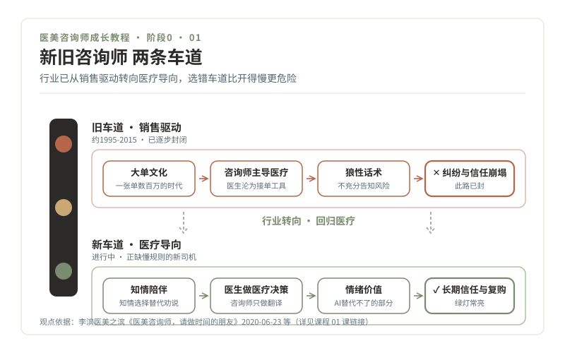

# 01 · 开课词，写给一位交通信号工程师的转行信

> **阶段 0 · 引擎自检** ｜ 预计用时：半天 ｜ 前置课程：无

## 学习目标

- 看清"医美咨询师"这个岗位的真实处境：不美化，也不吓退
- 分清"旧咨询师"与"新咨询师"两条车道，知道自己要上哪条
- 知道交通信号专业的四年积累，在这行里怎么派上用场

## 正文

### 一、你带了一张别人没有的地图

先回答你心里最大的疑问：我一个学交通信号的，和医美有什么关系？

关系比你想象的大。交通工程研究的是**流量、节奏、安全冗余和事故预防**；医美咨询做的也是这几件事，求美者的决策是流量，面诊的推进是节奏，风险告知是安全冗余，纠纷预防是事故预防。区别只是对象从车换成了人，而"人"比车复杂得多，也正因为复杂，AI 和话术模板都替代不了愿意理解人的咨询师。

本课程会反复用你熟悉的概念搭建新知识：OD 调查对应需求挖掘，信号配时对应面诊节奏，红绿灯对应面诊警讯分级，潮汐车道对应客户经营。你的旧地图，恰好能画出这座新城市。

### 二、三个真相，先听完再决定

这门课不画大饼。开课第一件事，是把行业的三篇重要文章读一遍（均为李滨"医美之滨"公众号文章，观点归属原作者，日期说明写作背景）。

**真相一：这不是一个"正式职业"，只是一个岗位。** "医美咨询师"从未进入国家职业分类，它因行业需要自然生长出来，也长期因"名义做咨询、实际做推销"被批评，2021 年曾有政协提案建议全国取缔这个岗位，行业趋势是转向"医务助理"或由医务人员承担咨询。读《两会提案：取缔医美咨询师》（2021-03-09，[原文链接](https://mp.weixin.qq.com/s?__biz=MzU2NjMzMTQ4Nw%3D%3D&chksm=fcacb9a1cbdb30b7e0d518dbcd131f66ce9e46b7a471e8b9ae1ae90334f2f091b16df7ef917b&idx=1&mid=2247493777&sn=6bad6d7716a2a3c1e13a87bdb7185961)）。注意：这不意味着岗位会消失，而意味着**这个岗位正在被重新定义**，重新定义的时候，正是新人的机会窗口。

**真相二：咨询师主导医疗的时代结束了。** 上世纪九十年代到 2015 年前后是"大单咨询师"的高光时代：越没有医疗背景越敢说，业绩越高。但"咨询师开单、医生照做"被行业证明是纠纷之源，行业正在"回归医疗"，医生是医疗决策的唯一关键环节，咨询师的新标准是"成单与医生决策的匹配度"，而不是销售额。读《医美咨询师，请做时间的朋友》（2020-06-23，[原文链接](https://mp.weixin.qq.com/s?__biz=MzU2NjMzMTQ4Nw%3D%3D&chksm=fcaf4306cbd8ca10e3328b864de3877fd721b4f19f46659d9268194dc3e79519604e9ddbc782&idx=1&mid=2247488054&sn=10781b8091f6c1dff69aefca8696ef61a)）。

**真相三：AI 会抢走网电咨询，抢不走情绪价值。** 不见面、靠信息差成交的线上咨询将全面被 AI 替代；留下来的核心能力是面对面的倾听、共情、个性化关怀与信任构建，文章称之为"情绪价值"，并给出了 12 种类型的拆解。读《情绪价值——AI 时代医美咨询师的贡献》（2024-11-05，[原文链接](https://mp.weixin.qq.com/s?__biz=MzU2NjMzMTQ4Nw%3D%3D&chksm=fcac83b4cbdb0aa224ad76413ee1048219d5e00344c4a408c453eff1ba2bb39e172d6892f6dc2&idx=1&mid=2247504516&sn=05c4313e1a75d7cd57d79812e4e3b0c)）。

### 三、两条车道：选错比开慢更危险

把三个真相比喻成一张路网图，就是上面这两条车道。旧车道上跑的车（大单文化、咨询师主导医疗、狼性话术）正在被逐步清退；新车道（知情陪伴、医生做决策、情绪价值、长期信任）刚刚划好线，缺的正是懂规则的新司机。

| | 旧车道 · 销售驱动 | 新车道 · 医疗导向 |
| --- | --- | --- |
| 成交逻辑 | 制造焦虑、话术逼单 | 澄清需求、知情选择 |
| 医疗决策 | 咨询师说了算 | 医生说了算，咨询师翻译 |
| 考核标准 | 销售额 | 成单与医生决策的匹配度 |
| 客户关系 | 一锤子买卖 | 长期信任与复购 |
| 职业前景 | 正在被政策和 AI 淘汰 | 正在被行业重新需要 |

### 四、这门课怎么学

五阶段十二个月：引擎自检 → 学交规 → 认识车流 → 看懂路口 → 上路 → 绿波带。学习方法三件套，从下一课开始启用：

1. **3-2-1 卡片法**：每读一篇教材，产出一张卡片，3 个知识点、2 个求美者常问问题与标准答法、1 个绝不能踩的坑。
2. **费曼录音**：每周挑一个主题，对着手机给"想象中的闺蜜"讲 5 分钟。讲不下去的地方，就是没学会的地方。
3. **集灯打卡**：每完成一个模块亮一盏灯，一个阶段全亮就是一条"绿波带"，给自己一个约定好的奖励。

详细的学习节奏和方法说明见《00-课程设计总纲》第五节。

## 本课作业

1. 精读上面三篇文章，合计写 500 字读后感，必须回答：这个岗位最坏的可能性是什么？我能接受吗？
2. 写下三句话："我为什么想入行。"写完放三天，第三天再读一遍，还认就继续。

## 通关检验

不看资料，向一位朋友复述"三个真相"，并说出你读完之后仍决定继续（或放弃）的理由。说得清，才算过。

## 配套教材

- 《00-课程设计总纲》（本系列设计蓝图）
- 李滨医美之滨三篇文章（链接见正文，建议同时收录进你的语料笔记库）
