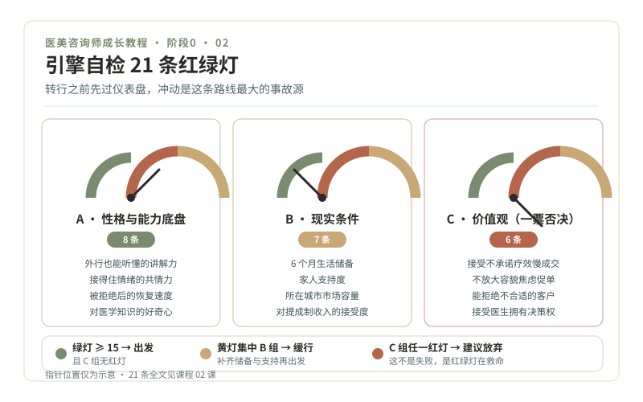

# 02 · 引擎自检，要不要入行，先过一遍红绿灯

> **阶段 0 · 引擎自检** ｜ 预计用时：一个周末 ｜ 前置课程：01

## 学习目标

- 用 21 条红绿灯自检，完成入行前的完整自我评估
- 写下你的"绝不清单"，它将伴随你的整个职业生涯
- 产出一页纸《入行决策书》

## 正文

### 一、转行之前，先看仪表盘

任何路口开放通行之前，工程师都要先检查信号机、流量和事故记录。转行也一样：冲动是这条路线上最大的事故源。这一课不学任何医美知识，只做一件事，把你自己这台"车"检查清楚。

自检分三块仪表盘：**性格与能力底盘**（8 条）、**现实条件**（7 条）、**价值观**（6 条）。每条只判三种状态：绿灯（没问题）、黄灯（有顾虑但可改善）、红灯（硬伤，短期改不了）。

### 二、21 条红绿灯自检

**A 组 · 性格与能力底盘（8 条）**

1. 我能把复杂的事讲得让外行听懂（试：给家人讲清楚什么是玫瑰痤疮，讲不清算黄灯）
2. 我能耐心听完别人说话，不急着打断给建议
3. 朋友难过时愿意找我聊，我也能接得住情绪
4. 被拒绝、被质疑后，我情绪恢复得比较快
5. 我的记忆力不差，能坚持背新知识
6. 我愿意管理自己的形象（咨询师的形象就是无声的介绍信）
7. 我的体力能扛住久站、加班和周末班
8. 我对人体、皮肤、衰老这些知识有真实的好奇心，而不只是为了赚钱

**B 组 · 现实条件（7 条）**

9. 我有 6 个月以上的生活储备（转行初期收入不稳定）
10. 家人知道并基本支持我的转型
11. 我所在或愿意去的城市，医美市场规模足够（一二线城市机会明显更多）
12. 我接受 28 岁转行从基层做起的身份落差
13. 我能坚持学完约 160 篇科普教材（按每周 4 篇，大约一年）
14. 我理解并接受"底薪 + 提成"的收入结构
15. 我接受这个岗位没有国家职业资格认证、政策仍在变化的事实

**C 组 · 价值观（6 条），一票否决区**

16. 我接受"不承诺疗效"会让成单变慢，仍然愿意这样做
17. 我不会为了业绩放大别人的容貌焦虑
18. 我能对不合适的客户说"这个项目不适合你，今天不建议做"
19. 我接受医生拥有最终医疗决策权，我永远不越界
20. 面对 AI 替代网电咨询的趋势，我愿意走"现场 + 情绪价值"这条更难但更稳的路
21. 我能不假思索地写出至少 5 条"我绝不做的事"

**判读规则（对照图中底部色带）：**

- 21 条中绿灯 ≥ 15 条，且 C 组无红灯：**出发**
- 黄灯集中在 B 组：**缓行**：先补齐（攒钱、和家人沟通、换城市计划），再出发
- C 组出现任何一条红灯：**建议放弃**。这不是失败，是红绿灯系统在救命，价值观硬伤的人在这个行业里要么痛苦，要么变坏。

### 三、绝不清单：你的职业刹车系统

交通安全不靠祈祷，靠设计。你的"绝不清单"就是这套刹车系统，写下来、贴出来、每年年检。示例：

1. 我绝不向未成年人推销任何医美项目
2. 我绝不用"肯定有效""包成功""无风险"这类词
3. 我绝不放大求美者的容貌焦虑来促成交易
4. 我绝不替医生做项目决定或更改方案
5. 我绝不在求美者情绪不稳、认知不清时促成签约

清单不限 5 条，但每条必须具体到行为，能被第三者判断违反与否。"我要做个好人"不算清单，"我绝不说'肯定有效'"才算。

### 四、一页纸《入行决策书》

模板如下，打印出来手写填空：

> **我为什么入行**：（三句话，参考第 01 课作业）
> **我的优势**：（从 A 组绿灯里挑三条）
> **我的底线**：（绝不清单全文）
> **未来 6 个月计划**：经济上＿＿＿；学习上＿＿＿（对应本课程阶段 1-2）
> **退出条件**：（写清什么信号出现时，我诚实地停下来，例如"连续三个月无法接受提成制带来的心理压力"）
> **见证人**：（一位了解你的人，请 TA 读完并写一句留言）

## 本课作业

1. 完成 21 条自评并统计红黄绿数量，写进学习笔记首页
2. 写出你自己的"绝不清单"（≥ 5 条）
3. 填写《入行决策书》，找一位见证人留言

## 通关检验

- 绿灯 ≥ 15 条（不足者先解决黄灯项，本周课不判失败，只判"缓行"）
- 绝不清单每条都可被第三者判断
- 决策书完成并有人见证

## 配套教材

- 《00-课程设计总纲》1.3 节：她的劣势与优势如实清点
- 《01-开课词》：三个真相（C 组自检的事实基础）
