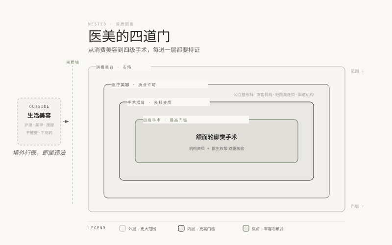

# 03 · 行业地图，一座叫"医美"的城市

> **阶段 1 · 学交规** ｜ 预计用时：2 周 ｜ 前置课程：02

## 学习目标

- 一张图看懂行业结构：生美与医美的边界、四类机构、产业链上下游
- 认识岗位生态，知道新人的入口在哪、入口不在哪
- 完成属于你自己的手绘行业地图

## 正文

### 一、先认边界：生美区和医美区隔着一道资质墙

把行业想象成一座城市。城墙外是**生活美容区（生美区）**：皮肤护理、美甲、睫毛、按摩，不破皮、不用药、不动医疗器械。城墙内是**医疗美容区（医美区）**：注射、激光光电、手术，凡是"破皮、进针、用药、用医疗器械"的，全部属于医疗行为，必须在持有《医疗机构执业许可证》（含医疗美容诊疗科目）的机构里、由具备资质的医务人员操作。

这道墙就是你要背的第一条交规：**生美店里做医美，等于无证驾驶。** 你未来会遇到的很多"渠道客人"，正是从生美店被引导过来的，她们未必知道这道墙的存在，而你要知道，并且永远不能参与翻墙。

### 二、城市里的四个街区：机构类型

**公立医院整形科**：公信力强、价格相对透明，但咨询类岗位少、流程偏"看病"，不强调服务体验。适合观察学习，不太适合新人入行。

**民营直客机构**：靠口碑和自然到店获客，重视现场体验和服务流程，是**现场咨询师岗位的主力需求方，新人的首选街区**。客人是自己走进来的，意味着咨询的重心是"帮人想清楚"，不是"把人拦下来"。

**渠道机构**：客源主要靠美容院等渠道分成转介绍，销售文化普遍高压，咨询师容易被迫扮演第 01 课里那条"旧车道"的角色。**新人慎入**，不是绝对不能去，是要想清楚代价。

**轻医美连锁**：以注射、光电等非手术项目为主，标准化程度高、扩张快，岗位数量多。适合新人快速上手标准流程，也要警惕"流水线式咨询"对专业能力的窄化。

### 三、城市外面：产业链上下游

上游是药械与设备厂商（玻尿酸、肉毒杆菌素、光电设备等），中游是机构，下游是获客渠道（电商平台、内容平台、渠道美容院、机构自媒体）。咨询师站在中游的柜台上：你嘴里说出的每一个产品名词，背后都有上游的市场费用在塑造；你接待的每一位客人，背后都有下游的流量成本在加压。**知道钱从哪来、往哪去，你才能理解机构为什么给你压力，以及哪些压力该扛、哪些该躲。**

### 四、岗位生态：你的入口站点

- **现场咨询师 / 现场咨询助理**：面对面接待，本课程的主目标岗位（AI 替代不了）
- **网电咨询师**：线上不见面咨询，正被 AI 快速替代，只能当跳板不能当终点
- **皮肤管理师 / 皮肤科咨询师助理**：从皮肤项目入行的稳妥路径，与本课程阶段 2 的皮肤教材直接对口
- **医生助理**：更靠近医疗核心，部分机构要求医学背景，是阶段 5 分支路线的方向之一
- **客服 / 会员管理**：接触老客户最多，练客户经营的好位置，转咨询的内部通道
- **运营 / 市场**：偏机构侧，不是本课程主线，但懂运营的咨询师更值钱

### 五、这张图怎么用

这张地图不是用来背的，是用来**定位**的：之后每学一个知识点，问自己"这属于哪个街区、哪个站点在用它"。比如第 06 课的皮肤知识，是轻医美连锁和皮肤管理师站点的硬通货；第 14 课的话术，在直客机构的现场每天都在发生。

地图上的机构特点属于行业一般情形的概括，**具体机构的资质、口碑、经营状况，入职或推荐前必须逐家核验**（属地卫健委官网可查执业许可，这是"需另行核验"清单的常驻项）。

## 本课作业

1. 手绘一张你自己的行业地图（默画，画不出的部分回课文补），贴在学习区
2. 按城市筛选 5 家你未来可能投递的机构，逐家查：执业许可公示、主营项目、医生团队、公开评价，各写 100 字档案
3. 若有条件，访谈一位在职咨询师或皮肤管理师（通过朋友介绍），问三个问题：一天的工作流程？最高兴和最难受的时刻各一件？给新人的一个忠告？

## 通关检验

- 给一位完全外行的亲友讲解"生美和医美隔着什么、四类机构各是什么、新人该从哪个岗位进"，对方能复述要点
- 5 家机构档案完成，且每家都注明信息来源

## 配套教材

- 《00-课程设计总纲》阶段 1 模块 1.1
- 《01-开课词》：旧车道与新车道（理解渠道机构风险的背景）
