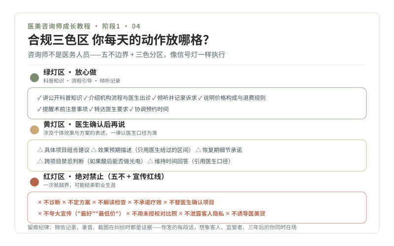

# 04 · 合规红线，咨询师不是医务人员

> **阶段 1 · 学交规** ｜ 预计用时：2 周 ｜ 前置课程：03

## 学习目标

- 背下"五不"边界：咨询师绝对不碰的五件事
- 学会识别广告与宣传红线，能标注违规案例
- 建立"留痕意识"：默认每句话都可能被录音截图

**本课是全课程优先级最高的一课。** 项目知识差一点可以慢慢补，红线踩一次就可能结束职业生涯。

## 正文

### 一、为什么红线是第一课

第 01 课讲过，这个岗位长期背负"名义咨询、实际推销"的批评，2021 年的政协提案正是冲着这个来的。监管对医美营销的高压是长期趋势，而你，一个没有医学学历、没有执业资质的咨询师，恰恰站在最容易越界的位置上。**红线思维不是"懂法"那么复杂，而是像信号灯一样：哪几个动作是红灯，永远不碰。**

### 二、"五不"边界：咨询师绝对不碰的五件事

你可能会遇到医生忙不过来、客人急着要答案、机构催着你成单，越是在这种时候，越要回到这五条：

1. **不诊断**：客人问"我这是不是黄褐斑"，你的回答是"皮肤问题需要医生当面判断"，然后描述你观察到的现象，转给医生
2. **不制定或更改治疗方案**："打几支、打哪里、用什么牌子"永远是医生的判断，你负责转达客人的诉求和预算
3. **不解读检查结果**：化验单、影像报告，一个字都不解读
4. **不承诺疗效**："肯定有效""包成功""维持三年没问题""绝对安全"，这些词从你嘴里说出来，每一个都是把机构和你自己架在火上
5. **不替医生做最终项目确认**：医生面诊之前的任何"方案"，都只是"待医生确认的初步沟通"

### 三、三色区：把日常动作放进绿灯、黄灯、红灯

**绿灯区（放心做）**：讲公开的科普知识；介绍机构流程、医生出诊安排；倾听和记录客人的诉求；说明价格构成与退费规则；提醒术前注意事项；转达医生的要求。

**黄灯区（医生确认后再说）**：涉及具体项目组合的建议；效果预期的具体描述（必须用医生给过的区间）；术后恢复的细节承诺（"几天能化妆"要医生定）；跨项目的禁忌（比如果酸后能不能打激光）。

**红灯区（绝对禁止）**：五不边界 + 夸大宣传（"最好的医生""全城最低价"）+ 使用未经授权的术前术后对比照片 + 泄露客人隐私（朋友圈发客人案例没拿到书面授权，就是事故）+ 任何形式的"医美贷"诱导话术。

### 四、留痕意识：默认"违章抓拍"常开

交通违法为什么越来越少？因为摄像头无处不在。医美咨询也一样：**微信聊天记录、录音、截图、转账记录，在纠纷发生时全都会成为证据。** 实操纪律：

- 涉及效果、风险、价格的重要沟通，尽量落到文字，且用"多数人""因人而异""以医生面诊为准"这类表述
- 客人的照片、姓名、案例，未经书面授权不用于任何宣传
- 你发给客人的每一段话，想象它同时被三个读者读：客人本人、监管者、三年后的你

### 五、情景判断示范（8 题）

1. 客人发来化验单："帮我看看这个指标正常吗？" **红**："检查结果请医生当面解读，我帮您约时间。"
2. "你就直接告诉我打几支玻尿酸合适，我不想再等医生了" **红**："注射部位和剂量是医生的医疗判断，我不能替他决定；我马上帮您协调最早的医生面诊。"
3. "做完这个项目能维持多久？" **黄**：引用医生给过的区间（"医生面诊评估后会给您个人情况下的维持时间，一般人群参考是……"），不自行给数
4. 机构要求你发"隆鼻手术全场五折，最后三天" **红**："限时+折扣"组合刺激，医疗广告红线高发区，先按下，按机构合规流程确认表述
5. 客人让你看朋友圈案例照问"我能做成这样吗" **黄/红**：不承诺"能做成"；说明个体差异，引导到医生面诊评估
6. "我朋友在他们家做坏了，你们能保证不出问题吗？" **红**："任何医疗操作都有风险，我们能做的是把风险讲清楚、由医生评估您适不适合。"
7. 客人是未成年人，想打玻尿酸，说妈妈同意了 → **红**：未成年人医美有严格限制，必须监护人到场面诊确认，且多数情形本身就不适合
8. 你想在小红书发对比图引流 → **红/黄**：未经书面授权的客人照片不能用；平台对医美内容另有规则，先学平台规则再发

### 六、需另行核验清单（入职前重做一遍）

本课教的是"红线思维框架"。以下内容随时间和属地变化，**入职任何城市前，按最新原文逐条核对**：《广告法》与《医疗广告管理办法》现行规定、属地卫健委对医疗美容营销执法案例、你所在机构的合规 SOP、各内容平台的医美内容规则。

另外记住一条防坑提醒：市面上各类"医美咨询师资格证"培训，绝大多数是培训机构自行发证，**均非国家职业资格**。任何"交钱包过、包就业"的话术，直接按红灯处理。

## 本课作业

1. 把"五不"抄写在卡片正面、三色区缩略抄在背面，随身一周
2. 收集 10 个医美违规宣传真实案例（行政处罚公示、新闻报道均可），逐条标注踩了哪条红线，注明信息来源
3. 把 8 道情景题遮住答案自测，错题入错题本

## 通关检验

- 15 道情景判断题（8 道课内 + 7 道作业后自编）全对
- 10 个违规案例标注完成，且每个都写得出"为什么"
- 能向他人完整讲出"五不"并各举一个反例

## 配套教材

- 《00-课程设计总纲》阶段 1 模块 1.2
- 《01-开课词》真相一（取缔提案的背景）
- 违规案例来源建议：属地市场监督管理局行政处罚公示、国家卫健委官网执法通报
