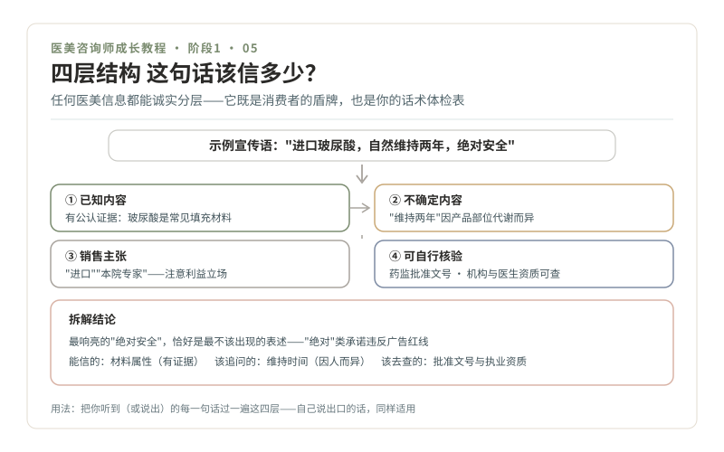

# 05 · 消费者视角，四层结构与暗访作业

> **阶段 1 · 学交规** ｜ 预计用时：2 周 ｜ 前置课程：04

## 学习目标

- 掌握"四层结构"信息拆解法，任何宣传语都能诚实分层
- 完成一次以顾客身份的初诊体验（合法暗访），写出观察报告
- 完成阶段 1 通关考核

## 正文

### 一、先学会当消费者，再学会当咨询师

你未来的客人就是消费者。她们走进机构时带着的不安，和你作为转行者面对这个行业的不安，是同一种：**不知道哪些话该信。** 所以学交规的最后一课，不是背机构的立场，而是练消费者的眼睛。信任这个东西，"我说你信"没有用，得让她自己能验证。

### 二、四层结构：一条宣传语的诚实拆法

任何一条医美信息，都可以拆成四层。拆完之后，哪些能信、信多少、怎么验证，一目了然。

- **第一层 · 已知内容**：有公认证据或权威口径支撑的部分。例如"透明质酸是人体本身存在的成分""注射属于医疗行为"。
- **第二层 · 不确定内容**：因人而异、无法提前保证的部分。例如"维持多久""淤青几天消退""最终效果什么样"。
- **第三层 · 销售主张**：带利益立场的判断。例如"我们家医生是这块最好的""这个套餐最划算"。不是必然虚假，但要意识到说话者的立场。
- **第四层 · 可自行核验**：消费者自己动手就能查的部分。例如机构执业许可（属地卫健委官网）、医生执业注册信息、产品是否为药监部门批准的正规产品。

**示范拆解一条宣传语："进口玻尿酸，自然维持两年，绝对安全，本院专家亲自注射。"**

| 层 | 拆解 |
| --- | --- |
| 已知 | 玻尿酸（透明质酸）是常见填充材料，注射属医疗行为 |
| 不确定 | "维持两年"因产品、部位、代谢而异，个体无法保证 |
| 销售主张 | "进口""本院专家"，进口不等于更适合，"专家"需要查执业信息验证 |
| 可核验 | 产品是否有药监批准文号；机构和医生资质可查；"绝对安全"本身违反广告红线 |

拆完你会发现：这句话里最响亮的"绝对安全"，恰好是最不该出现的表述。**四层结构既是消费者的盾牌，也是你未来的话术体检表**，你自己说出口的每句话，都先过一遍这四层。

### 三、暗访作业：以顾客身份走一遍初诊

带着刚学的工具，去真实体验。选择 2-3 家不同类型机构（直客机构、轻医美连锁各至少一家），以普通顾客身份咨询一个你有真实兴趣了解的项目（如皮肤检测、光子嫩肤类入门项目）。

**这是完全合法的消费者体验**，但有三条纪律：不虚构病史套取方案；不录音录像侵犯他人（只事后凭记录写报告）；只观察流程，不做曝光式"钓鱼"。

**观察清单（每家按此记录）：**

1. **动线**：进门到落座用了多久？检测、咨询、报价、医生面诊的顺序是怎样的？
2. **提问**：对方问了你哪些问题？问了多少？有没有问病史、过敏史、既往项目史？
3. **风险告知**：主动讲到风险和恢复期了吗？讲了哪些？用词是"多数人/因人而异"还是"绝对/肯定"？
4. **报价**：什么时候报价？价格构成讲清楚了吗？有没有"今天定才有优惠"？
5. **压力感**：全程哪个瞬间让你最不舒服？（这个瞬间往往就是越界点）
6. **四层拆解**：把你听到印象最深的一句话拆进四层结构

**报告写法**：每家一页，结构固定，基本印象（3 句）→ 六项观察记录 → "最不舒服的瞬间"详写 → 如果我是这家机构的咨询师，我会保留什么、改进什么（各 2 条）。

### 四、阶段 1 通关考核

三件事，全部完成即通过：

1. **外行讲解测试**：向亲友讲清"医美行业是什么、咨询师能干什么不能干什么"，对方能复述要点
2. **合规测试**：15 道情景题全对（第 04 课 8 道 + 自编 7 道）
3. **暗访报告**：2-3 家机构报告完成，每份都包含"最不舒服的瞬间"和四层拆解

## 本课作业

1. 用四层结构拆解 5 条机构宣传语（暗访听到的、朋友圈看到的都可以），每条做成一张表
2. 完成 2-3 家机构的暗访报告
3. 通过阶段 1 通关考核，给自己亮起第一条"绿波带"奖励

## 配套教材

- 《00-课程设计总纲》阶段 1 模块 1.3、1.4
- 《04-合规红线》：三色区（暗访观察的对照工具）
- 核验渠道：属地卫健委官网（机构执业许可）、国家卫健委医生执业注册信息查询入口（属"需另行核验"类，以最新官方渠道为准）
