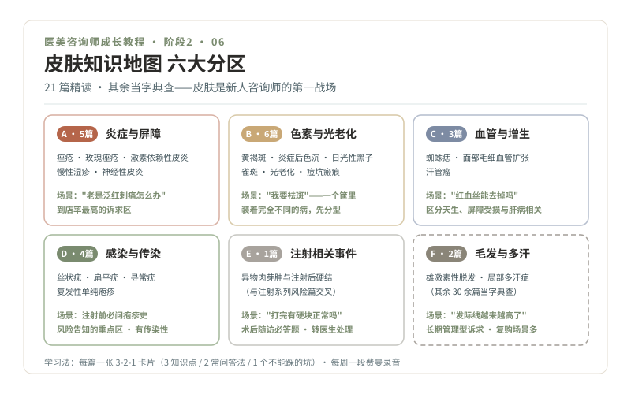

# 06 · 皮肤底盘，21 篇精读地图

> **阶段 2 · 认识车流** ｜ 预计用时：5 周（每周 4 篇 + 复盘） ｜ 前置课程：05

## 学习目标

- 建立皮肤知识的分组框架：六大类、21 篇精读、其余当字典查
- 掌握 3-2-1 卡片法（本课用《痤疮》做完整示范）
- 产出第一批 21 张学习卡片

## 正文

### 一、为什么从皮肤开始

轻医美和皮肤项目是新人咨询师接触最多的场景：到店的客人大多从"皮肤不好"聊起，痘、斑、红、敏、垮。皮肤知识是你上岗第一天就会用到的硬通货，而且它是整个知识体系里最"看得见摸得着"的部分，学习反馈最快。

先看地图再上路：

### 二、21 篇精读清单（按组推进）

教材为本仓库《皮肤常见病症科普系列》（路径 `../皮肤常见病症科普系列/`），每周一组或两组，先通读再精读。

**A 组 · 炎症与屏障（5 篇，第 1 周）**，到店率最高的诉求区

- [00-痤疮](../皮肤常见病症科普系列/00-痤疮.md)
- [01-玫瑰痤疮](../皮肤常见病症科普系列/01-玫瑰痤疮.md)
- [02-激素相关性面部皮炎与屏障受损](../皮肤常见病症科普系列/02-激素相关性面部皮炎与屏障受损.md)
- [16-慢性湿疹](../皮肤常见病症科普系列/16-慢性湿疹.md)
- [17-神经性皮炎](../皮肤常见病症科普系列/17-神经性皮炎.md)

**B 组 · 色素与光老化（6 篇，第 2 周）**，"祛斑"这个大筐里装着完全不同的病

- [04-黄褐斑](../皮肤常见病症科普系列/04-黄褐斑.md)
- [05-炎症后色素沉着](../皮肤常见病症科普系列/05-炎症后色素沉着.md)
- [06-日光性黑子](../皮肤常见病症科普系列/06-日光性黑子.md)
- [08-雀斑](../皮肤常见病症科普系列/08-雀斑.md)
- [41-光老化](../皮肤常见病症科普系列/41-光老化.md)
- [42-萎缩性瘢痕与痘坑](../皮肤常见病症科普系列/42-萎缩性瘢痕与痘坑.md)

**C 组 · 血管与增生（3 篇，第 3 周上）**

- [48-蜘蛛痣](../皮肤常见病症科普系列/48-蜘蛛痣.md)
- [49-面部毛细血管扩张](../皮肤常见病症科普系列/49-面部毛细血管扩张.md)
- [24-汗管瘤](../皮肤常见病症科普系列/24-汗管瘤.md)

**D 组 · 感染与传染（4 篇，第 3 周下）**，风险告知的重点区

- [28-丝状疣](../皮肤常见病症科普系列/28-丝状疣.md)
- [29-扁平疣](../皮肤常见病症科普系列/29-扁平疣.md)
- [30-寻常疣](../皮肤常见病症科普系列/30-寻常疣.md)
- [53-复发性单纯疱疹](../皮肤常见病症科普系列/53-复发性单纯疱疹.md)（注射前必问病史，见第 07 课）

**E 组 · 注射相关皮肤事件（1 篇，第 4 周上）**

- [50-异物肉芽肿与注射后硬结](../皮肤常见病症科普系列/50-异物肉芽肿与注射后硬结.md)（与注射系列风险篇交叉，务必精读）

**F 组 · 毛发与多汗（2 篇，第 4 周下）**

- [32-雄激素性脱发](../皮肤常见病症科普系列/32-雄激素性脱发.md)
- [36-局部多汗症](../皮肤常见病症科普系列/36-局部多汗症.md)

第 5 周复盘：把 21 张卡片打乱，随机自测，答不出的回炉。**其余 30 余篇（癣类、痣类、唇炎、白癜风等）当字典用**：接待中遇到再查，查完当场补一张卡片。

### 三、3-2-1 卡片法：完整示范

以《00-痤疮》为例，一张标准卡长这样：

> **【痤疮】卡片 A-01**
>
> **3 个知识点**
> 1. 痤疮是毛囊皮脂腺单位的慢性炎症性疾病，不是"脸没洗干净"，更不是"排毒"
> 2. 皮损分等级：粉刺（闭口）→ 丘疹脓疱（炎性）→ 结节囊肿（深部、留疤风险高），严重度看类型不只看数量
> 3. 痘印分红（血管）与黑褐（色素），会自然淡化；痘坑是真皮结构改变，护肤品填不平，处理顺序必须"先控新痘、再治旧坑"
>
> **2 个求美者常问 + 标准答法**
> 1. "我是不是清洁不到位才长痘？"，"恰恰相反，很多人是清洁过度。痤疮是毛囊皮脂腺的慢性炎症，和激素、遗传、作息都有关，医生会按皮损类型分级处理，我先帮您约皮肤科面诊。"
> 2. "痘印痘坑能不能一次做掉？"，"痘印多数会随时间变淡，痘坑是真皮层面的改变，需要医生评估类型后分步处理，通常先把新痘控制稳定再治坑，顺序反了容易白花钱。"
>
> **1 个绝不能踩的坑**
> - 绝不承诺"几次根治、永不复发"，痤疮是慢性病，管理目标是控制与防疤，不是"清零"

### 四、学习纪律

- **先通读后精读**：第一遍快速读完掌握结构，第二遍做卡片
- 卡片是给你自己看的，用自己的话写，抄书不算卡片
- 每张卡片的"常问答法"必须符合第 04 课三色区，凡是让你替医生下判断的答法，重写
- 费曼录音：每周把当周组别的知识讲一遍，录音存档，第 10 周回头重听（你会惊讶自己进步了多少）

## 本课作业

1. 完成 21 篇精读 + 21 张 3-2-1 卡片
2. 每周一段费曼录音（共 5 段）
3. 字典演练：随机翻 3 篇未精读篇章，限时 20 分钟读完并口头复述要点（练"接待中遇到再查"的临场能力）

## 通关检验

- "给闺蜜讲明白"测试第一轮：从 A、B 组随机抽 6 题，每题 5 分钟脱稿讲解（外行听懂 + 风险讲清 + 无红线话术）
- 21 张卡片全部完成且通过自检（常问答法无越界表述）

## 配套教材

- 《皮肤常见病症科普系列》全 55 篇（`../皮肤常见病症科普系列/`）
- 《00-课程设计总纲》阶段 2 · 学习方法
- 《04-合规红线》三色区（卡片答法的过滤器）
