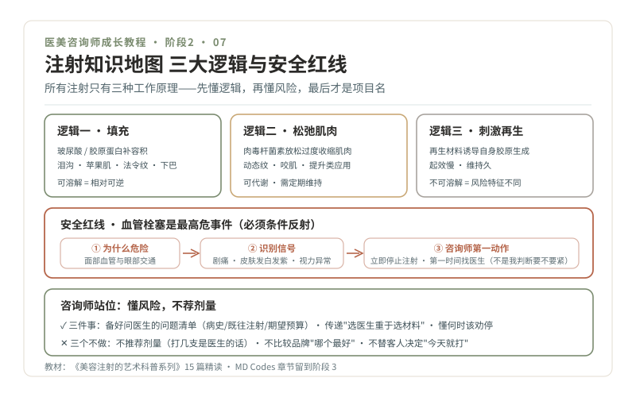

# 07 · 注射底盘，三大逻辑与风险重灾区

> **阶段 2 · 认识车流** ｜ 预计用时：4 周 ｜ 前置课程：06

## 学习目标

- 用"三大逻辑"框架看懂所有常见注射项目
- 精读 15 篇注射教材，重点吃透血管栓塞的识别与急救路径
- 明确咨询师在注射场景的站位：懂风险、不荐剂量

## 正文

### 一、为什么注射是必修课

注射是轻医美的绝对主力，也是**信息最不对称、风险最集中的品类**：客人分不清玻尿酸和肉毒的区别，却被"3 天见效""午休变美"的宣传包围。咨询师若不懂，要么被客人问倒，要么胡说踩线。教材为本仓库《美容注射的艺术科普系列》（路径 `../美容注射的艺术科普系列/`）。

### 二、三大逻辑：所有注射只有三种"工作原理"

这是整个注射知识的总纲（详见 [01-美容注射不只是打一针](../美容注射的艺术科普系列/01-美容注射不只是打一针.md)、[02-三类注射材料的核心区别](../美容注射的艺术科普系列/02-三类注射材料的核心区别.md)）：

1. **填充**：用玻尿酸、胶原蛋白等补容积，泪沟、苹果肌、法令纹、下巴（[06-玻尿酸是什么](../美容注射的艺术科普系列/06-玻尿酸是什么.md)、[18-胶原蛋白直接填充](../美容注射的艺术科普系列/18-胶原蛋白直接填充.md)）
2. **松弛肌肉**：肉毒杆菌素放松过度收缩的肌肉，动态纹、咬肌肥厚（[11-肉毒杆菌素](../美容注射的艺术科普系列/11-肉毒杆菌素.md)、[12-动态纹和静态纹](../美容注射的艺术科普系列/12-动态纹和静态纹.md)、[13-咬肌肥厚与瘦脸针](../美容注射的艺术科普系列/13-咬肌肥厚与瘦脸针.md)）
3. **刺激再生**：再生类材料诱导自身胶原生成，起效慢、维持久、不可溶解，风险特征完全不同（[16-再生类材料](../美容注射的艺术科普系列/16-再生类材料.md)、[17-再生类材料的远期](../美容注射的艺术科普系列/17-再生类材料的远期.md)）

记住这个框架，客人报出任何项目名，你先问自己：它是哪种逻辑？层次在哪？可逆吗？

### 三、安全红线：血管栓塞是最高危事件

这一节是 15 篇里分量最重的部分，你必须能脱口而出：

- **为什么危险**：面部血管丰富且与眼部血管有交通，填充物误入血管可能造成皮肤坏死、失明等严重后果，鼻部与眶周是高危区（[08-鼻部注射的血管风险](../美容注射的艺术科普系列/08-鼻部注射的血管风险.md)、[03-一张脸的解剖](../美容注射的艺术科普系列/03-一张脸的解剖.md)）
- **如何识别**：注射后剧烈疼痛、皮肤发白发紫、视力异常等不是"正常反应"（[26-血管栓塞](../美容注射的艺术科普系列/26-血管栓塞.md)）
- **如何急救**：立即停止注射、由医生处理，透明质酸填充可用透明质酸酶溶解，这正是"可溶"与"不可溶"材料风险差异的关键（[28-透明质酸酶](../美容注射的艺术科普系列/28-透明质酸酶.md)、[27-结节过敏感染](../美容注射的艺术科普系列/27-结节过敏感染.md)）

**咨询师的职责边界**：识别异常信号并第一时间找到医生，而不是自己判断"要不要紧"。把这套识别—上报路径背到条件反射。

### 四、咨询师的三件事与三个不做

**三件事**：

1. 帮客人准备好问医生的问题（[05-注射面诊清单](../美容注射的艺术科普系列/05-注射面诊清单.md)）：病史（重点：疱疹史、过敏史，呼应皮肤系列《53-复发性单纯疱疹》）、既往注射史、期望与预算
2. 传递"选医生比选材料更重要"的判断框架（[04-选注射医生比选材料更重要](../美容注射的艺术科普系列/04-选注射医生比选材料更重要.md)）
3. 懂"何时该停止"（[30-何时该停止](../美容注射的艺术科普系列/30-何时该停止.md)、[20-注射的节奏](../美容注射的艺术科普系列/20-注射的节奏.md)）：过度注射的脸没有人好看，会劝停的咨询师才是好咨询师

**三个不做**：不推荐剂量（"打几支"是医生的话）；不比较品牌优劣（说事实，不说"哪个最好"）；不替客人决定"今天就打"（见第 12 课警讯分级）。

### 五、精读清单（15 篇 · 4 周）

- 第 1 周 · 基础逻辑：01、02、06、11
- 第 2 周 · 解剖与安全（最重要）：03、08、26、28
- 第 3 周 · 风险与选择：27（+ 回顾皮肤系列 50）、04、05、16
- 第 4 周 · 节奏与长期：20、21（[面部年轻化的容量概念](../美容注射的艺术科普系列/21-面部年轻化的容量概念.md)）、30

MD Codes 章节（31-40 篇）本阶段先跳过，阶段 3 讲面部分区时回来精读。

## 本课作业

1. 完成 15 篇精读 + 15 张 3-2-1 卡片
2. "血管栓塞三问"自测：为什么危险？有哪些信号？咨询师第一动作是什么？三天内随机自测三次，每次 30 秒内答完
3. 费曼录音：给"想象中的闺蜜"讲清"玻尿酸、肉毒、再生针到底差在哪"

## 通关检验

- "给闺蜜讲明白"测试第二轮：注射随机抽 6 题（含至少 2 题风险类），通过标准同第 06 课
- 血管栓塞三问三次自测全部通过
- 累计卡片 ≥ 36 张，错题本 ≥ 20 条

## 配套教材

- 《美容注射的艺术科普系列》全 40 篇（`../美容注射的艺术科普系列/`）
- 《皮肤常见病症科普系列》50（异物肉芽肿）、53（疱疹史）
- 《04-合规红线》黄灯区：效果与维持时间的答法纪律
