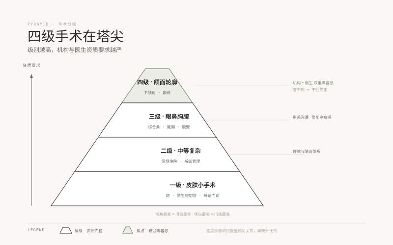

# 08 · 手术底盘，分级、资质与最长的决策链

> **阶段 2 · 认识车流** ｜ 预计用时：3 周 ｜ 前置课程：07

## 学习目标

- 理解手术分级与机构资质的对应关系（"四级手术"到底是什么）
- 精读 6 篇决策类教材，通览主要术式与风险量级
- 明确咨询师在手术场景的角色：陪诊者，不是促单者

## 正文

### 一、先搞懂"四级手术"这个门槛

美容外科手术按难度分级管理，级别越高，对机构资质、医生资质的要求越严格。**"四级手术"是难度与风险的最高级别**（典型如颌面部轮廓手术），不是所有机构都能做，也不是所有整形医生都有资质做，这正是客人最容易被忽悠的地方：在不具备对应级别的机构做了高级别手术。详见 [00-什么是四级美容手术](../四级与整形美容手术科普系列/00-什么是四级美容手术.md)、[01-手术分级与机构资质](../四级与整形美容手术科普系列/01-手术分级与机构资质.md)。

咨询师的实操要点：客人提到手术项目时，你的标准动作是**核对两件事**，机构的手术资质级别、医生的执业范围与手术权限（查证渠道见第 05 课"可自行核验"层）。你不需要背下全部分级表，你需要背下"查什么、去哪查、查不到就不往前走"。

### 二、决策链最长：手术是"慢决策"，冲动是最大敌人

注射决策链以"周"计，手术决策链以"月"计。教材里最值得反复读的正是 6 篇决策类文章：

- [02-如何选医生](../四级与整形美容手术科普系列/02-如何选医生.md)：资质、案例、审美沟通三件套
- [03-面诊要问什么](../四级与整形美容手术科普系列/03-面诊要问什么.md)：把它改写成你的"陪诊清单"
- [04-费用与价值判断](../四级与整形美容手术科普系列/04-费用与价值判断.md)：贵的和便宜的区别到底在哪
- [05-决策与心理预期](../四级与整形美容手术科普系列/05-决策与心理预期.md)：期望管理是手术咨询的核心

手术咨询的三道关，都不是"今天能不能定"：

1. **心理预期关**：客人想的是"换头"，医学能给的是"改善"，差距不弥合，术后必炸
2. **支持系统关**：恢复期需要家人知情与照护，瞒着家人做大手术是重大风险信号
3. **生活安排关**：假期、工作可见度、术后护理条件，安排不了恢复期就不该排手术期

**冷静期是你的职业价值**：能说"您先回去想两周，方案和医生出诊我都给您留着"的咨询师，在手术品类里反而更被信任。

### 三、术式通览：知道有什么、风险量级在哪

通读系列各论（06 篇及以后），不要求记住术式细节，要求形成"风险量级直觉"：

| 类别 | 代表术式 | 风险量级与决策要点 |
| --- | --- | --- |
| 轮廓类 | 下颌角成形、颧骨颧弓成形 | 最高级 · 四级手术 · 资质核对零容忍 |
| 眼鼻类 | 重睑、隆鼻、综合鼻 | 中高级 · 修复率不低 · 审美沟通是成败关键 |
| 胸部类 | 隆胸 | 中高级 · 假体类型与远期随访 |
| 腹部与体型类 | 腹壁成形、吸脂 | 见《腹壁整形科普系列》（`../腹壁整形科普系列/`），产后与减重人群的情感诉求重 |
| 皮肤小手术 | 痣、赘生物切除 | 低量级 · 但同样必须在医疗机构做 |

### 四、咨询师角色：陪诊者，不是促单者

手术客单价高，提成诱惑大，这正是旧车道思维最容易复活的场景。你的站位：

- **信息整理者**：把客人的诉求、病史、疑虑整理成清晰的医生面诊摘要（第 10 课教写法）
- **期望的降温者**：引用医生的评估，把"换头梦"翻译成"可实现的改善区间"
- **恢复期的护航者**：术后随访、异常信号的第一响应人（呼应第 07 课的识别—上报路径）
- **永远不是**：方案的拍板人、价格的最终谈判人、"再不定就没优惠了"的话术执行人

## 本课作业

1. 精读 6 篇决策类文章 + 通览术式各论，产出 6 张卡片 + 1 张"风险量级表"（默画）
2. 把《03-面诊要问什么》改写成你的《手术陪诊清单》（一页，按术前—面诊—术后三段组织）
3. 费曼录音："为什么四级手术不能随便找机构做"

## 通关检验

- "给闺蜜讲明白"测试第三轮：手术随机抽 4 题 + 手术与注射决策链差异 1 题
- 《手术陪诊清单》完成并经一位外行朋友读后能看懂
- 默画风险量级表，无遗漏类别

## 配套教材

- 《四级与整形美容手术科普系列》全 31 篇（`../四级与整形美容手术科普系列/`）
- 《腹壁整形科普系列》（`../腹壁整形科普系列/`），重点读 C2《那些必须正视的风险》
- 《04-合规红线》资质核验部分
