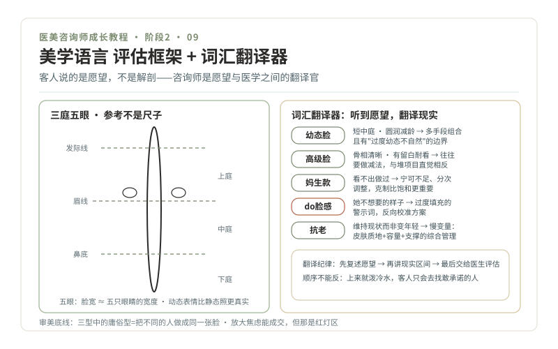

# 09 · 美学语言，从三庭五眼到骨相皮相

> **阶段 2 · 认识车流** ｜ 预计用时：3 周 ｜ 前置课程：08

## 学习目标

- 掌握基础面部评估语言：三庭五眼、骨相皮相、动态静态
- 学会"词汇翻译器"：把求美者的愿望词汇翻译成医学现实
- 建立审美底线：不把人带向流水线网红脸

## 正文

### 一、咨询师的第一外语

客人不会说"我想改善中面部容量缺失"，她们说"我想看起来没那么累""想要幼态一点""要妈生款"。**美学语言就是这行的方言**，你听不懂方言，就做不了翻译官；你的翻译质量，直接决定医生拿到的信息质量。教材：《医美亚美学科普系列》（`../医美亚美学科普系列/`）与《医美美学三型科普系列》（`../医美美学三型科普系列/`）。

### 二、比例语言：三庭五眼，是参考不是尺子

[01-医美亚美学是什么](../医美亚美学科普系列/01-医美亚美学是什么.md) 给出的基础框架：正面观"三庭"（发际线到眉、眉到鼻底、鼻底到下巴的三等分）与"五眼"（脸宽约等于五只眼睛的宽度）。记住两条纪律：

1. **比例是参考，不是尺子。** 它帮你描述问题，不能替医生决定方案，更不能拿它评判客人"不标准"，审美没有唯一解
2. **静态照骗人，动态才真实。** 静态照片与真人动态表情差别巨大，评估要看动态（笑、抬眉、说话）

### 三、骨相与皮相：框架与内容物

[06-骨相美与皮相美](../医美亚美学科普系列/06-骨相美与皮相美.md)：骨相是框架（骨骼、软骨、筋膜韧带），皮相是内容物（脂肪、肌肉、皮肤质地）。衰老 = 框架支撑下降 + 内容物流失移位 + 皮肤质地改变三线并进，这正是 [07-抗老美学](../医美亚美学科普系列/07-抗老美学.md) 和注射教材《21-面部年轻化的容量概念》共同的底层逻辑。咨询师能用这套语言向客人解释"为什么医生建议先补容量再做皮肤"，客人就更容易理解方案逻辑而不是纠结项目名。

### 四、词汇翻译器：听到愿望，翻译现实

| 客人的词 | 她真正想要的 | 你要翻译的医学现实 |
| --- | --- | --- |
| 幼态脸 | 短中庭、圆润、减龄感 | [02-幼态脸](../医美亚美学科普系列/02-幼态脸.md)：多手段组合，且有"过度幼态不自然"的边界 |
| 高级脸 | 骨相清晰、有留白、耐看 | [03-高级脸](../医美亚美学科普系列/03-高级脸.md)：往往要"做减法"，与堆项目的直觉相反 |
| 妈生款 / 自然款 | 看不出做过 | [04-妈生款与自然款](../医美亚美学科普系列/04-妈生款与自然款.md)：宁可不足、分次调整，克制比饱和更重要 |
| do 脸感 / 网红脸（贬义） | 她不想要的样子 | [05-do脸感与网红脸](../医美亚美学科普系列/05-do脸感与网红脸.md)：过度填充的警示词，反向校准方案 |
| 抗老 | 维持现状而非变年轻 | 抗老是"慢变量"，皮肤质地+容量+支撑的综合管理 |

翻译纪律：**先复述愿望，再讲现实区间，最后交给医生评估。** 顺序不能反，上来就泼冷水，客人只会去找敢承诺的人。

### 五、审美底线：三型与容貌焦虑

《医美美学三型科普系列》把审美取向分为高级型、技术型、庸俗型（[01-总论](../医美美学三型科普系列/01-医美美学三型总论.md)）。你要重点读的是两篇"反面教材"：[08-庸俗型医美美学](../医美美学三型科普系列/08-庸俗型医美美学.md) 和 [09-流水线化与趋同](../医美美学三型科普系列/09-流水线化与趋同.md)，**把不同的人做成同一张脸，是庸俗型的典型特征；而咨询师是流水线最容易的起点**（一套话术卖所有人）。[03-高级型的医患协作](../医美美学三型科普系列/03-高级型的医患协作.md) 则是你未来与医生、客人三方协作的范本。

[10-容貌焦虑美学](../医美亚美学科普系列/10-容貌焦虑美学.md) 划出愿望与焦虑的分界：愿望是"我想变得更好"，焦虑是"我这样不行"。前者可以聊方案，后者先聊情绪（第 12、13 课展开）。**放大焦虑能成交，但那是红灯区。**

### 六、精读清单（3 周）

- 第 1 周 · 基础框架：亚美学 01、06、07；回顾注射系列 21
- 第 2 周 · 词汇与底线：亚美学 02、03、04、05、10；三型 01、08、09
- 第 3 周 · 分区工具回归：注射系列 31、32（MD Codes 是什么 / 面部分区与编码逻辑）通读，39（解剖安全）精读；三型 03 精读

## 本课作业

1. 精读清单完成 + 卡片（累计 ≥ 60 张）
2. **20 张肖像分析**：公开的明星/模特照片（注意版权，仅私人练习用），每张 100 字：骨相皮相各一句、最突出的比例特征一句、如果她走进咨询室你会先问什么
3. 词汇翻译练习：找 5 位朋友说出她们的"变美愿望词"，逐个写翻译卡片

## 通关检验

- 阶段 2 总考核："给闺蜜讲明白"测试 10 题随机抽取（皮肤 4 + 注射 4 + 手术/美学 2），全部通过
- 20 张肖像分析 + 5 张翻译卡完成
- 错题本 ≥ 50 条（阶段 2 收官线）

## 配套教材

- 《医美亚美学科普系列》全 10 篇、《医美美学三型科普系列》全 10 篇
- 《美容注射的艺术科普系列》21、31、32、39
- 《00-课程设计总纲》阶段 2 · P1 美学进阶
