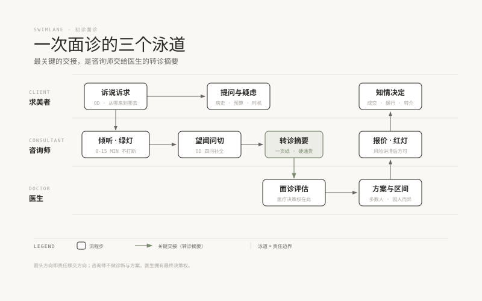

# 10 · 面诊技术，OD 访谈与信号配时

> **阶段 3 · 看懂路口** ｜ 预计用时：3 周 ｜ 前置课程：09（阶段 2 全部通过）

## 学习目标

- 用 OD 访谈法完成需求挖掘：四个问题看懂一位求美者
- 掌握"望闻问切"四步面诊流程与配时纪律
- 会写"转诊摘要"，你给医生的一页纸，也是你的核心职业产品

## 正文

### 一、面诊就是一个交叉口设计题

阶段 2 你认识了"车流"（知识），现在学"路口"（对话）。交通规划里有个经典方法叫 **OD 调查**（Origin–Destination，起讫点调查）：想管理一条路，先弄清车上的人从哪来、到哪去、走哪条路、何时出发。面诊完全同构：

- **从哪来（Origin · 诉求起源）**：为什么是现在？分手了？要拍婚纱照？闺蜜做了效果不错？还是刷到了某条视频？诉求起源决定情绪状态，情绪状态决定今天能不能谈方案
- **到哪去（Destination · 期望状态）**：让她具体描述"变好之后的样子"，最好能落地到场景："素颜拍照不用修""同学聚会看起来气色好"。**能描述场景的期望才能被评估，"就是想变美"无法评估**
- **走哪条路（Route · 项目认知与偏好）**：她自己查过什么、想做什目、怕什么。她提的项目未必适合她，但她提的方式暴露了她的信息来源和信任结构
- **何时出发（Timing · 决策时机与节奏）**：婚期、面试、季节、预算周期。时机不成熟的客人，正确动作是"养"而不是"催"（第 19 课展开）

### 二、望闻问切：四步流程

1. **望**：皮肤与面部的初步观察（用第 09 课的框架：比例、骨相皮相、皮肤质地），同时观察情绪状态和陪同关系。只记录，不下判断，诊断是医生的事
2. **闻**：听。听她说什么，更听她怎么说：反复回到同一个点，说明那才是真诉求；提到"我老公说""我闺蜜说"，说明决策结构里有别人
3. **问**：结构化补全，病史（过敏史、疱疹史、既往项目与反应）、护肤与用药、作息与防晒、预算区间、时间安排。用《注射面诊清单》和《手术陪诊清单》打底
4. **切**：把前三步整理成**转诊摘要**（见下），衔接医生面诊

### 三、配时纪律：什么时候倾听、什么时候问、什么时候停

把一次 60 分钟面诊想象成信号配时：

- **绿灯 · 倾听（前 15 分钟）**：不打断、不纠正、不推销。这 15 分钟买的是信任，也是信息，她主动说的比你问出来的值钱十倍
- **黄灯 · 追问与澄清（中段）**：OD 四问补全、病史问全、期望落地成场景。出现警讯信号（第 12 课）立即切换处置流程
- **红灯 · 报价（末段）**：报价前必须完成两件事，风险与恢复期讲清、医生初判衔接好。红灯前抢跑（先报价后讲风险）是纠纷的标准配方

### 四、转诊摘要：你交给医生的一页纸

这是咨询师专业度的"硬通货"，模板：

> **转诊摘要 · 张女士 32 岁（初诊）**
> **主诉**：双侧泪沟明显，笑起来"眼下两条纹"，想"看起来没那么累"
> **诉求起源**：近期升职需频繁出镜；闺蜜做了眶周改善效果自然
> **期望场景**：素颜开会不显疲态（可评估）；不接受"看出来的效果"
> **病史与既往**：无过敏史；3 年前外院注射过玻尿酸（品牌不详，自述已吸收）；偶发唇疱疹（每年 1-2 次）★
> **预算与时间**：预算区间 X；下周三后才有恢复期
> **疑虑**：怕做完显假；担心疱疹复发
> **一句话总结**：诉求清晰、期望合理，重点请医生评估泪沟层次与容量方案，注意疱疹史。

写摘要的三条纪律：事实与她的原话分开写；病史放显眼位置（★标记医生必须知道的事）；不做任何"建议做什么项目"的预设，**摘要写的是"人"，不是"单"**。

### 五、练习方法

一个人也能练：找朋友扮演求美者（给她们发角色卡：设定起源、期望、隐藏病史），完整走一遍四步，写出转诊摘要，全程录像。复盘看三件事：绿灯期有没有忍住不打断；OD 四问是否问全；摘要有没有越界写项目建议。

## 本课作业

1. 完成三场模拟面诊（三个不同角色卡），每场一份转诊摘要
2. 把配时纪律做成一张贴纸/手机壁纸，前 10 次面诊（含模拟）对照执行
3. 回顾《03-面诊要问什么》《05-注射面诊清单》，把两份清单合并成你的《万能问诊卡》

## 通关检验

- 三场模拟面诊录像，按"三件事"自评 + 一位朋友评"真诚度"
- 三份转诊摘要请一位医疗背景朋友（或用 AI 扮演医生视角）挑毛病，修改到"医生愿意收"的程度

## 配套教材

- 《美容注射的艺术科普系列》03、05；《四级与整形美容手术科普系列》03
- 《医美美学三型科普系列》03（高级型的医患协作）
- 《00-课程设计总纲》阶段 3 模块 3.2
