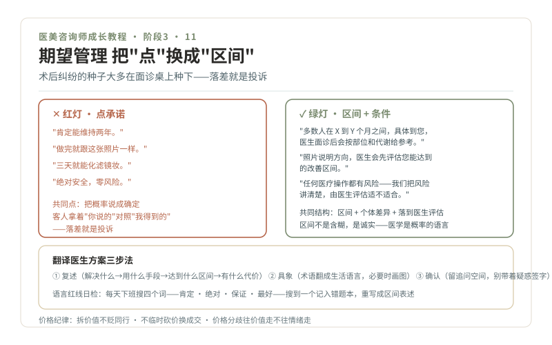

# 11 · 期望管理，效果区间表达法

> **阶段 3 · 看懂路口** ｜ 预计用时：2 周 ｜ 前置课程：10

## 学习目标

- 把所有效果表述从"点承诺"改写为"区间描述"
- 掌握翻译医生方案的三步法
- 学会价格问题的医疗导向答法

## 正文

### 一、术后纠纷的种子，大多在面诊桌上就种下了

第 08 课说过，手术决策链里期望不弥合、术后必炸。其实所有品类都一样：**客人拿着"你说的"来对照"我得到的"，落差就是投诉。** 期望管理的本质，是把"你说的"变成经得起对照的区间，这就是语言纪律。

### 二、效果区间表达法：把"点"换成"区间"

规则只有一条：**凡涉及效果、维持时间、恢复期，只说区间和条件，不说确定值。**

| 红灯说法（点承诺） | 绿灯说法（区间 + 条件） |
| --- | --- |
| "肯定能维持两年" | "这个产品的维持时间，多数人在 X 到 Y 个月之间，具体到您，医生面诊后会按部位和代谢情况给参考" |
| "做完就跟这张照片一样" | "照片可以说明方向，但每个人的基础不同，医生会先评估您能达到的改善区间" |
| "三天就能化滤镜妆" | "多数人恢复期在 X 到 Y 天，个体有差异，术后我们会按天跟进您的情况" |
| "绝对安全" | "任何医疗操作都有风险，我们能做的是把风险讲清楚、由医生评估您适不适合" |

注意绿灯说法的共同结构：**区间（说"多数人在某个范围"）+ 个体差异 + 落到医生评估**。区间不是含糊，是诚实，医学本身就是概率的语言。

### 三、翻译医生方案的三步法

医生讲完方案，客人常是一头雾水。你的翻译三步：

1. **复述**："我给您整理一下医生的意思，您听我讲得对不对"，把方案按"解决什么问题 → 用什么手段 → 达到什么区间 → 有什么代价（恢复期/风险/费用）"四段复述
2. **具象**：把术语翻成生活语言（"容量支持"→"把塌下去的地方垫回来一点"），必要时画简图
3. **确认**："这个理解对吗？还有什么想再问医生的？"，留下追问空间，别让客人带着疑惑签字

### 四、价格问题的医疗导向答法

"为什么这么贵""别家只要一半"，价格战的坑就在脚下。纪律三条：

- **拆价值，不贬同行**：把报价拆成医生资质与技术、产品器械来源、麻醉与安全保障、术后随访四块讲清楚，永远不说"他家用的肯定是假货"
- **不临时砍价换成交**：价格权限之外的让步去请示，用"赠术后护理/随访升级"替代"直接打折"（先与机构制度核对）
- **价格分歧往价值走，不往情绪走**："您觉得贵，是和哪个方案比？我拆开给您看看差别在哪。"

### 五、语言红线日检

每天下班前过一遍当天说过的话，重点搜四个词：**肯定、绝对、保证、最好**。搜到一个，记入错题本，重写成区间表述。坚持一个月，语言纪律会变成本能。

## 本课作业

1. 把上面对照表扩写：自己再写 8 组红灯/绿灯说法（覆盖皮肤、注射、手术各品类）
2. 翻译练习：把注射系列和手术系列的 3 个真实方案描述（教材里挑）翻译成"四段复述"讲给外行朋友听
3. 语言红线日检启动，连续 14 天记录

## 通关检验

- 12 组对照说法完成并全部通过三色区过滤
- 翻译练习 3 次录音，外行朋友能复述方案要点
- 14 天日检记录里，"肯定/绝对/保证"出现频次逐周下降

## 配套教材

- 《四级与整形美容手术科普系列》04、05（费用与价值判断 · 决策与心理预期）
- 《医美美学三型科普系列》03（高级型的医患协作）
- 《04-合规红线》黄灯区；《07-注射底盘》"三个不做"
