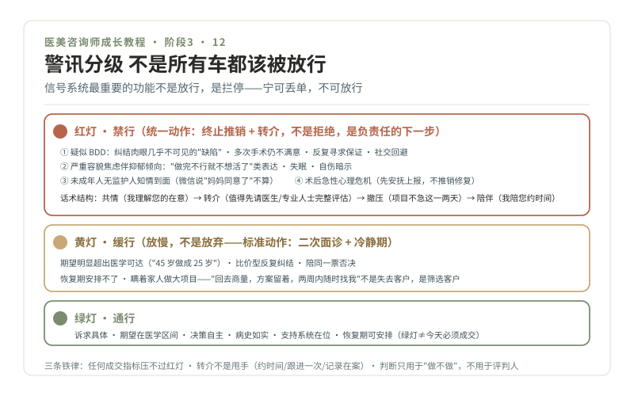

# 12 · 警讯系统，红黄绿灯分级

> **阶段 3 · 看懂路口** ｜ 预计用时：2 周 ｜ 前置课程：11

## 学习目标

- 建立面诊警讯的分级判断：红灯禁行、黄灯缓行、绿灯通行
- 掌握红灯场景的统一动作：终止与转介（不是拒绝，是负责任的下一步）
- 只学"识别与转介"，永远不尝试"心理治疗"

## 正文

### 一、不是所有车都该被放行

信号系统最重要的功能其实是拦停，其次才是放行。咨询师最容易犯的错，往往不是没成交，而是把不该放行的车放了进去：不适合的客人做完项目，纠纷、退费、心理危机都会找上门，对客人是伤害，对你是事故，对机构是黑点。这一课把第 10 课面诊流程里的"黄灯切换"展开成完整系统。

### 二、红灯 · 禁行（宁可丢单，不可放行）

**红灯一：疑似躯体变形障碍（BDD）。** 识别要点（同时出现越多越警惕）：

- 纠结的是肉眼几乎看不见或极轻微的"缺陷"，且反复描述、反复寻求保证（"你说实话，我是不是很丑"）
- 多次医美/手术史，每家都说"没做好"，仍持续寻求下一次
- 因外貌问题明显回避社交、工作受影响，或情绪痛苦程度与"缺陷"严重不相称

**你的动作是识别出"这单不能做"**，诊断是精神科医生的事。

**红灯二：严重容貌焦虑伴抑郁倾向。** 情绪极度低落、说出"做完这个不行我就不想活了"类表达、明显失眠或自伤暗示，任何一条出现，立即从"咨询流程"切换到"关怀与转介流程"。

**红灯三：未成年人无监护人知情到面。** 未成年人医美有严格限制，多数项目本身就不适合；监护人不在场、只靠微信说"妈妈同意了"，一律不推进。

**红灯四：术后急性心理危机。** 术后肿胀期的崩溃、对结果的全盘否定、深夜连发消息情绪失控。第一动作是安抚与上报医生，不是解释"这是正常过程"，更不是推销修复项目。

**红灯统一话术结构**（不贴标签、不诊断、给出路）：

> "我特别理解您对这件事的在意（共情）。以我的了解，您的情况值得先请医生/专业人士当面做个完整评估（转介目标），项目的事不急在这一两天（撤掉成交压力），我陪您约最近的时间（陪伴）。"

### 三、黄灯 · 缓行（放慢，不是放弃）

- **期望明显超出医学可达范围**："把 45 岁做成 25 岁"。用第 11 课区间法对齐，对不齐就约二次面诊
- **比价型反复纠结**：价格是唯一话题、反复要更低。拆价值，拆不动就礼貌收尾，留住关系不留怨气
- **陪同一票否决**：本人想做、陪同者全程否定，说明决策结构没理顺，今天不成交是对的
- **恢复期安排不了**：假期、工作、照护都不落实却要排手术（呼应第 08 课支持系统关）
- **瞒着家人做大项目**：重大风险信号，缓行并如实告知医生

黄灯标准动作：**二次面诊 + 冷静期**。"您回去和家人商量，方案我给您留着，两周内随时找我"，这句话不是失去客户，是筛选客户。

### 四、绿灯 · 通行

诉求具体、期望在医学区间内、决策自主（自己说了算）、病史如实、支持系统在位、恢复期可安排。绿灯也不等于"今天必须成交"，只等于"可以正常走流程"。

### 五、三条铁律

1. **任何成交指标都压不过红灯**，这是第 02 课"绝不清单"的执行版
2. **转介不是甩手**：帮约时间、跟进一次、记录在案
3. **警讯判断只用于"做不做"，不用于"评判人"**：她不是"麻烦客户"，她是"此刻需要不同帮助的人"

## 本课作业

1. 把红灯四类各写一个 3 句话识别脚本（听到什么话、看到什么行为就触发）
2. 红灯统一话术背熟，并做 3 次角色扮演（朋友扮演红灯客人）
3. 回读《10-容貌焦虑美学》，写 200 字：愿望与焦虑的分界线在哪里，咨询师怎么分辨

## 通关检验

- 10 道警讯情景判断题全对（给情景判红/黄/绿并说出动作）
- 3 次红灯话术角色扮演录像，自评"没有贴标签、没有诊断、给出了下一步"

## 配套教材

- 《医美亚美学科普系列》10-容貌焦虑美学
- 《情绪价值——AI 时代医美咨询师的贡献》（2024-11-05，李滨医美之滨）心理疏导部分
- 《04-合规红线》未成年人相关；本课涉及的心理健康知识属健康教育范畴，转介渠道以当地实际医疗资源为准（需另行核验）
