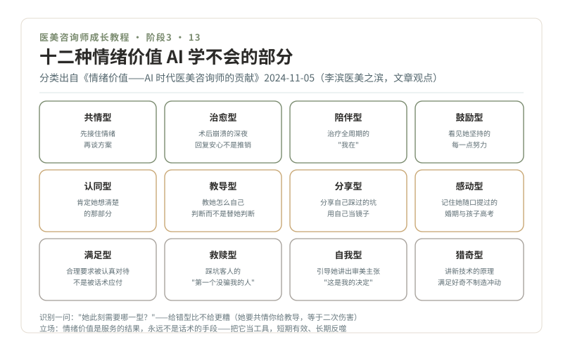

# 13 · 情绪价值，AI 替代不了的十二种能力

> **阶段 3 · 看懂路口** ｜ 预计用时：2 周 ｜ 前置课程：12

## 学习目标

- 理解情绪价值为什么是 AI 时代的留存能力
- 认识 12 种情绪价值类型，并学会识别"这位客人此刻需要哪一种"
- 建立你自己的客户情绪档案

## 正文

### 一、留下来的理由

第 01 课的真相三在这里落地：不见面的网电咨询会被 AI 全面替代，而面对面咨询里那些只能产生在人与人之间的部分，倾听、共情、个性化关怀、信任，被《情绪价值——AI 时代医美咨询师的贡献》（2024-11-05，李滨医美之滨）称为咨询师的核心贡献。以下 12 型分类与 8 项做法均出自该文（文章观点），我把它们翻译成咨询台的实操场景。

### 二、12 型情绪价值轮盘

| 类型 | 咨询台场景（一句话识别） |
| --- | --- |
| 共情型 | 她说"生完孩子肚子回不去了"，先接住情绪再谈方案 |
| 治愈型 | 术后肿胀期崩溃的深夜消息，回复的是安心不是推销 |
| 陪伴型 | 全程治疗周期的"我在"：预约、随访、恢复期提醒 |
| 鼓励型 | "您防晒坚持得很好，色沉比上月淡了"，看见她的努力 |
| 认同型 | "您想先改善肤质再考虑项目，这个顺序想得很清楚" |
| 教导型 | 用四层结构帮她拆解一条广告，教她"怎么自己判断" |
| 分享型 | 分享你自己踩过的护肤坑，用自己当镜子 |
| 感动型 | 记住她随口提过的婚期、出差、孩子高考 |
| 满足型 | 让她的每个合理要求被认真对待，而不是被话术应付 |
| 救赎型 | 长期渠道踩坑客人的"第一个没骗我的人" |
| 自我型 | 引导她讲出自己的审美主张，让她感到"这是我的决定" |
| 猎奇型 | 带她了解新技术的原理，满足好奇而不是制造冲动 |

**识别练习法**：接待中问自己一句"她此刻需要哪一型？"多数时刻只需要一种，给错型比不给更糟（她要共情你给教导，等于二次伤害）。

### 三、8 个落地动作（文中提出的策略）

1. 建立信任与情感沟通：温暖的言语与倾听，陪她度过从咨询到恢复的情感波动
2. 专业与透明的沟通：讲清过程、风险、预期，让她做知情决策。**透明本身就是情绪价值**
3. 关注细节与人文关怀：术后按天跟进，让她感到"被认真对待"
4. 情绪疏导：焦虑出现时先疏导情绪，再谈项目；帮她建立合理预期
5. 营造舒适环境：灯光、音乐、休息区，环境替你说话
6. 主动的正面支持：真诚赞美她的优点和努力（赞美事实，不谄媚）
7. 展现真实的自己：真诚坦率比完美人设更长久
8. 建立反馈机制：定期收集她的体验反馈，让她看到"我的意见被当回事"

### 四、工具还是结果，这道题决定你走哪条车道

原文提出过一个尖锐追问：情绪价值是**索取的工具**（用它促单），还是**给予的结果**（服务自然产生的副产品）？这正是第 01 课两条车道在人心里的分界：把它当工具，你会滑向"情感操控"，短期有效、长期反噬；把它当结果，成交只是被好好对待的人顺带做出的决定。**课程立场：情绪价值是服务的结果，永远不是话术的手段。**

### 五、客户情绪档案（模板）

> **姓名 / 称呼偏好**：J 姐（不要叫全名）
> **雷区**：讨厌被催单；反感"亲"
> **情绪触发点**：提到前一家机构的失败经历会激动，先听，不接话评价
> **需要的一型**：共情 + 认同（自我评价偏低）
> **重要日期**：女儿 6 月高考（5 月后才有时间做项目）
> **跟进记录**：3/12 电话 8 分钟，聊恢复期担忧，未谈项目

## 本课作业

1. 12 型自评：给自己各型能力打 1-5 分，圈出最强的 3 型和最弱的 3 型
2. 识别练习：回看第 10 课的三场模拟录像，判断每个角色"最需要的一型"，你给对了吗
3. 为你的 3 位真实朋友（想象她们是客人）各写一份情绪档案

## 通关检验

- 12 型含义全部能脱稿讲出，场景对答如流
- 三份情绪档案完成，其中至少一份经本人确认"像她"

## 配套教材

- 《情绪价值——AI 时代医美咨询师的贡献》（2024-11-05，李滨医美之滨，原文链接见第 01 课）
- 《12-警讯系统》：情绪疏导与红灯处置的边界
- 《00-课程设计总纲》阶段 3 模块 3.5
