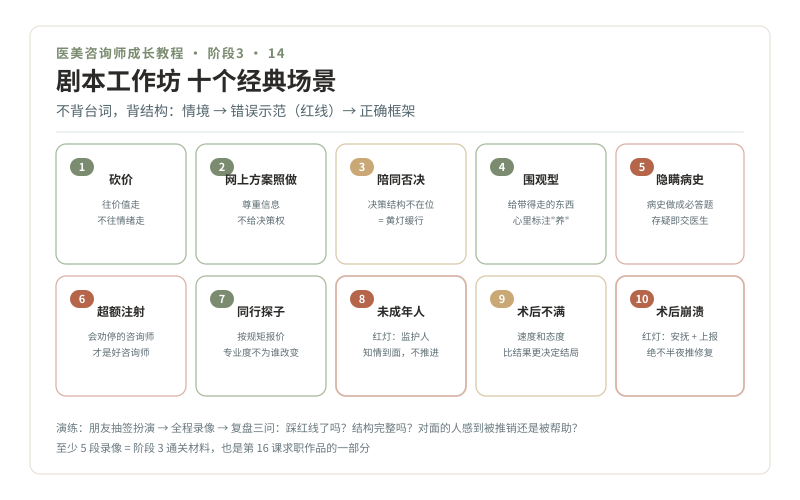

# 14 · 剧本工作坊，十个经典场景话术

> **阶段 3 · 看懂路口** ｜ 预计用时：3 周 ｜ 前置课程：13（阶段 3 收官课）

## 学习目标

- 十个高频难题场景，每个都有"红线示范 + 正确框架"
- 完成至少 5 个场景的角色扮演录像
- 通过阶段 3 通关考核

## 正文

前面十三课是零件，这一课是装配。十个场景覆盖新人上岗头一年最可能遇到的全部难题。每个场景三段式：**情境 → 错误示范（标红线）→ 正确框架（不背台词，背结构）**。

### 场景 1 · 砍价

- 情境：报价后客人说"太贵了，别家便宜一半"
- 错误示范："那我把折扣再放大点，今天定还能送"（✕ 临时砍价换成交，价值崩塌）
- 正确框架：认可预算感受 → 拆价值四块（医生/产品器械/安全保障/术后随访）→ 差异讲不拢就给替代方案（分次做、先做优先级最高的）→ 价格权限外就去请示，不当场松口
- 原则：价格分歧往价值走，不往情绪走（第 11 课）

### 场景 2 · "网上说要做这个，你照做就行"

- 情境：客人拿着短视频/攻略，指定项目和剂量
- 错误示范："可以可以，我给您安排"（✕ 替医生接了医疗决策）
- 正确框架：先肯定她做功课 → 讲清"方案和剂量必须医生当面评估您的解剖条件" → 把她的攻略变成面诊话题带给医生
- 原则：她的信息要尊重，医疗决策权不给（第 04 课五不）

### 场景 3 · 陪同者一票否决

- 情境：本人想做，闺蜜/家属全程"别做，都有害"
- 错误示范：绕开陪同者单聊成交（✕ 决策结构没理顺就推进）
- 正确框架：主动邀请陪同者提问 → 承认顾虑合理 → 提议"家人一起听医生讲风险和方案" → 仍反对就黄灯缓行："回去商量，方案留着"
- 原则：决策结构不在位 = 黄灯（第 12 课）

### 场景 4 · 围观型（只问不做的）

- 情境：问了四十分钟，一毛钱不打算花
- 错误示范：脸色变差、催促逼单（✕ 丢掉的是未来客户和口碑）
- 正确框架：正常高质量接待 → 给她"带得走的东西"（护肤建议、面诊清单）→ 加联系方式进长期触达 → 心里标注"养"
- 原则：不是每单都要成交，但每个人都值得被好好对待

### 场景 5 · 隐瞒病史

- 情境：事后才（或根本不）提过敏史、疱疹史、抗凝药
- 错误示范：知道了却觉得"应该没关系"继续推进（✕ 重大安全事故配方）
- 正确框架：问诊清单把病史做成必答题 → 发现隐瞒不指责，说明"为什么要问"（疱疹史与注射的关系）→ 任何存疑病史交给医生判断
- 原则：病史问全是绿灯通行的一部分（第 10 课）

### 场景 6 · 要求超额注射

- 情境："一次给我打四支，我要效果猛一点"
- 错误示范："多打效果确实好"（✕ 为业绩推人下悬崖）
- 正确框架：讲"过度注射的脸没人好看"（do 脸感反向例子）→ 宁可不足、分次调整 → 剂量上限交给医生
- 原则：会劝停的咨询师才是好咨询师（第 07 课"何时该停止"）

### 场景 7 · 同行探子

- 情境：问话专业、只要底价和项目单、不碰任何检查
- 错误示范：恼怒赶人，或和盘托出全部价格体系
- 正确框架：正常接待、按规矩报价、不透露内部信息 → 心里有数即可，不当场戳穿
- 原则：你的 professionalism 不因对面是谁而改变

### 场景 8 · 未成年人咨询

- 情境：17 岁，想做双眼皮，"妈妈同意了，她在上班"
- 错误示范："妈妈发个微信确认就行"（✕ 红灯）
- 正确框架：温和不推进 → 讲清未成年人项目的严格限制 → 邀请监护人到场面诊 → 记录在案
- 原则：红灯统一动作，终止 + 转介（第 12 课）

### 场景 9 · 术后不满投诉

- 情境：术后两周，"没效果/和说好的不一样"，语气激烈
- 错误示范："这是正常的，您再等等"（✕ 敷衍）；"当初是您自己签的字"（✕ 对抗）
- 正确框架：先安抚情绪（共情型）→ 记录完整诉求 → 当天上报医生，安排复诊评估 → 给出明确跟进时间点 → 全程留痕
- 原则：投诉处理的速度和态度，比结果更决定结局

### 场景 10 · 术后情绪崩溃

- 情境：恢复期深夜连发消息哭诉"毁了""没法见人"
- 错误示范：已读不回到早上；或半夜推销修复项目（✕ 红灯）
- 正确框架：及时回应（治愈型先上）→ 简明安抚 + 次日安排医生查看 → 出现极端言行立即启动红灯流程上报
- 原则：术后心理危机是红灯（第 12 课），第一动作是安抚与上报

### 演练方法

1. 每个场景写你自己的话术卡（结构照搬，语言长在你身上）
2. 找朋友抽签扮演，全程录像，一场 10 分钟
3. 复盘三问：有没有踩红线？结构是否完整？对面的人感到被推销还是被帮助？
4. 至少完成 5 个场景录像，作为阶段 3 通关材料，也是你求职时的作品（第 16 课）

### 阶段 3 通关考核

- 3 段抽签模拟面诊录像（含至少 1 个黄灯或红灯场景），按统一评分表自评 + 外行朋友评"真诚度"
- 10 道警讯题 + 12 组话术对照 + 5 段剧本录像全部完成

## 本课作业

1. 十张话术卡全部完成
2. 5 个场景角色扮演录像
3. 阶段 3 通关考核通过，第二条"绿波带"亮灯，奖励自己

## 配套教材

- 第 04、10、11、12、13 课（五块基石的联合应用）
- 《医美美学三型科普系列》03（医患协作范本）
