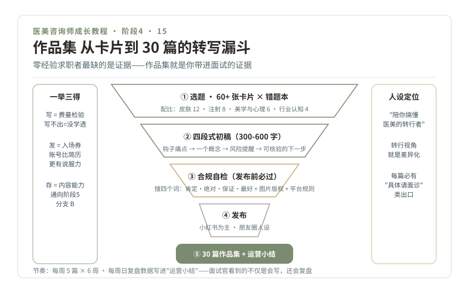

# 15 · 作品集，三十篇科普转写法

> **阶段 4 · 上路** ｜ 预计用时：6 周（与阶段 3 收尾并行） ｜ 前置课程：14

## 学习目标

- 用"转写公式"把 60 多张 3-2-1 卡片变成 30 篇可发布的科普短文
- 掌握小红书与朋友圈两种平台的语言差异
- 产出一部能带进面试的作品集

## 正文

### 一、一举三得的作品集

零经验求职者最大的困境是"没有证据"。作品集就是你的证据，而且它一举三得：**写 = 费曼检验**（写不出来就是没学透）；**发 = 行业入场券**（机构刷到你的账号，比简历有说服力得多）；**存 = 入职后的内容能力**（懂内容运营的咨询师更值钱，通向第 20 课分支 B）。

### 二、转写公式：四段式

每篇 300-600 字，固定四段：

1. **钩子**：一句话说中一个真实痛点。"脸上红血丝到底是皮肤薄还是病？"
2. **一个概念**：只讲一个，从卡片的"3 个知识点"里挑一个展开。讲透一个比堆十个更有用
3. **风险提醒**：把卡片的"1 个坑"翻译成安全版，不说行业黑话，说"怎么避"
4. **行动**：给一个可自行核验的下一步（呼应第 05 课四层结构）："分不清是哪种红，先别买任何精华，去挂个皮肤科"

**选题从哪来**：你的 60+ 张卡片 × 错题本里"朋友问倒过我的问题"，就是选题库。30 篇建议配比：皮肤 12、注射 8、美学与心理 6、行业认知（怎么选机构/看资质）4。

### 三、平台语言差异

**小红书**：标题决定生死，真实感大于精致感；正文短段落 + emoji 分隔；结尾引导互动（"你们想知道 XX 吗"）；带 3-5 个精准话题标签。你的人设定位：**"陪你搞懂医美的转行者"**，你的转行视角本身就是差异化（"我也是从小白学的，我知道小白会卡在哪"）。

**朋友圈**：更短（150 字内）、更低频（每周 2-3 条）、更人设化（学习笔记、行业观察、生活切片穿插）。朋友圈是给未来同事和面试官看的"职业素养展"。

### 四、合规自检（发布前必过）

你的账号就是你的"违章记录仪"，发布前三查：

1. 搜四个词：**肯定、绝对、保证、最好**，出现即重写（第 11 课）
2. 查图片来源：不用客人照片、不用无授权网图（版权 + 隐私双红线）
3. 查身份表述：科普可以，**个体化建议不行**，每篇都要有"具体请面诊"类出口；不贬低任何机构与同行；平台医美内容规则以平台最新规范为准（需另行核验）

### 五、节奏与复盘

每周固定产出 5 篇（6 周完成 30 篇）。每周日复盘：哪篇互动最高？钩子哪里好？哪篇被自己翻出来重写？这些数据写进求职作品集的"运营小结"，面试官会看到你不仅会写，还会复盘。

## 本课作业

1. 30 篇科普短文发布完成（小红书为主），汇总成作品集文档（链接 + 数据 + 运营小结）
2. 每周日复盘记录，共 6 份
3. 精选 3 篇最好的，配上"为什么这篇好"的自评

## 通关检验

- 30 篇全部通过合规自检（可出示自检记录）
- 作品集文档完成：含账号定位说明、30 篇链接与数据、6 周复盘、3 篇精选自评

## 配套教材

- 你的 3-2-1 卡片库与错题本（选题库）
- 《05-消费者视角》四层结构；《11-期望管理》语言纪律
- 《04-合规红线》宣传红线部分
