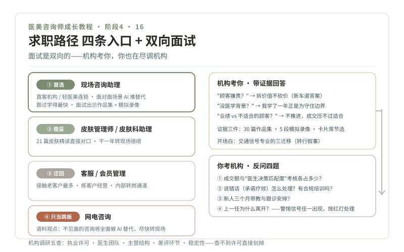

# 16 · 求职路线，岗位选择与面试准备

> **阶段 4 · 上路** ｜ 预计用时：3 周 ｜ 前置课程：15

## 学习目标

- 用决策树选定入行岗位与机构类型
- 完成一份"零经验但有证据"的简历与面试准备
- 学会反问机构，面试是双向的，你也在考察它

## 正文

### 一、岗位路径：四条入口怎么选

| 路径 | 适合谁 | 提示 |
| --- | --- | --- |
| ① 现场咨询助理（直客机构/轻医美连锁） | 目标明确要走本课主线的人 | **首选**。面对面场景 AI 替代不了，跟诊学得最快；面试时可出示作品集与模拟面诊录像 |
| ② 皮肤管理师 / 皮肤科助理 | 皮肤知识学得扎实、想要更稳起点 | 稳妥路径。用第 06 课的 21 篇精读直接对口，干一年转现场咨询非常顺 |
| ③ 客服 / 会员管理 | 暂时够不着前台岗位时的迂回 | 接触老客户最多，练第 19 课客户经营，走内部转岗通道 |
| ④ 网电咨询 | 只想先进门 | **只当跳板**。语料观点：不见面的咨询将全面被 AI 替代，进去后必须尽快转现场 |

### 二、机构调研清单（投递前逐家过）

1. 资质：执业许可公示（属地卫健委官网可查，查不到直接划掉）
2. 医生团队：主力医生的执业信息、专科背景、公开内容
3. 主营结构：手术为主还是轻医美为主？与你的知识结构匹配吗
4. 口碑：公开评价里的差评集中在什么环节（价格？售后？效果？）
5. 规模与稳定性：成立年限、分店情况（新开小店的培训和带教通常薄弱）

### 三、零经验简历的写法

HR 不信"学习能力强"，只信证据。你的简历核心段：

- **作品集**：30 篇科普 + 账号数据 + 运营小结（第 15 课产出）
- **学习证明**：160 篇教材精读的卡片库节选、两轮"给闺蜜讲明白"测试记录
- **实战证明**：5 段模拟面诊/剧本录像、3 份转诊摘要
- **转行叙事**：一段 100 字讲清"为什么交通信号专业是优势"（第 01 课的三迁移，就是你的面试开场白）

### 四、高频面试题：三题示范

**Q1 "顾客嫌贵怎么办？"**（考你是哪条车道的人）
- 旧车道答案：打折逼单。新车道答案：认可预算感受 → 拆价值（医生资质/产品来源/安全保障/术后随访）→ 给替代方案（分次、优先级排序）→ 不临时砍价换成交

**Q2 "你没有医学背景，凭什么做咨询？"**
- 答："我很清楚咨询师的边界，不诊断、不定方案、不承诺疗效，我学了一年正是为了守住这些边界。我的价值是把客人的诉求整理清楚交给医生，再把医生的方案翻译给客人。"（然后甩出作品集和录像）

**Q3 "这个月业绩没完成，但面前坐着一位不太适合项目的顾客，你怎么办？"**
- 这是价值观题，答案只有一条："不推进。成交指标压不过适不适合，不适合的成交是未来的纠纷。"敢在面试里说这句话的机构，才值得去

### 五、反问机构：你也在面试它

面试尾声的"你有什么问题"，是你的尽调窗口：

1. "咨询师的考核里，成交额和'成单与医生决策的匹配度'各占多少？"
2. "咨询师说错话（比如承诺疗效）机构怎么处理？有合规培训吗？"
3. "新人前三个月的带教安排是什么？能跟诊吗？"
4. "上一任咨询助理为什么离开？"

**警惕信号**（任一出现，慎重考虑）：面试官夸耀"我们咨询师很能冲单"；对合规培训问题含糊其辞；岗位实际内容与招聘描述明显不符；入职要先交培训费、押证件，一律按红灯处理。

## 本课作业

1. 完成岗位决策（写下你的选择和三条理由）
2. 简历定稿：以作品集为核心证据段
3. 10 家目标机构调研档案（第 03 课的 5 家基础上扩充）
4. 三道高频题 + 两道自拟题，各写答案并口头演练 3 遍

## 通关检验

- 投出 ≥ 10 份简历，完成 ≥ 3 场面试
- 每场面试后写复盘：被问住的问题全部入错题本
- （理想结果）拿到至少 1 个 offer，没有也不判失败，复盘迭代继续

## 配套教材

- 第 03 课机构地图与调研作业；第 15 课作品集
- 《医美咨询师，请做时间的朋友》（2020-06-23，李滨医美之滨）：医生主导机构里咨询师的新标准
- 第 18 课（入职后识别病态 KPI 的预习）
