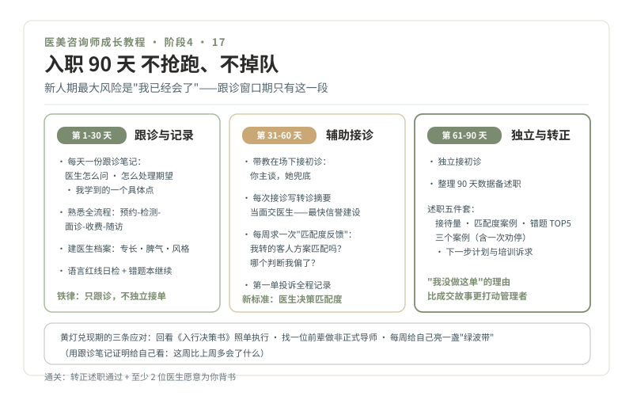

# 17 · 入职 90 天，跟诊学习与转正述职

> **阶段 4 · 上路** ｜ 预计用时：90 天 ｜ 前置课程：16

## 学习目标

- 按 30/60/90 节奏度过新人期，不抢跑、不掉队
- 建立与医生的协作关系：主动求"匹配度反馈"
- 完成转正述职，把 90 天变成可展示的职业履历

## 正文

### 一、新人期的最大风险：抢跑

你带着 6 个月的学习成果入职，最容易犯的错是"我已经会了"，急着独立接单证明自己。**前 30 天的铁律：只跟诊、只记录、不独立接单。** 医生是最好的老师，跟诊是最好的课，而跟诊的窗口期只有新人期这一段。

### 二、30/60/90 节奏

**第 1-30 天 · 跟诊与记录**

- 每天一份跟诊笔记，三个栏目：医生怎么问（问诊路径与我的 OD 四问差在哪）· 医生怎么处理期望（哪些话我说不出、为什么）· 我今天学到的一个具体点
- 熟悉机构流程：预约、检测、面诊、收费、随访全链路
- 认人：每位医生的专长、脾气、沟通风格，建立自己的"医生档案"
- 继续语言红线日检 + 错题本

**第 31-60 天 · 辅助接诊**

- 在带教老师或主管在场下接初诊：你主谈，她兜底
- 每次接诊写转诊摘要（第 10 课），当面交给医生，这是你最快的信誉建设
- **每周主动找一位医生要一次"匹配度反馈"**：我最近转来的客人，方案匹配度如何？哪个判断我偏了？（语料观点：在医生主导决策的机构里，咨询师的新标准是"成单与医生决策的匹配度"，而非单纯销售额，《医美咨询师，请做时间的朋友》2020-06-23）
- 处理第一单投诉时：全程记录处理过程，这是最好的学习材料

**第 61-90 天 · 独立与转正**

- 独立接初诊，保持转诊摘要习惯
- 整理 90 天数据，准备转正述职

### 三、转正述职模板（一页讲稿 + 一页数据）

> **接待量**：初诊 X 人 / 复诊 Y 人 / 转诊医生 Z 次
> **匹配度**：医生反馈中"判断准确"的案例占比，举 2 个正面例子
> **错题复盘**：90 天错题本 TOP5，每个附"当时的我 → 现在的我"
> **三个案例**：一个绿灯成交、一个黄灯缓行（或劝停）、一个投诉/疑难处理，**能讲出"我没做这单"的理由，比成交故事更打动管理者**
> **下一步**：我希望深耕的品类、想补的知识、请机构支持的培训

### 四、心态：黄灯兑现的时候

第 02 课 B 组的黄灯会在这 90 天集中兑现：身份落差（同学在大厂，我在前台）、收入波动（底薪期）、被拒的日常。应对三条：

1. 回看《入行决策书》，你写过预期和退出条件，照单执行
2. 找到一位机构内前辈做非正式导师（请一顿饭的开销，换一年的经验）
3. 每周给自己的"绿波带"亮灯：这周我比上周多会了什么（用跟诊笔记证明给自己看）

## 本课作业

1. 跟诊笔记 30 份（每天一份，缺勤补记）
2. 匹配度反馈记录 ≥ 4 次（每周一次）
3. 90 天错题本 + 转正述职两页

## 通关检验

- 完成转正述职并获得通过（或明确获得改进清单）
- 医生端至少 2 位愿意为你背书（内部口碑是下一程的启动资本）

## 配套教材

- 第 10 课转诊摘要；第 12 课警讯（第一次独立遇到红灯时的定心丸）
- 《医美咨询师，请做时间的朋友》（2020-06-23，李滨医美之滨）
- 第 19 课（转正后的客户经营，提前预习）
