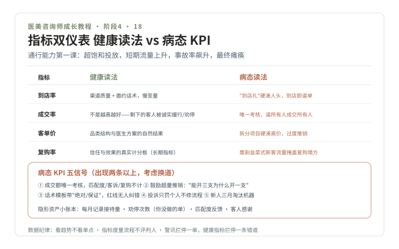

# 18 · 指标的健康读法，识别病态 KPI

> **阶段 4 · 上路** ｜ 预计用时：1 周 ｜ 前置课程：17

## 学习目标

- 看懂机构常用的四个基本指标，掌握"健康读法"
- 会用通行能力隐喻理解"成交率不是越高越好"
- 能识别病态 KPI 的五个信号，及时止损换道

## 正文

### 一、四个基本指标，四种健康读法

| 指标 | 含义 | 健康读法 | 病态读法 |
| --- | --- | --- | --- |
| 到店率 | 线索转化为到店的比例 | 反映渠道质量与邀约话术，慢变量 | 用"到店礼"硬凑人头，到店即逼单 |
| 成交率 | 到店客人成交的比例 | **不是越高越好**（见下） | 唯一考核指标，逼着所有人成交所有人 |
| 客单价 | 单客消费金额 | 品类结构与医生方案的自然结果 | 拆分项目硬凑高价，过度推销 |
| 复购率 | 老客再消费比例 | **信任与效果的真实计分板** | 靠"割韭菜式"新客流量掩盖复购塌方 |

### 二、通行能力隐喻：超饱和会瘫痪

交通工程的第一课：路口通行能力有上限，超饱和投放绿信比，短期流量上升，事故率飙升，最终瘫痪。成交率同理，**把不该成交的人成交进来，等于把不该放行的车放进路口**：纠纷率、退费率、差评率在后面排队。健康机构的成交率落在一个区间里，剩下的客人被诚实地"缓行"或"劝停"了。**复购率才是长期指标**：它度量的是"被好好对待过的人愿不愿意回来"，恰好是第 13 课情绪价值的计分板。

### 三、病态 KPI 五信号（出现两条以上，考虑换道）

1. **成交额是唯一考核**，匹配度、客诉率、复购全不计
2. **鼓励超量推销**，"能开三支为什么开一支"，第 07 课"何时该停止"在这里是罪过
3. **默许夸大宣传**，话术模板里带"绝对""保证"，红线词无人纠错
4. **投诉归罪个人**，不修流程，只罚咨询师，事故黑点永远不治理
5. **新人淘汰机器**，三个月冲不走业绩就开掉，说明要的是流量不是人

### 四、数据的诚实用法

- **看趋势不看单点**：单周成交率波动说明不了什么，三个月趋势才有意义
- **指标度量流程，不评判人**：成交率低，先查线索质量、流程断点，再谈个人能力
- **给自己的小账本**：每月记录自己的接待量、劝停次数（你没做的单）、医生匹配度反馈、客人感谢，**劝停次数是你的隐形资产**，它积累的是长期信任，也是你简历上最特别的一行

### 五、和第 12 课的关系

警讯红绿灯是"单次决策"的安全系统，健康指标是"职业生涯"的安全系统。前者拦停这一单，后者拦停这条错误的车道。两个系统都要常开。

## 本课作业

1. 画出你所在机构（或目标机构）的指标结构图：考核什么、不考核什么
2. 用五信号清单给它打分，写 200 字判断：这家机构值得待多久
3. 启动你的"隐形资产小账本"，从转正第一个月开始记

## 通关检验

- 能向一位外行讲清"为什么成交率不是越高越好"（用通行能力隐喻）
- 指标结构图 + 五信号评分完成
- 阶段 4 收官：offer + 90 天述职（第 17 课）+ 本课判断，三条绿波带全亮

## 配套教材

- 第 03 课行业地图（渠道机构的客源结构）；第 12 课警讯系统
- 《医美咨询师，请做时间的朋友》（2020-06-23，李滨医美之滨）：医生主导机构的标准
- 第 20 课（如果五信号≥2 条，直接跳去看分支路线）
