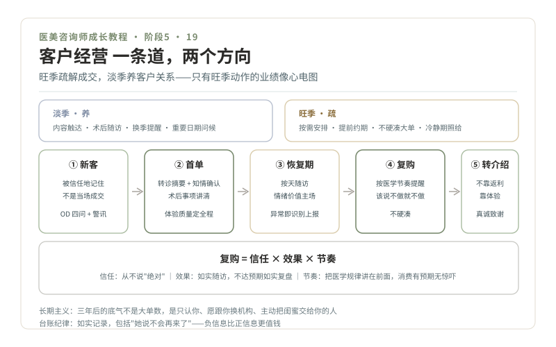

# 19 · 客户经营，潮汐车道与长期主义

> **阶段 5 · 绿波带** ｜ 预计用时：2 周（转正后持续实践） ｜ 前置课程：18

## 学习目标

- 用潮汐车道思维规划旺季与淡季的不同动作
- 掌握客户生命周期五阶段的经营要点
- 让复购和转介绍从"信任 + 效果 + 节奏"里自然长出来

## 正文

### 一、潮汐车道：一条道，两个方向

交通高峰用潮汐车道：早高峰进城多就多开进城道，晚高峰反过来。客户经营同构，**旺季（节假日、婚庆季、暑期）疏解成交，淡季（平季）养客户关系**。大多数咨询师的失败在于只有旺季动作（逼单），没有淡季动作（存在感），于是业绩像心电图。淡季的动作清单：内容触达（你的科普账号正好用上，第 15 课）、术后随访回访、皮肤状态提醒（换季防晒、干燥期保湿）、生日与重要日期问候（第 13 课情绪档案里的日期，在这里兑现）。

### 二、生命周期五阶段，五个动作重心

1. **新客（初诊）**：第 10-12 课的全部。目标是"被信任地记住"，不是"当场成交"
2. **首单成交**：转诊摘要 + 知情同意确认 + 术后注意事项讲清。**首单的体验质量决定后面所有阶段**
3. **恢复期**：按天随访（情绪价值兑现期，第 13 课治愈型/陪伴型主场）。异常信号走第 07 课识别—上报路径
4. **复购**：按医学节奏提醒（玻尿酸代谢周期、皮肤治疗的疗程间隔，从你的卡片库来），**不硬凑**：她的皮肤状态不需要时，提醒就是打扰，说"这次可以先不做"反而养信任
5. **转介绍**：不靠返利靠体验。别用"介绍朋友送项目"当返利钩子；她主动说"我闺蜜也想做"时认真接待，事后真诚致谢

### 三、复购从哪来：信任 × 效果 × 节奏

- **信任**来自每次接待都守住三色区，她知道你不说"绝对"，所以信你说的
- **效果**来自如实随访：效果好的如实肯定；不达预期的如实复盘原因和下一步，**不回避的咨询师才配得上第二次消费**
- **节奏**来自医学规律：把"什么时候该做什么"讲在前面（疗程间隔、维持周期、年度规划），让消费有预期、无惊吓

第 18 课说过，复购率是信任与效果的真实计分板，这一课就是它的得分手段。

### 四、长期主义：做时间的朋友

《医美咨询师，请做时间的朋友》（2020-06-23，李滨医美之滨）的标题本身就是职业策略：销售驱动的旧车道赚快钱，也快被淘汰；医疗导向的新车道慢，但每个被好好对待的客人都留在你的职业生命里。**三年后你的底气，不是成交过多少大单，而是有多少客人只认你、愿意跟你换机构、主动把闺蜜交给你。** 这些人走不掉，才是真正的职业资产，尤其在 AI 替代网电咨询的时代，她们是替代不了的那部分（第 01 课真相三）。

### 五、你的客户台账（模板字段）

称呼偏好 / 来访渠道 / 诉求与起源 / 做过的项目与反应 / 情绪档案（雷区·触发点·需要的一型）/ 重要日期 / 医生的评估要点 / 跟进记录（日期·内容·未谈项目）/ 下次合理触达时机。

台账纪律：如实记录，包括"她说不会再来了"，负信息比正信息更值钱。

## 本课作业

1. 给你现有的（或 imagined 的）20 位客人建台账，其中 5 位填写完整情绪档案
2. 做一张自己的"年度潮汐表"：标出所在城市的旺季时段，倒推淡季动作排期
3. 写一段 200 字的"三年愿景"：三年后我希望客人怎么描述我（收进第 20 课年度复盘）

## 通关检验

- 台账 20 份 + 潮汐表完成
- 第一次真实运用：完成一次"医学节奏提醒"或一次"这次可以先不做"的诚实建议，记录客人反应

## 配套教材

- 第 13 课情绪档案；第 15 课内容账号（淡季触达工具）
- 第 07 课"何时该停止"、第 11 课区间表达（节奏与信任的语言基础）
- 《医美咨询师，请做时间的朋友》（2020-06-23，李滨医美之滨）
