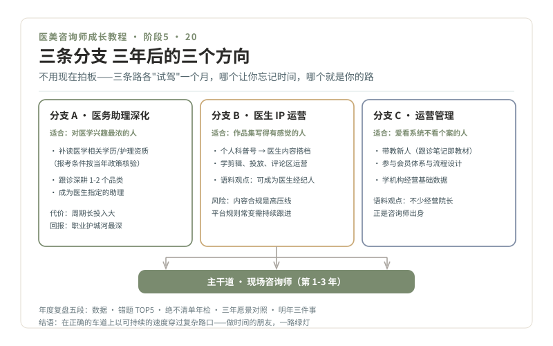

# 20 · 三条分支与年度复盘

> **阶段 5 · 绿波带** ｜ 预计用时：1 周 + 每年一次 ｜ 前置课程：19（全系列收官课）

## 学习目标

- 认识咨询师的三条长期分支路线，选定你的方向
- 掌握年度复盘模板（含"绝不清单"年检）
- 完成从 00 到 20 课的结业自检

## 正文

### 一、站上路口：三年后的三个方向

《医美咨询师，请做时间的朋友》（2020-06-23，李滨医美之滨）为无医疗背景的咨询师指过出路：转向营销方向、协助医生打造个人 IP、成长为经营管理者。结合你的积累，展开成三条分支：

**分支 A · 医务助理深化**（靠近医疗核心）

- 适合：对医学知识兴趣最浓、想要更强专业确定性的人
- 2-3 年动作：在岗考取/补读医学相关学历或护理资质（**报考条件与路径属"需另行核验"事项，按当年当地政策核实**）；跟诊深耕 1-2 个品类；成为医生指定的助理
- 风险与代价：学历补读周期长、投入大；但一旦完成，职业护城河最深

**分支 B · 医生 IP 与内容运营**（放大你的作品集）

- 适合：第 15 课 30 篇作品写得有感觉、数据反馈好的人
- 2-3 年动作：从个人科普号升级为医生的内容搭档（选题、拍摄、评论区运营）；学基础的视频剪辑与投放；语料观点：擅长自媒体的咨询师可成为医生品牌的左膀右臂乃至医生经纪人
- 风险与代价：内容合规是高压线（第 04、15 课的红线全部适用且更严）；平台规则常变，需持续跟进（需另行核验）

**分支 C · 客户经营与运营管理**（通向经营院长）

- 适合：第 19 课台账和潮汐表做得最起劲、喜欢看系统不看个案的人
- 2-3 年动作：带教新人（你的跟诊笔记就是教材雏形）；参与会员体系与流程设计；学机构经营的基础数据（第 18 课升级版）
- 语料观点：不少中小机构的经营院长正是咨询师出身，这条路的上限是"经营一家机构"

**选择方法**：不用现在拍板。未来一年，三条分支各做一次"小型试驾"（帮一位医生做一个月内容、独立带一个新人、跟店长看一周经营报表），哪个让你忘记时间，哪个就是你的路。

### 二、年度复盘模板（每年生日或入职纪念日做）

> **一、数据**：接待量 / 转诊医生次数 / 复购率 / 劝停次数（隐形资产）/ 客诉与处理结果
> **二、错题 TOP5**：从当年错题本里挑出最贵的五个错误，各写"当时的我 → 现在的我"
> **三、绝不清单年检**：逐条问自己，今年有没有哪条被业绩压力碰过边？碰过的那条，为什么？要不要加新条目？
> **四、三年愿景对照**：去年写的"三年后客人怎么描述我"，今年靠近了吗
> **五、明年三件事**：最多三件，写具体动作与检验标准

### 三、结业自检：从 00 到 20

对照检查，全部打勾即结业：

- [ ] 入行决策书 + 绝不清单（第 02 课）
- [ ] 合规 15 题 + 暗访报告（第 04、05 课）
- [ ] 60+ 张卡片 + 10 题"给闺蜜讲明白"+ 50 条错题（阶段 2）
- [ ] 5 段剧本录像 + 3 段模拟面诊（第 14 课）
- [ ] 30 篇作品集（第 15 课）
- [ ] offer + 90 天转正（第 17 课）
- [ ] 指标健康判断 + 客户台账 20 份（第 18、19 课）
- [ ] 分支选择（或试驾计划）+ 第一次年度复盘（本课）

### 四、绿波带的意义

交通工程里，"绿波"来自整条路的信号协同设计，不靠运气；你以合理的速度行驶，就一路绿灯。这份教程的真正目标从来不是"快"，是让你在正确的车道上，以可持续的速度，穿过这个行业的复杂路口。

一年前你问：一个学交通信号的人，和医美有什么关系？现在的答案是：**你带来的是这行最稀缺的东西，系统、流程与安全的思维方式，加上愿意把人当人的耐心。** 车流会变，信号会升级，AI 会接管更多的灯，但坐在咨询桌前的那个人，永远决定着一位求美者此刻是被当作"单"，还是被当作"人"。

做时间的朋友。一路绿灯。

## 本课作业

1. 完成第一次年度复盘（按模板五段）
2. 写出三条分支的"试驾计划"（各一个月内的一个小动作）
3. 把 20 课的结业自检清单过一遍，缺的补上

## 通关检验

- 年度复盘完成并存档（明年对照用）
- 分支试驾计划已启动至少一项
- 结业自检全勾，恭喜，五条绿波带全部点亮

## 配套教材

- 《医美咨询师，请做时间的朋友》（2020-06-23，李滨医美之滨），分支出路的行业观点来源
- 全系列 00-19 课（结业自检的对照材料）
- 你的错题本、卡片库、台账、作品集，它们是你下一个十二个月的起点
