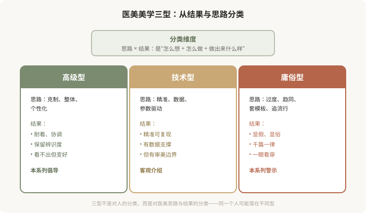
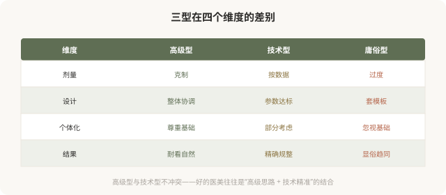
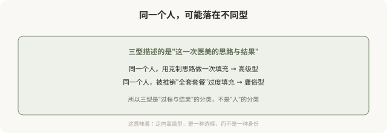

# 医美美学三型：高级、技术、庸俗，你的医美属于哪一型

## 三个备选标题

1. 高级、技术、庸俗：医美审美的三种境界
2. 为什么有的医美耐看，有的医美显俗：三型分类
3. 你的医美审美在第几型：一份自我评估框架

## 封面介绍（100字以内）

医美审美可分为高级型、技术型、庸俗型三种。本系列明确倡导高级型、警示庸俗型，帮你识别自己处于哪一型，并理解如何走向更耐看的结果。

## 正文

先说结论：**医美审美可以从结果与思路的角度，大致分为三种型：高级型、技术型、庸俗型。**这不是对面孔的分类，而是对**医美思路和结果**的分类——同一个人，用不同思路做，可能落在不同型。这个系列会明确倡导高级型（克制、整体、个性化、耐看），客观介绍技术型（精准、数据驱动，但有其边界），并警示庸俗型（过度、趋同、套模板、显俗）。**理解这三型的差别，是走向好结果的第一步；这一篇先讲清楚分类框架。**

### 为什么用“型”来分类

前面的《医美亚美学》系列盘点的是“审美流派”——幼态脸、高级脸、妈生款等。这个系列不同，它从**结果与思路**的角度，把医美审美分成三个层级：

### 三型的核心差别

**一个重要说明**：高级型和技术型不是对立的。好的医美，往往是“高级的思路”加上“技术的精准”——用整体、克制的设计，配以精确、有依据的执行。**真正与高级型对立的是庸俗型**——那种过度、趋同、套模板的思路，无论用多贵的产品、多新的技术，做出来都难免显俗。

### 这个系列的明确立场

与之前《医美亚美学》系列的“盘点 + 反思”不同，这个系列的立场更鲜明：

- **倡导高级型**：克制、整体、个性化、耐看，是值得追求的方向。
- **客观介绍技术型**：技术是工具，精准本身是好的，但有审美边界。
- **警示庸俗型**：过度、趋同、套模板，无论包装得多高端，结果往往显俗。

**需要强调的是**：批判“庸俗型”，批判的是**思路和现象**——趋同化、过度治疗、套模板、追逐流行。**不是嘲讽做过医美的人**。很多人是在信息不对称、被营销推动的情况下，做出了庸俗型结果，他们是被害者而非加害者。理解庸俗型的机制，是为了避免更多人踩坑，而非嘲笑已经踩坑的人。

### 三型不是固定标签

### 接下来 9 篇要讲什么

- **高级型（3 篇）**：核心理念、医生与患者的审美协作、克制与整体的智慧。
- **技术型（3 篇）**：测量学审美、数字化设计、数据驱动的边界。
- **庸俗型（3 篇）**：典型特征与成因、流水线化与趋同、如何避免与走向高级。

### 一个自我评估的小练习

读完这篇，你可以先给自己现在的医美思路做个粗略评估：

- 我做医美，是先想“我想解决什么具体问题”（偏高级），还是“我想变成某种样子”（偏庸俗）？
- 我是否在追求某个具体的“标准”（如某个角度、某个比例），而忽视了自己基础？
- 我是否在反复叠加治疗，却总觉得“还差点”？
- 我能否接受“看不出做过”的结果，还是必须“看出变化”才满意？

**这些问题没有标准答案，但它们能帮你判断自己当前的思路更接近哪一型。**如果偏向庸俗型，也不用焦虑——认识到就是改变的开始，接下来的篇章会讲如何走向高级。

### 这个系列想给你什么

- 一套识别“医美思路与结果”的分类框架。
- 理解为什么有的医美耐看、有的显俗。
- 知道如何与医生沟通，走向高级型。
- 识别庸俗型的陷阱，避免趋同与过度。
- 在充分知情下，做出真正属于自己的、耐看的选择。

**美有境界之分。**这个系列的目的，就是帮你识别境界、走向更高的境界——不是更贵、更多，而是更克制、更整体、更属于你自己。

> 本文用于健康教育与审美思辨，立场明确倡导高级型、警示庸俗型；具体医美决策须结合个体情况与具备资质的医师面诊。

## 参考资料

- 中华医学会整形外科学分会：医美审美与设计相关共识（以现行版本为准）
  https://www.cma.org.cn/
- American Society of Plastic Surgeons: Aesthetic analysis & patient goals
  https://www.plasticsurgery.org/patient-safety
