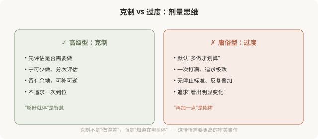
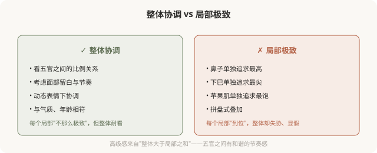
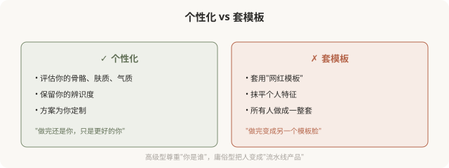

# 高级医美美学的核心：克制、整体、个性化

## 三个备选标题

1. 什么是高级医美：克制比加法更难
2. 高级感的来源：整体协调与尊重个体
3. 为什么“少做”反而更高级

## 封面介绍（100字以内）

高级医美美学的核心是克制、整体、个性化。它不以“做了多少”衡量好坏，而以“是否耐看、是否属于你”为目标。这是本系列倡导的方向。

## 正文

先说结论：**高级医美美学的核心是三个词：克制、整体、个性化。**克制——少做比多做难，宁可不足也不过度；整体——局部服从整体协调，不孤立追求某个部位；个性化——尊重每个人的基础与特征，不套模板。**高级感不来自“做了多少”或“用了多贵的产品”，而来自“思路的境界”和“对个体的尊重”。**这一篇展开讲这三个核心。

### 克制：少做比多做难

克制之所以难，是因为它**反商业逻辑**——机构和医生“多做”才能多赚。一个愿意劝你“少做”的医生，往往审美自信更高、也更负责。**在医美里，“够好就停”比“再加一点”更需要功力。**

### 整体：局部服从整体协调

庸俗型医美常见的问题，是**孤立地追求每个局部的极致**——鼻子最高、下巴最尖、苹果肌最饱满、眼睛最大。结果是每个局部都“到位”，整体却失协，形成显假的“拼盘脸”。

高级型的思路相反：**局部服从整体协调**。

**整体协调的标志**是：动起来自然、静下来耐看、远观协调、近看不突兀。一个人做完医美后，别人感觉“变好看了但说不出哪里变”，往往是整体协调的体现——这正是高级型的典型结果。

### 个性化：尊重基础，不套模板

**个性化的核心是尊重基础**——你的骨骼、肤质、五官比例、年龄、气质，决定了什么样子适合你。**强行把不适合的模板套到你的脸上，无论模板本身多“美”，结果都会显俗**——因为它不是你。

### 高级型不等于“贵”或“少”

一个常见误解：高级型 = 贵项目，或高级型 = 啥都不做。都不准确。

- **高级型不等于贵**：用普通材料 + 克制思路，也能做出高级感；用最贵材料 + 过度思路，照样显俗。
- **高级型不等于不做**：高级型该做还是做，但每一步都有明确理由和停止标准。
- **高级型不等于保守**：有时明显的改变（如正颌、鼻综合）也可以是高级型——关键是思路是否整体、是否尊重基础。

**高级型衡量的是“思路的境界”，不是“价格”或“剂量”。**

### 如何识别高级型的医生

- **他先评估你的整体**，而不是直接推荐某个部位的项目。
- **他会劝你“少做”或“不做”**某些项目，如果它们不适合你。
- **他谈论“协调”“比例”“你的特征”**，而不是“最新”“最流行”“最饱满”。
- **他给你停止标准**，而不是“再加一点”。
- **他讨论风险和替代方案**，而不是只说“放心包你满意”。

**能展现这些特征的医生，往往能带你走向高级型。**

### 一个反思

高级医美美学的三个核心——克制、整体、个性化——说起来简单，做起来需要审美自信和医学功底的结合。**它不是“省钱”或“保守”的代名词，而是一种“知道在哪里停、知道什么协调、知道你是谁”的智慧。**这种智慧，比任何一支昂贵的产品、任何一种最新的技术，都更能决定你的医美结果是耐看还是显俗。

走向高级型，从理解这三个核心开始。

> 本文用于健康教育与审美思辨，明确倡导高级型；具体医美决策须结合个体情况与具备资质的医师面诊。

## 参考资料

- 中华医学会整形外科学分会：面部美学设计相关共识（以现行版本为准）
  https://www.cma.org.cn/
- American Society of Plastic Surgeons: Facial harmony & individualized design
  https://www.plasticsurgery.org/patient-safety
