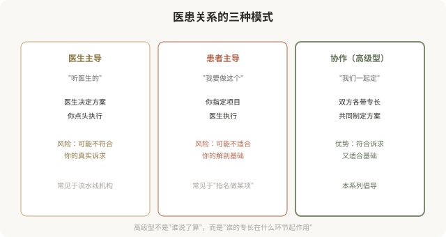
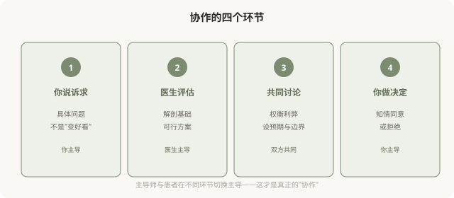

# 高级型的医患协作：你和医生是审美合伙人

## 三个备选标题

1. 高级医美不是“医生做主”：你和医生是审美合伙人
2. 为什么高级型需要你的参与：审美决策的共享
3. 别只当被动接受者：高级型医患关系怎么建

## 封面介绍（100字以内）

高级型医美中，你和医生是审美合伙人——共同参与决策，而非一方主导。理解这种协作关系，是走向高级型的关键。

## 正文

先说结论：**高级型医美中，你和医生是“审美合伙人”——共同参与决策，而非一方主导。**庸俗型的医患关系往往是“医生/咨询师做主，你被动接受”或“你强硬指定，医生执行”；高级型则是双方带着各自的专长（你懂自己，医生懂医学和解剖）共同制定方案。**理解并主动建立这种协作关系，是走向高级型的关键一步。**

### 三种医患关系模式

### 协作的基础：各自的专长

**你的专长**：

- 你最了解自己的诉求——想解决什么问题、能接受到什么程度。
- 你最了解自己的生活方式——工作性质、社交需求、能承受的恢复期。
- 你最了解自己的身体反应——既往治疗效果、过敏史、愈合情况。

**医生的专长**：

- 医生懂解剖和医学——什么方案安全、什么方案有效。
- 医生懂美学和技术——什么结果自然、什么结果协调。
- 医生懂材料和并发症——什么产品适合你、出了问题怎么处理。

**协作的意思，是让各自的专长在合适的环节发挥作用**——你来描述诉求和边界，医生来评估可行性和方案，双方共同确认。

### 协作怎么做

### 协作型医生的几个特征

识别协作型医生，可以看几个信号：

- **他先听你说**，而不是先推荐项目。
- **他解释“为什么”**，而不只是“做什么”。
- **他会说“不”**，当你想要的方案不适合你。
- **他给你选择**，而不是“只有这一种方案”。
- **他记录你的诉求和决策**，作为长期档案。

**这样的医生，倾向于带你走向高级型。**相反，“咨询师主导全程、医生只执行”“打包套餐、不允许讨论”的机构，往往导向庸俗型。

### 协作的前提：你的准备

协作不是医生单方面的责任，**你也需要带着准备来**：

- **梳理诉求**：具体到“想解决什么问题”，而不是“想变好看”。
- **了解基础**：自己的解剖特点、既往治疗、健康状况。
- **设定边界**：能接受的恢复期、风险、剂量、预算。
- **准备问题**：面诊前写下想问的，避免被引导。
- **冷静期**：不在第一次面诊当场决定，留时间思考。

**一个有准备的患者，更能与医生形成高质量的协作。**

### 协作≠患者指定方案

需要区分“协作”和“患者主导”：

- **协作**：你描述诉求和边界，医生评估方案，双方讨论后共同决定。
- **患者主导**：你直接指定“我要做这个项目、用这个材料”，医生执行。

**协作不是患者替代医生做医学判断。**当你强行指定某个不适合你基础的方案，医生若不劝阻直接执行，这恰恰不是高级型——因为高级型尊重的是**医学依据 + 你的个体情况**，不是“顾客永远正确”。

### 一个反思

高级型医美的医患关系，本质是**两个成年人基于各自专长的合作**——你对自己的身体和诉求负责，医生对医学判断负责，双方共同对结果负责。**这种关系比“听医生的”或“我要做这个”都更成熟，也更能带来耐看的结果。**下次面诊时，不妨把自己定位为“审美合伙人”，而非“被动接受者”或“强势决策者”——这可能是走向高级型最重要的心态转变。

> 本文用于健康教育与审美思辨，明确倡导高级型的协作医患关系；具体医美决策须结合个体情况与具备资质的医师面诊。

## 参考资料

- 中华医学会整形外科学分会：医美诊疗沟通与知情同意相关规范（以现行版本为准）
  https://www.cma.org.cn/
- American Society of Plastic Surgeons: Patient-physician partnership
  https://www.plasticsurgery.org/patient-safety
