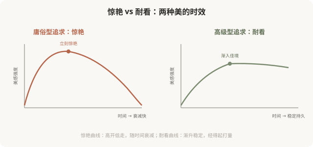
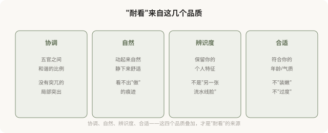

# 高级型的智慧：耐看比惊艳更难，也更重要

## 三个备选标题

1. 为什么“耐看”比“惊艳”更高级
2. 时间是审美的试金石：高级型经得起多久
3. 高级型的智慧：与潮流、与时间和解

## 封面介绍（100字以内）

高级型医美的结果是“耐看”——经得起时间、经得起潮流变化。这种耐看来自克制与整体的智慧，是高级型的终极标志。

## 正文

先说结论：**高级型医美的终极标志是“耐看”——经得起时间检验、经得起潮流变化、经得起反复打量。**“惊艳”是庸俗型追逐的目标（一眼吸睛、立刻变化），但惊艳往往短暂，随潮流退去而失色；“耐看”是高级型的追求（协调、自然、有持久美感），它不刺激，但经久。**这一篇讲高级型为什么追求耐看、耐看来自什么、以及如何把“耐看”作为自己医美的评价标准。**

### 惊艳 vs 耐看

**惊艳和耐看不是完全对立**——有些结果既惊艳又耐看。但庸俗型往往只追求惊艳（一眼吸睛、明显变化），忽视耐看；高级型则把耐看放在第一位，惊艳是次要的。

### 为什么“惊艳”往往短暂

惊艳的美感通常依赖**强烈的视觉刺激**——突出的轮廓、饱满的体积、明显的对称。这些刺激在第一眼会抓人，但有几个问题：

- **习惯化**：看久了，刺激感减弱，“惊艳”变成“普通”。
- **潮流变化**：今天惊艳的标准，明天可能过时。
- **比例失衡**：为追求惊艳而做的局部极致，往往破坏整体协调，时间久了显得突兀。
- **可识别**：惊艳的医美结果常被“一眼看出做过”，而一旦潮流转向，“做过”的痕迹就成了尴尬。

**所以追求惊艳的庸俗型，常常陷入“必须不断加码维持惊艳”的循环**——剂量越打越多，变化越来越显，最终走向假面。

### 耐看来自什么

### 耐看与潮流的关系

庸俗型医美的一个根本问题：**它追求当下的“标准”，而标准会变。**五年前的“标准脸”（高鼻、尖下巴、饱满苹果肌），现在被认为是“网红脸”“显俗”；今天流行的“幼态脸”“妈生款”，五年后可能也被新的标准取代。

**耐看的医美，是超越潮流的**——它不追逐“当下标准”，而是追求“协调、自然、属于你”。这种美不会因为潮流改变而显得过时，因为它不依赖潮流。

### 如何用“耐看”作为评价标准

做完医美后，怎么判断结果是不是“耐看”？几个自测：

- **远观**：3 米外看，整体协调吗？
- **近看**：0.5 米内看，有不自然痕迹吗？
- **动态**：笑、说话、做表情，协调吗？
- **照片**：拍正脸侧脸，自然吗？
- **时间**：半年后回看，仍觉得好吗？
- **他人**：别人感觉“你变好看了”，但说不出哪里变？

**如果这些答案大多积极，恭喜你，结果偏向高级型。**如果“一眼看出做过”“显假”“半年后觉得俗”，那可能落入了庸俗型。

### 一个反思

“耐看”之所以是高级型的终极标志，是因为它**最难造假、最难速成**。惊艳可以通过过度治疗快速达到，但耐看需要克制、整体、个性化的智慧——这是花钱买不到的，只能在思路和选择上逐步修炼。**追求耐看，本质上是把医美从“消费”变成“长期投资”**——投资一个经得起时间检验的、属于你自己的样子。这比任何一次“惊艳”的瞬间，都更值得。

> 本文用于健康教育与审美思辨，明确倡导高级型的“耐看”追求；具体医美决策须结合个体情况与具备资质的医师面诊。

## 参考资料

- 中华医学会整形外科学分会：面部美学与长期效果相关研究（以现行版本为准）
  https://www.cma.org.cn/
- American Society of Plastic Surgeons: Long-term aesthetic outcomes
  https://www.plasticsurgery.org/patient-safety
