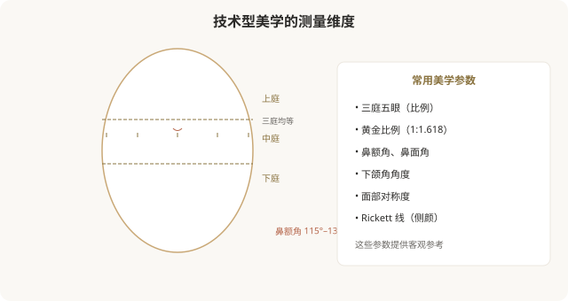
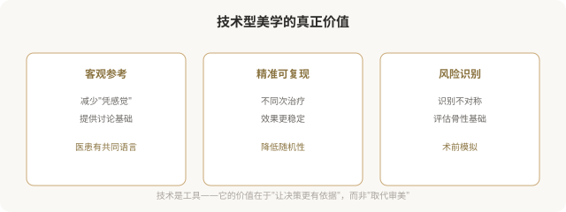
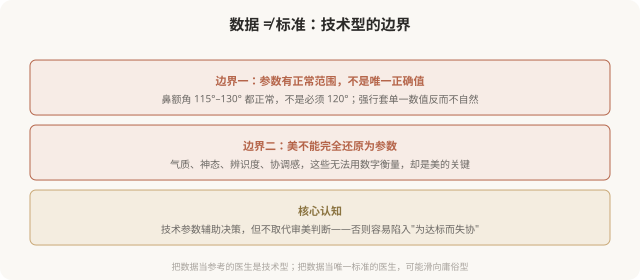
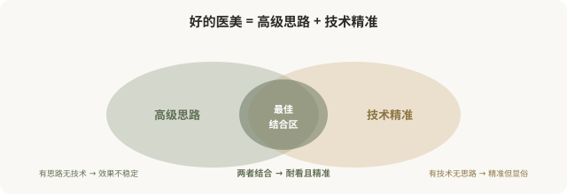

# 技术型医美美学：当审美被数据和参数定义

## 三个备选标题

1. 技术型医美美学：用数据丈量美的边界
2. 黄金比例、面部夹角：技术审美的逻辑与陷阱
3. 当美变成参数：技术型医美的能力与边界

## 封面介绍（100字以内）

技术型医美美学以测量、比例、参数为核心，追求精准可复现。它是工具而非标准，理解它的能力与边界，才能用好而不被它奴役。

## 正文

先说结论：**技术型医美美学以测量学、比例分析、参数化设计为核心，把“美”分解为可量化的数据——黄金比例、面部夹角、三庭五眼、对称度等。**它的价值在于提供客观参考、降低对“感觉”的依赖、让设计更精准可复现。但技术型也有边界：数据是参考不是标准，审美不能完全还原为参数。**技术型是工具，高级型是境界——好的医美是“高级的思路 + 技术的精准”，而非技术取代审美。**

### 技术型美学的核心：把美化成数据

技术型美学的几个常用工具：

- **比例分析**：三庭五眼、黄金比例，评估五官关系。
- **角度测量**：鼻额角、鼻面角、下颌角，评估轮廓。
- **对称度评估**：左右脸对称性的量化。
- **侧颜线**：Rickett 线等评估颏部与鼻唇的位置。
- **数字化设计**：3D 成像、CT 三维重建，术前模拟。

### 技术型的价值

### 技术型的边界：数据不是标准

这是技术型美学最重要的边界认知：**测量数据是参考，不是必须达到的标准。**

**一个关键区分**：

- **技术型（好的）**：用数据辅助判断，结合个体特征制定方案。
- **庸俗型（坏的）**：把数据当唯一标准，强行把人脸“调整到标准值”，忽视个体差异。

后者是技术型的滥用——它表面上“科学”，实际上是用参数取代审美，结果往往是“标准但失协”“精准但显假”。

### 技术型与高级型的关系

**高级型和技术型不是对立的，而是互补的**。最高水平的医美，是“高级的整体思路”配上“技术的精准执行”——用克制、协调、个性化的设计，通过精确的数据分析和操作来实现。

### 技术型被滥用时的风险

当技术型被误用为“唯一标准”，会出现几个问题：

- **趋同化**：所有人都被调到“标准参数”，结果千篇一律。
- **忽视气质**：参数达标了，但气质、神态、辨识度被抹平。
- **过度治疗**：为达到某个“标准值”，做不必要的项目。
- **抹杀个体特征**：把本应保留的个人特征（如轻微不对称、独特鼻型）当成“缺陷”修正。

**这就是技术型滑向庸俗型的路径——用“科学”包装趋同。**

### 如何正确看待技术型

作为消费者，理解技术型美学的几个原则：

- **数据是参考不是标准**：医生用参数辅助判断是好事，但不能把人脸简化为数字。
- **关注整体而非局部数值**：与其问“我的鼻角是多少度”，不如问“我的整体协调吗”。
- **警惕“科学”包装**：有些机构用“AI 测量”“黄金比例”等话术营销，实际仍是套模板。
- **尊重个体差异**：你的“非标准”特征，可能是你的辨识度，不必“修正”。
- **技术 + 思路**：选医生时，看他是否既用技术工具，又有整体审美思路。

### 一个反思

技术型医美美学是现代医美的重要进步——它让设计更精准、沟通更有依据、效果更可复现。**但技术的价值在于辅助审美，而非取代审美。**当数据成为唯一标准，当参数取代了协调与气质，技术型就滑向了庸俗型——用“科学”的名义批量生产趋同的脸。真正高级的医美，是把技术作为实现审美思路的工具，而非让审美屈从于数据。**数据是仆人，不是主人。**

> 本文用于健康教育与审美思辨，客观介绍技术型、警示其滥用；具体医美决策须结合个体情况与具备资质的医师面诊。

## 参考资料

- 中华医学会整形外科学分会：面部美学测量与分析相关共识（以现行版本为准）
  https://www.cma.org.cn/
- American Society of Plastic Surgeons: Facial aesthetic analysis
  https://www.plasticsurgery.org/patient-safety
