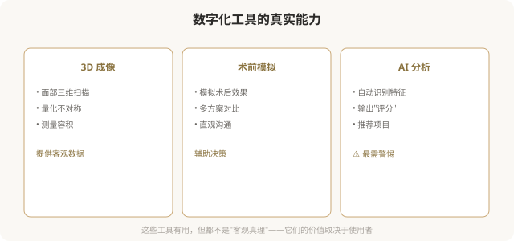
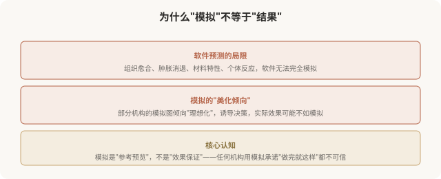
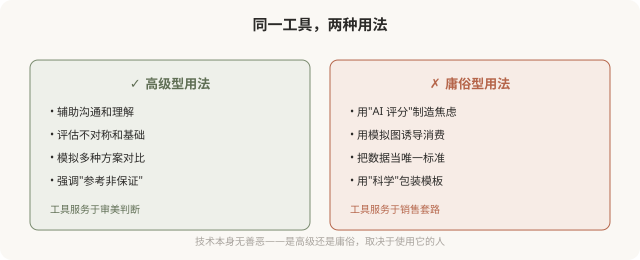

# 数字化设计与 3D 模拟：看见未来，但别迷信

## 三个备选标题

1. 术前 3D 模拟：能看到结果，但别全信
2. 数字化医美设计：能力、限制与陷阱
3. AI 测脸、3D 成像：技术工具怎么用才对

## 封面介绍（100字以内）

数字化设计和 3D 模拟能让术前预见结果，是技术型医美的重要工具。但它有局限，模拟≠现实，理解边界才能用好它。

## 正文

先说结论：**数字化设计（3D 成像、CT 三维重建、AI 面部分析、术前模拟）是技术型医美的重要工具，能帮助术前预见结果、医患沟通更直观。**但它有明确的局限：模拟不等于现实，软件预测的与实际效果可能有差距；AI 测脸的结果受算法影响，不是绝对客观；更关键的是，**技术工具的好坏取决于使用者的审美思路**——同样的 3D 模拟，有高级思路的医生用来设计协调方案，庸俗型医生用来推销“全套套餐”。理解这些边界，才能用好而不被它奴役。

### 数字化工具能做什么

### 模拟≠现实：最重要的边界

### AI 测脸的陷阱

近年来流行“AI 测脸”——上传照片，AI 输出“颜值评分”“缺陷分析”“推荐项目”。这类工具的问题：

- **算法有偏见**：AI 训练数据决定它的“审美标准”，往往是某种流行审美（如幼态脸），不是客观真理。
- **制造焦虑**：AI 找出“缺陷”的能力远超肯定“特征”——它总能量化出你“不达标”的部分。
- **导向消费**：很多 AI 测脸背后是机构营销，“缺陷”对应“推荐项目”，本质是销售工具。
- **简化审美**：把复杂的美学简化为分数和参数，忽视气质、辨识度、协调感。

**一个清醒的认知**：AI 测脸的“评分”，不是你颜值的客观值，而是某个算法在某个审美标准下的输出。**用 AI 测脸给自己打分，等于让一个有偏见的算法评判你的价值**——这本身就是容貌焦虑的放大器。

### 数字化工具的两面性

### 如何清醒地看待数字化工具

- **模拟是参考**：用它理解大致方向，不把它当效果保证。
- **AI 评分不是客观值**：它反映算法的偏见，不是你的价值。
- **警惕“科学”包装**：机构用 3D、AI 等术语营销，不等于它真的高级。
- **关注使用者的思路**：医生用工具辅助整体设计，还是用工具推销项目？
- **不被“缺陷分析”吓住**：AI 找出的“缺陷”，很多是正常的人类差异。

### 一个反思

数字化工具是医美的进步，它们确实让设计更精准、沟通更直观。**但技术工具不能取代审美判断，更不能取代对个体的尊重。**当 3D 模拟被用来诱导消费，当 AI 评分被用来制造焦虑，技术就从助力变成了陷阱。**真正高级的医美，是把数字化工具作为实现审美思路的手段，而非让审美屈从于技术展示。**工具永远只是工具——决定结果好坏的，是使用工具的人的审美与良知。

> 本文用于健康教育与审美思辨，客观介绍技术工具、警示其滥用；具体医美决策须结合个体情况与具备资质的医师面诊。

## 参考资料

- 中华医学会整形外科学分会：数字化医美设计应用相关共识（以现行版本为准）
  https://www.cma.org.cn/
- American Society of Plastic Surgeons: Imaging & simulation in plastic surgery
  https://www.plasticsurgery.org/patient-safety
