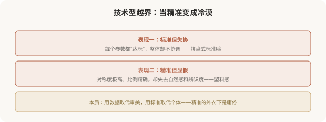

# 技术型的边界：当精准变成冷漠

## 三个备选标题

1. 技术型医美的边界：精准之外还有什么
2. 当“参数达标”取代“美不美”：技术型的陷阱
3. 数据、对称、标准：技术审美的能与不能

## 封面介绍（100字以内）

技术型医美追求精准，但精准有边界——气质、辨识度、协调感无法用数据衡量。理解技术型的“不能”，才能避免滑向庸俗。

## 正文

先说结论：**技术型医美追求精准、对称、达标，但精准有明确的边界——气质、辨识度、协调感、神态这些美的核心维度，无法用数据衡量。**当技术型越界，把“参数达标”当成“美不美”的唯一标准，它就滑向庸俗型：标准但失协、精准但显假、对称但冷漠。**理解技术型的“能与不能”，是避免滑向庸俗的关键。**这一篇作为技术型三篇的收尾，集中讲它的边界。

### 技术型的“能”

### 技术型的“不能”

**这就是技术型的根本边界**：它能测量比例、角度、对称度，但测不出气质、辨识度、神态、协调感。**而这些“测不出”的维度，恰恰是决定一张脸耐不耐看的核心。**

### 当技术型越界：精准的冷漠

**一个反直觉的事实**：绝对对称的脸反而显得不自然。研究发现，完全镜像对称的脸缺乏“生动感”，轻微的不对称反而是真实和美的来源。**技术型追求“绝对对称”的极端，反而走到了美的反面。**

### 如何把握技术型的边界

### 面诊时如何评估医生的技术型用法

理解技术型边界后，你可以通过沟通判断医生是否用对了工具：

- **好信号**：医生用数据辅助说明，但强调“这是参考，关键看整体协调”。
- **好信号**：医生指出你的“非标准”特征是辨识度，建议保留。
- **坏信号**：医生把某个参数说成“必须达到”，无视你的整体。
- **坏信号**：医生用 AI 评分或数据让你感觉“自己浑身是缺陷”。
- **坏信号**：医生追求“绝对对称”“最佳值”，忽视自然感。

### 一个反思

技术型医美美学是现代医美的进步，它让设计更精准、决策更有依据。**但技术的价值，在于辅助审美判断，而非取代它。**当数据成为唯一裁判，当标准抹杀个体，技术型就滑向了它本应避免的庸俗——用精准的外衣，批量生产失协的脸。**真正成熟的医美，是“高级的审美思路 + 技术的精准执行”**：用数据辅助判断，但始终记得，美的核心——气质、协调、辨识度、生动——是数据永远测不出的部分。

> 本文用于健康教育与审美思辨，客观介绍技术型的能力与边界；具体医美决策须结合个体情况与具备资质的医师面诊。

## 参考资料

- 中华医学会整形外科学分会：面部美学与测量边界相关研究（以现行版本为准）
  https://www.cma.org.cn/
- American Society of Plastic Surgeons: Aesthetic analysis & its limits
  https://www.plasticsurgery.org/patient-safety
