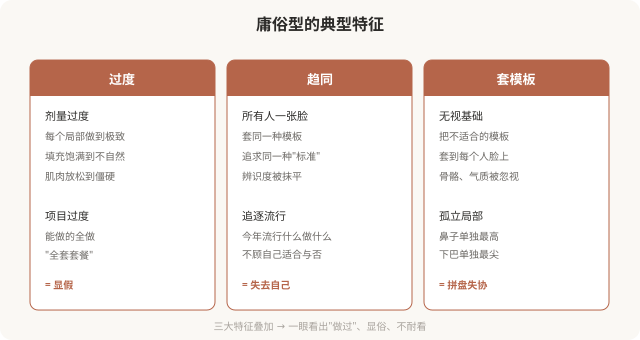
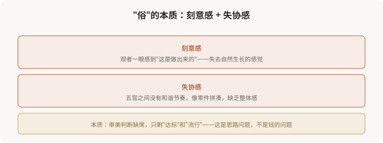
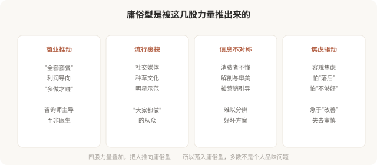

# 庸俗型医美美学：为什么有些医美显俗

## 三个备选标题

1. 为什么有的医美一眼就显俗：庸俗型的特征
2. 过度、趋同、套模板：庸俗型医美的三大病灶
3. 显俗不是钱不够，是思路错了

## 封面介绍（100字以内）

庸俗型医美以过度、趋同、套模板为特征，结果往往显假显俗。它不是钱花得不够，而是思路出了问题。本系列警示并分析这一型。

## 正文

先说结论：**庸俗型医美美学以“过度治疗、趋同化、套模板、追逐流行”为特征，结果是“一眼看出做过”、显假显俗。**庸俗型不是因为钱花得少、材料不好——恰恰相反，很多庸俗型花了大量金钱、用了昂贵材料。**问题出在思路**：把医美当成“达标游戏”或“流行追逐”，而非针对个体的整体设计。这一篇分析庸俗型的典型特征和成因，**警示而非嘲讽**——很多落入庸俗型的人，是在信息不对称中被推动的。

### 庸俗型的典型特征

### 显俗的“俗”在哪里

“俗”不是道德判断，而是**审美结果的描述**——指那种一眼能看出“刻意”“过度”“趋同”的感觉。它的核心是**缺乏自然的协调感和个体的辨识度**。

### 庸俗型是怎么形成的

### 庸俗型 ≠ 没钱或品味差

必须强调：**落入庸俗型，不等于这个人“没钱”或“品味差”。**

- 很多庸俗型医美花费巨大，用的是最贵材料。
- 很多落入庸俗型的人，品味并不差——只是在信息不对称中，被机构、流行、焦虑共同推动，做出了趋同的决定。
- 庸俗型的根源是**思路和机制**，不是个人的经济或品味。

**所以批判庸俗型，批判的是机制和现象，不是嘲讽个人。**理解这一点，才能建设性地讨论“如何避免、如何走向高级”。

### 庸俗型的几个红旗信号

如果你正在考虑医美，以下信号提示可能滑向庸俗型：

- **机构推荐“全套套餐”**，而非针对你的具体问题。
- **咨询师主导全程**，医生只在执行时出现。
- **强调“最新”“最流行”“最饱满”**，而非“协调”“适合你”。
- **用 AI 评分或数据让你感觉自己“浑身缺陷”**。
- **承诺“做完就像某某明星”**，套模板。
- **从不讨论“停止标准”或“替代方案”**。
- **催促“今天定有优惠”**，不给你冷静期。

**遇到这些信号，警惕——你正在被推向庸俗型。**

### 一个反思

庸俗型医美最大的悲剧，不在于“显俗”本身，而在于**它把本可以走向高级的医美，引向了反面**。同样的金钱、同样的产品、同样的技术，换一种思路，本可以做出耐看、自然、属于个体的结果——但庸俗型的思路，把这些资源浪费在了趋同和过度上。**避免庸俗型，不在于花更多钱或用更贵的产品，而在于换思路**：从“达标”“流行”转向“协调”“个体”。这是下一篇要讲的——如何识别庸俗型的陷阱，走向高级。

> 本文用于健康教育与审美思辨，批判庸俗型现象与机制，不嘲讽个人；具体医美决策须结合个体情况与具备资质的医师面诊。

## 参考资料

- 中华医学会整形外科学分会：医美审美与行业规范相关研究（以现行版本为准）
  https://www.cma.org.cn/
- American Society of Plastic Surgeons: Aesthetic trends & over-treatment
  https://www.plasticsurgery.org/patient-safety
