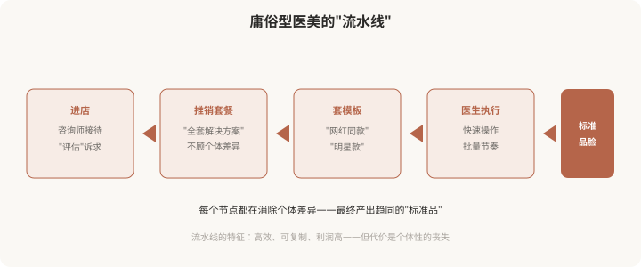
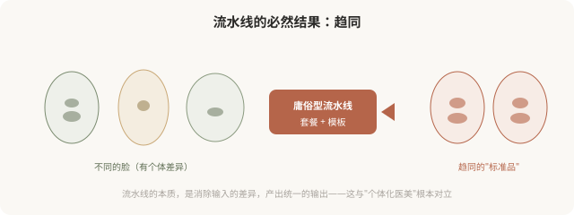

# 流水线化与趋同：当医美变成批量生产

## 三个备选标题

1. 流水线医美：当你的脸被当成产品加工
2. 为什么越来越多人长一样：医美趋同的机制
3. 套餐、模板、咨询师主导：庸俗型的生产线

## 封面介绍（100字以内）

庸俗型的核心机制是“流水线化”——套餐化、模板化、咨询师主导，把个体脸变成批量产品。理解这条生产线，才能跳出它。

## 正文

先说结论：**庸俗型医美的核心机制是“流水线化”——套餐化设计、模板化操作、咨询师主导流程，把本来应该个体化的医美，变成批量生产的“标准品”。**这条生产线高效、可复制、利润丰厚，但它必然产出趋同的结果——因为流水线的本质就是消除个体差异。**理解这条生产线如何运作，是跳出庸俗型的前提。**这一篇剖析庸俗型的“生产机制”。

### 医美流水线长什么样

### 流水线化的几个核心机制

**机制一：咨询师主导。**在庸俗型机构，“咨询师”（往往是非医疗人员）主导整个决策——评估诉求、推荐项目、确定套餐，医生只在最后执行。**这绕过了医生的专业判断**，把本应基于解剖和美学的决策，变成了基于销售的推销。

**机制二：套餐化。**把多个项目打包成“套餐”，听起来“划算”，实际是**无视个体需求**——你的问题可能只需要一个项目，但套餐让你做五个。套餐的本质是提高客单价，而非针对性解决问题。

**机制三：模板化。**“网红同款”“明星款”“幼态脸套餐”——这些模板无视你的骨骼、肤质、气质，强行套用。**模板的本质是消除个体差异**，因为它假设“所有人应该做成一样”。

**机制四：快节奏。**庸俗型机构追求高周转——快速面诊、快速决定、快速操作、快速下一个。**这种节奏消除了审慎**，不给消费者冷静评估的时间。

### 趋同化的必然结果

### “流水线”为什么流行

流水线化在商业上极其成功，原因：

- **可复制**：标准化流程可以在多家机构复制，快速扩张。
- **高利润**：套餐提高客单价，快节奏提高吞吐量。
- **低门槛**：咨询师主导降低了对医生个人能力的依赖。
- **迎合焦虑**：消费者在焦虑中倾向“一站式解决”，套餐正好满足。

**但商业成功不等于审美成功。**流水线的商业效率，恰恰以牺牲个体性和审美质量为代价。

### 庸俗型的“升级版”陷阱

需要警惕：**有些庸俗型机构会包装成“高级”的样子**——用精致装修、英文术语、AI 测量、3D 模拟等“技术感”元素，掩盖流水线的本质。判断是不是真高级，不看装修和术语，看：

- 医生是否主导决策（而非咨询师）？
- 方案是否针对你的具体问题（而非套餐）？
- 是否讨论“停止标准”和“替代方案”？
- 是否尊重你的个体特征（而非套模板）？

**包装可以高级，思路可能是庸俗的。**别被表象迷惑。

### 如何跳出流水线

- **要求与医生直接沟通**，而非只与咨询师交流。
- **拒绝“全套套餐”**，问“我具体需要什么”。
- **不接受现场决定**，要冷静期。
- **警惕“同款”“模板”**话术。
- **选医生而非选机构**，看医生的审美和沟通。
- **接受“少做”**，如果医生建议你不必做某项。

### 一个反思

医美本应是最“个体化”的服务——因为每个人的脸都不一样，每个人的诉求和基础都不一样。**但庸俗型的流水线，把它变成了最“标准化”的商品。**这是对医美本质的背离。跳出流水线，意味着拒绝被当成“产品加工”， reclaim 作为个体的尊严——你的脸不是流水线上的标准品，它是属于你自己的、独一无二的存在。下一篇会讲如何从庸俗型走向高级型。

> 本文用于健康教育与审美思辨，批判庸俗型流水线机制；具体医美决策须结合个体情况与具备资质的医师面诊。

## 参考资料

- 中华医学会整形外科学分会：医美行业规范化与诊疗流程相关共识（以现行版本为准）
  https://www.cma.org.cn/
- American Society of Plastic Surgeons: Individualized treatment vs commoditization
  https://www.plasticsurgery.org/patient-safety
