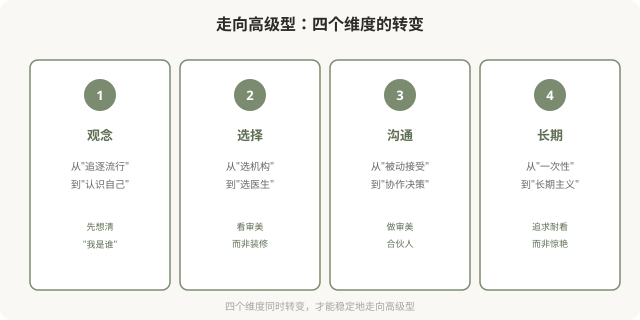
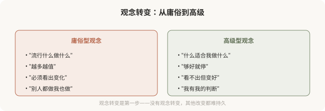
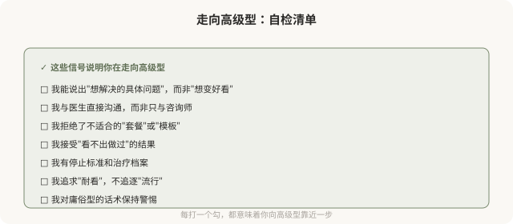

# 从庸俗走向高级：一份审美升级的实践指南

## 三个备选标题

1. 从庸俗型到高级型：审美升级的实践路径
2. 走向高级医美：观念、选择与长期主义
3. 给想升级的你：避开庸俗、走向高级的清单

## 封面介绍（100字以内）

走向高级型是观念和选择的双重升级：从追逐流行到尊重个体、从过度到克制、从被动到协作。这是系列的收尾与实践指南。

## 正文

先说结论：**从庸俗型走向高级型，是一种可实践的审美升级——它不需要花更多钱、用更贵产品，而需要观念转变和选择改变。**核心是从“追逐流行/达标/越多越好”转向“尊重个体/协调/克制”。这一篇是系列的收尾，把前面 9 篇的内容整合成一份实践指南——观念、选择、沟通、长期，四个维度帮你走向高级型。

### 走向高级型的四个维度

### 维度一：观念转变

**几个关键的观念自问**：

- 我追求的，是我真正喜欢的，还是被种草的？
- 我能否接受“看不出做过”的结果？
- 我有没有自己的审美判断，还是随波逐流？
- 我把医美当“一次性消费”还是“长期管理”？

### 维度二：选择转变

**从“选机构”转向“选医生”**：

- 看医生的资质、经验、审美观，而非机构的装修和规模。
- 看医生是否主导决策，而非咨询师主导。
- 看医生是否愿意与你深入沟通，而非快节奏操作。
- 看医生的案例是否多元（而非千篇一律的模板脸）。

**识别高级型医生的信号**：

- 他先评估你的整体，而非直接推荐项目。
- 他会劝你“少做”或不做不适合的项目。
- 他谈“协调”“比例”“你的特征”，而非“最新”“最饱满”。
- 他给你冷静期，不催促当场决定。
- 他讨论风险和替代方案。

### 维度三：沟通转变

**从“被动接受”转向“协作决策”**（详见第 03 篇）：

- 面诊前梳理具体诉求，不是“想变好看”。
- 带着问题清单去，主动提问。
- 要求看方案的逻辑，而非只听结论。
- 设定自己的边界（剂量、预算、恢复期、停止标准）。
- 不在第一次面诊当场决定。

### 维度四：长期转变

**从“一次性”转向“长期主义”**（详见第 04 篇）：

- 追求“耐看”而非“惊艳”。
- 建立注射/治疗档案，记录每次操作。
- 设立停止标准，不无限叠加。
- 定期冷静期，审视长期走向。
- 可逆优先，不可逆慎之又慎。

### 一份走向高级的自检清单

### 已经做了庸俗型医美怎么办

如果你已经做了偏向庸俗型的医美，不必自责——前面说过，多数人是被机制推动的。几个建议：

- **可逆的，调整**：填充可酶解、肉毒会代谢，等待或溶解后重新规划。
- **不可逆的，接受或谨慎修复**：骨骼手术等不可逆，修复需更慎重，找有经验的修复医生。
- **换思路**：比换产品或加剂量更重要的，是换思路——从过度转向克制。
- **停止叠加**：不要在庸俗型结果上继续叠加“补救”，可能更糟。
- **接受现实**：有些改变无法完全逆转，学会接受和与自己和解。

### 一个收尾反思

走向高级型，本质上是一种**审美成熟**——从被外部标准定义，到形成自己的判断；从追逐瞬时的惊艳，到追求经久的耐看；从被动接受机构安排，到主动参与决策。**这种成熟，比任何一支产品、任何一项技术，都更能决定你医美结果的质量。**

美有境界之分。庸俗型不是“差”，而是“未成熟”——它是审美决策被商业和焦虑绑架的状态。**走向高级型，是把审美的主导权拿回自己手里的过程。**当你能从容地说“我知道我想要什么、什么适合我、什么时候该停”，你就已经站在了高级型这一边。

这是这个系列的收尾，也是你审美升级的起点。

> 本文用于健康教育与审美思辨，明确倡导从庸俗型走向高级型；具体医美决策须结合个体情况与具备资质的医师面诊。

## 参考资料

- 中华医学会整形外科学分会：医美审美教育与患者决策相关研究（以现行版本为准）
  https://www.cma.org.cn/
- American Society of Plastic Surgeons: Patient education & aesthetic decision-making
  https://www.plasticsurgery.org/patient-safety
