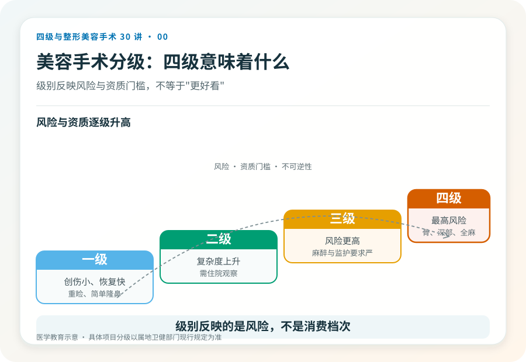
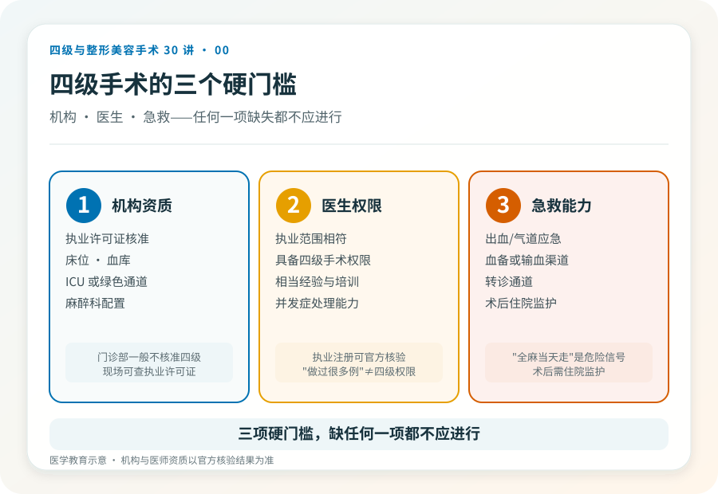

# 整形手术也分级：到底什么是“四级美容手术”

## 三个备选标题

1. 不是所有整形都叫“大手术”：一文读懂美容手术分级
2. 为什么有的整形手术只有少数医院能做？四级手术背后的逻辑
3. 从双眼皮到改脸型：手术分级怎么决定你的安全边界

## 封面介绍（100字以内）

国内把医疗美容手术分成一至四级，四级风险最高、对机构和医生资质要求最严。看懂分级，才能判断某个项目是不是适合自己、该去哪儿做。

## 分级标识

**手术分级：科普说明**（本文为分级制度科普，非具体术式）

## 正文

先说结论：**医疗美容手术在国内是按风险分级管理的，不是按“贵不贵”或“大不大”分。**一级到四级，风险和对资质的要求逐级提高。很多让人犹豫的“大项目”——比如削下颌角、颧骨内推、腹壁成形——属于四级；而双眼皮、简单隆鼻这些常见项目，多数是一级或二级。把分级搞清楚，是判断一个手术“该不该在你身上发生、在哪里发生”的第一步。

### 为什么要有手术分级

不同手术的出血风险、麻醉难度、可能波及的重要血管神经、以及一旦出问题的后果轻重，差别很大。门诊小手术和需要全身麻醉、可能进入骨质的手术，不可能用同一套安全标准管理。分级的核心目的是把高风险手术约束到具备相应救治能力的机构和有资质的医生手里，而不是把所有项目都做成“在哪都能做”。

> 关于“四级手术资质是批给医院还是批给医生”，《联合丽格第一医疗美容医院是如何获得四级手术资质的》（2020-06-12，李滨医美之滨）一文的观点是：在专家论证通过后，资质形式上批给机构，但实质上依托于具备四级手术能力的学科带头人与团队。**这是文章中的观点；当前各地审批口径以属地卫健部门规定为准，需另行核验。**

### 一到四级，大致怎么分

分级依据是原卫生部《医疗美容项目分级管理目录》。理解上可以把握几个层次，但具体某项目归属哪一级，要以现行目录和属地监管口径为准——以下为科普性质的概括，非逐项认定。

- **一级**：操作相对简单、创伤小、恢复快，常见如重睑术（双眼皮）、简单隆鼻、小额脂肪填充等，多数可在符合条件的美容外科门诊开展。
- **二级**：复杂度与风险上升，常需住院观察，如较复杂的隆鼻、假体隆乳的部分术式等。
- **三级**：风险更高、对麻醉和围术期管理要求更严，部分复杂修复、较大范围切除重建可能归此级。
- **四级**：风险最高，往往涉及深部组织、骨质、重要血管神经或全身麻醉下的较大手术，典型如颌面骨整形、腹壁成形、乳房缩小等。**只有取得相应级别资质的机构、由具备相应权限的医师才能开展。**

### “四级”两个字意味着什么

它至少意味着三件事，而这恰恰是科普里最容易被略过的部分。

第一，机构门槛更高。能做四级手术的机构在床位、血库、ICU 或绿色通道、麻醉和抢救配置上有更明确要求，不是任何一家美容门诊都具备。第二，医生资质更严。主刀医生需要具备相应的手术权限和经验，并不是“做过很多台手术”就自动具备四级手术资格。第三，决策应更慎重。四级手术多数不可逆、恢复期长、并发症一旦发生可能较重，所以术前评估、影像检查、麻醉评估、知情同意这些环节，比低级别手术更不能省。

### 一个常见误解：级别高 ≠ 效果好

有人把“四级”理解成“更高级、效果更好”，于是主动要求做更高级别的术式。这是把安全分级当成了消费档次。一个手术属于哪一级，反映的是它的风险和操作难度，不代表它一定更适合你，更不代表“越高级越好看”。是否需要某个术式，要看解剖基础、诉求合理性和风险承受能力，而不是级别。

反过来也一样：一级手术不等于“随便做”。任何手术都有适应证、禁忌证和并发症，低级别项目做坏了同样可能造成长期困扰。

### 分级信息怎么自己核实

最稳妥的方式是看机构公示与官方渠道。正规医疗机构会公示《医疗机构执业许可证》的诊疗科目和核准开展的手术级别；医生的执业资格可在国家卫生健康委的医师执业注册信息查询系统核实。**需要另行核验的当前事实：**各地对美容项目分级的目录细节、备案要求可能更新，发布或就诊时以属地卫健部门现行规定和机构公示为准。

### 决定做手术前，先把这三件事弄清

一是这个项目在我的情况下的真实级别和风险，二是打算去的机构有没有相应级别资质、主刀医生有没有相应权限，三是一旦出问题，这家机构有没有就地救治或快速转诊的能力。这三点比“价格”“案例图”“活动”都更值得花时间。如果对方对资质含糊其辞、用“我们是高端”替代明确回答，这本身就是一个信号。

> 本文用于健康教育，不能替代面诊和个体化评估；具体项目分级与资质以官方信息和机构公示为准。

## 参考资料

- 中华人民共和国国家卫生健康委员会：医师执业注册信息查询
  https://fuwu.nhc.gov.cn/
- 国家卫生健康委：医疗美容服务管理办法相关文件（以现行版本为准）
  http://www.nhc.gov.cn/
