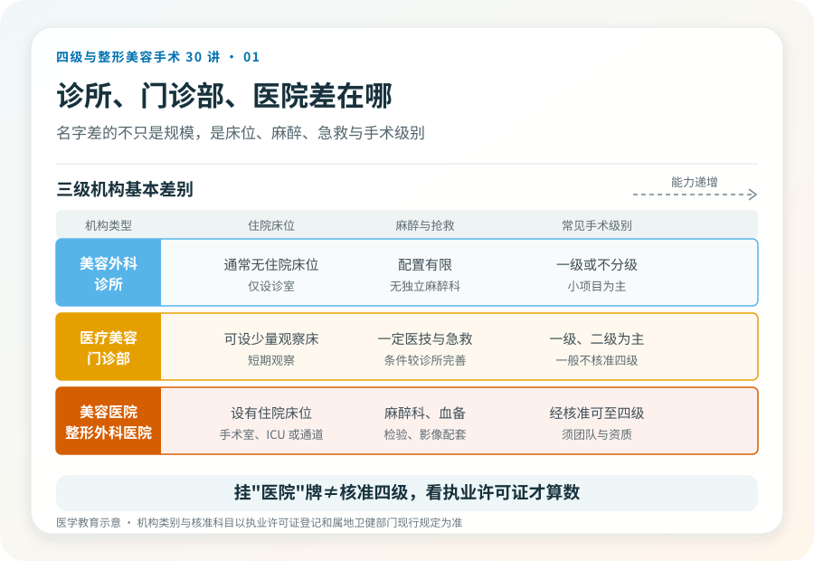
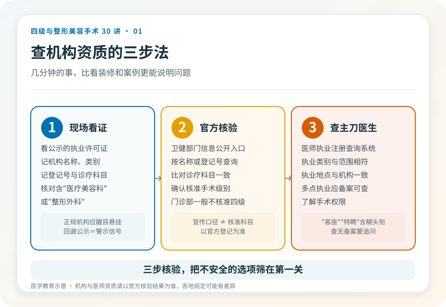

# “美容医院”和“门诊部”差在哪：机构资质怎么查

## 三个备选标题

1. 美容诊所、门诊部、医院都能做整形？资质差的不只是名字
2. 怎么查一家医美机构有没有“四级手术资质”？三步就够
3. 别只看门面装潢：识别医美机构资质的硬指标

## 封面介绍（100字以内）

机构叫“诊所”“门诊部”还是“医院”，对应不同的床位、麻醉、抢救和手术级别能力。学会查执业许可证，比看装修和案例更重要。

## 分级标识

**手术分级：科普说明**（本文为机构资质科普）

## 正文

先说结论：**“美容医院”“医疗美容门诊部”“美容诊所”在监管上对应不同的级别和能力，不只是规模大小的区别。**它们能开展的手术级别、是否设有住院床位、麻醉配置、抢救能力都有差异。看资质，比看门面更能判断一个地方能不能安全地承担你想做的手术。

### 三类机构的基本差别

按《医疗机构基本标准（试行）》等相关规定，可以大致这样理解，但具体核准科目以各机构执业许可证登记为准：

- **美容外科诊所/医疗美容诊所**：通常只设诊室，无住院床位，开展的医疗美容项目受限，多限一级或不分级的小项目。
- **医疗美容门诊部**：可设少量观察床，配备一定的医技和急救条件，可开展的手术级别较诊所更宽，常见为一级、二级。
- **美容医院/整形外科医院**：设有住院床位、手术室、麻醉科、检验与影像等，经核准可开展三级乃至四级手术（须具备相应资质与团队）。

这只是结构上的差别。一家挂着“医院”牌子的机构，未必核准了四级手术科目；一家门诊部再气派，也未必能合法开展高风险术式。**核验以执业许可证登记的诊疗科目和核准项目为准，需另行核验当前信息。**

### 三个硬指标，比装修更能说明问题

第一，**《医疗机构执业许可证》**。正规机构会在醒目位置悬挂，上面写明机构类别、诊疗科目和核准开展的项目。注意“诊疗科目”一栏是否包含你想做的手术相关科目，比如“医疗美容科”或“整形外科”。第二，**手术级别核准**。能开展四级手术的机构，其登记或备案信息中应有相应体现；门诊部一般不核准四级。第三，**麻醉与抢救条件**。全身麻醉、需住院的手术，要求机构具备麻醉科、血备、急救与转诊通道；若一家机构既没有住院条件又承诺“全麻大手术当天走”，要追问其合规性。

### 三步查证，几分钟的事

1. 看现场公示的执业许可证，记下机构名称、类别、登记号和诊疗科目。
2. 在国家或属地卫生健康部门的医疗机构信息公开/查询入口，按机构名称或登记号核验，比对诊疗科目是否与宣传一致。
3. 查主刀医生的执业注册信息（医师执业注册查询系统），确认执业类别、执业范围与所在机构一致，必要时了解其手术权限。

> 《联合丽格第一医疗美容医院是如何获得四级手术资质的》（2020-06-12，李滨医美之滨）提到，该机构通过增设病床、血库、ICU 和绿色通道，达到三级专科医院标准后才获批四级手术资质，且由专家“一个人一个人审核”，用时近十个月。**这是文章中的观点；当前各地审批流程与标准以属地卫健部门规定为准，需另行核验。**

### 几个需要警惕的信号

- 宣传里只强调“高端”“专家”“进口设备”，却回避执业许可证和核准科目。
- 主刀医生的执业注册机构与宣传不符，或仅有“客座”“特聘”等模糊头衔。
- 承诺四级手术“门诊完成、当天回家”，却无住院、麻醉科或抢救配置支撑。
- 价格远低于同类有资质机构的市场水平，同时强调“限时”“名额”制造紧迫感。

### 一个被忽略的细节：属地差异

医疗美容的机构准入和项目分级在不同省份、不同时期可能有细节差异。本文给的是判断框架，不是逐项认定。**真正决定一家机构“能不能做某个手术”的，是它执业许可证上核准的科目与属地卫健部门的现行规定**，而不是宣传册上的措辞。核对这件事，本身就是对面诊机构的一次低成本筛查。

> 本文用于健康教育，不能替代面诊；机构与医师资质请以官方核验结果为准。

## 参考资料

- 中华人民共和国国家卫生健康委员会：医疗机构信息查询
  https://fuwu.nhc.gov.cn/
- 国家卫生健康委：医疗机构管理条例及相关配套文件（以现行版本为准）
  http://www.nhc.gov.cn/
