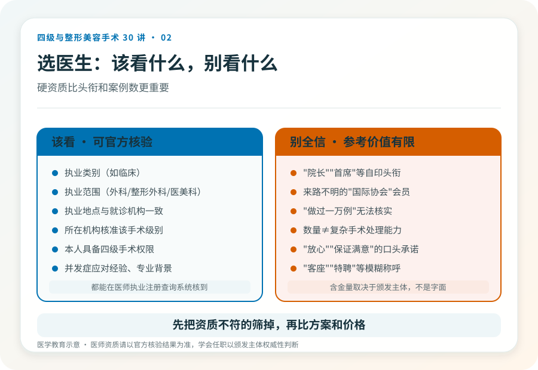
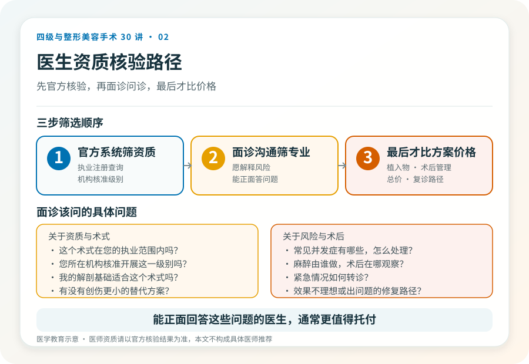

# 选医生别只看“案例图”：主刀资质怎么看

## 三个备选标题

1. 整形医生的头衔那么多，哪些是真的有用？
2. 比“做了多少例”更重要的事：怎么判断医生能不能做四级手术
3. 别被“院长”“首席”绕晕：整形医生的硬资质只有这几条

## 封面介绍（100字以内）

医生的“案例数”“头衔”参考价值有限。真正决定他能不能做你那台手术的，是执业范围、手术权限、专业背景和并发症处理经验。

## 分级标识

**手术分级：科普说明**（本文为医师资质科普）

## 正文

先说结论：**选整形医生，硬指标比头衔和案例数更重要。**一个医生能不能合法、安全地给你做某台手术，取决于执业注册的类别与范围、所在机构核准的手术级别、他本人的手术权限和专业经验。而宣传里的“院长”“首席”“国际会员”多数不是法定资质，参考意义有限。

### 法定资质，先看这三条

第一，**执业类别与范围**。医生的执业注册信息里写明执业类别（如临床）和执业范围（如外科、整形外科或医疗美容科）。做整形手术的医生，其执业范围应与所开展项目相关。第二，**执业地点**。注册的执业机构应与你就诊的机构一致，“多点执业”也应在官方备案可查。第三，**手术权限**。四级手术通常要求主刀医师具备相应资历和权限，不是任何注册了整形范围的医生都能主刀。

这三条都能在医师执业注册查询系统核到。查不到、查出来对不上，或只有一堆自印头衔，就值得多问一句。

### “案例数”为什么不能完全信

案例数量是经验的一个侧面，但有两个问题。一是无法核实——很多数字来自自我陈述，没有第三方数据。二是数量不等于质量——做过一万例小项目，不等于能处理一台复杂颌面手术的术中出血。对四级手术尤其如此：关键能力是解剖熟悉度、术中判断和并发症应对，这些很难用“做了多少例”一句话概括。

> 《慎用“头衔”——陈春花老师的经历，值得美容医生深思》（2022-08-09，李滨医美之滨）一文讨论了医生夸大头衔的风险。**这是文章中的观点**，但它指向一个普遍原则：头衔的含金量取决于颁发主体的权威性，而非头衔本身的字面。

### 更值得问的问题

与其问“您做过多少例”，不如问这些：

- 这个术式在您的执业范围内吗？您所在机构核准开展这一级别吗？
- 这个手术常见的并发症有哪些？您遇到时通常怎么处理？
- 麻醉由谁做？术后在哪观察？出现紧急情况怎么转诊？
- 我的解剖基础（可结合影像）适合这个术式吗？有没有更小代价的替代方案？
- 如果我对效果不满意或出现问题，术后复诊和修复路径是怎样的？

能正面、具体回答这些问题的医生，通常更值得托付；反复回避或只用“放心”“保证满意”应对，是另一种信号。

### 专业背景的几个客观锚点

学术任职、学会会员资格、发表文献等可以作为参考，但要看颁发主体。国家级专业学会（如中华医学会相关分会）的任职有参考价值；来路不明的“国际协会”“亚太联盟”则未必。在正规教学医院受训、有公立医院整形外科工作经历、参与过复杂修复或教学，是相对可核实的背景。**这些是辅助判断，不替代执业资质核验。**

### 别被“打包价”和“咨询师”主导决策

很多机构的初诊由“咨询师”主导，医生最后只出现几分钟。对于四级手术这种高风险决策，你应该和主刀医生本人有充分沟通。如果沟通中只有报价、套餐和“今天定有优惠”，没有对你的解剖、诉求、风险和替代方案的讨论，这家机构对你这台手术的态度可能不够严肃。

### 一个简单的筛选顺序

先用官方系统筛掉资质不符的，再用面诊沟通筛掉不专业或不愿解释风险的，最后才比较方案细节和价格。把价格放在第一筛，很容易在第一关就留下不安全的选项。

> 本文用于健康教育，不能替代面诊；医师资质请以官方核验结果为准。

## 参考资料

- 中华人民共和国国家卫生健康委员会：医师执业注册信息查询
  https://fuwu.nhc.gov.cn/
- 中华医学会相关专科分会信息
  https://www.cma.org.cn/
