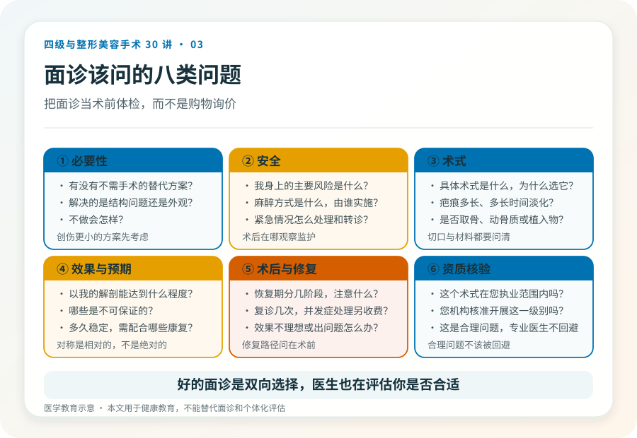
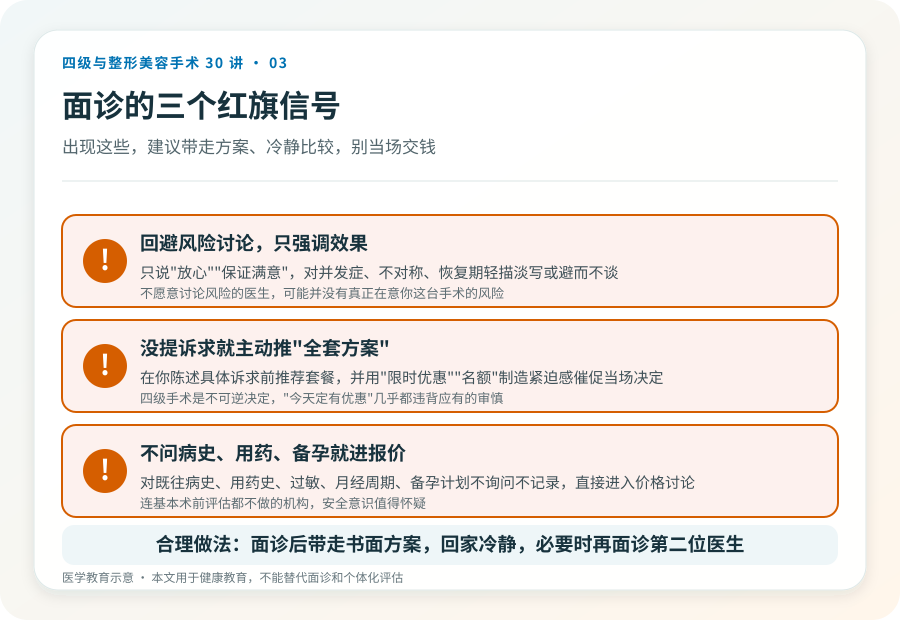

# 面诊不是去听报价的：四级手术面诊该问什么

## 三个备选标题

1. 整形面诊 20 分钟，比“咨询案例”更该问的 8 个问题
2. 面诊时医生愿意解释什么，比报价更能说明问题
3. 把面诊当体检，而不是当购物：四级手术的术前沟通清单

## 封面介绍（100字以内）

四级手术的面诊，目的不是定套餐，而是评估适不适合做、风险能不能承受、术后能不能配合。带上这份问题清单，让面诊变成真正的医学沟通。

## 分级标识

**手术分级：科普说明**（本文为面诊沟通科普）

## 正文

先说结论：**面诊是四级手术决策里最重要的一环，但很多人把它用错了——只用来听报价和看案例图。**真正有价值的面诊，是判断这台手术在你的身体上是否必要、安全、可承受。把面诊当成“术前体检 + 风险沟通”，而不是“购物询价”，能筛掉大量后续麻烦。

### 面诊前，先自己理清三件事

去之前，把这三件事想清楚，能大幅提高面诊效率：

1. **我的真实诉求是什么**。不是“想变好看”，而是具体到“下颌角太宽影响发型”“产后腹壁松弛运动改善不了”。越具体，越能判断有没有必要动手术。
2. **我能接受到什么程度**。包括能接受的恢复期、疤痕、可能的并发症和二次手术。诚实面对自己的承受力，比幻想“完美效果”更有用。
3. **我的健康状况底线**。慢性病、用药史、过敏、既往手术和麻醉反应、月经周期、备孕计划，都要事先整理好。

### 面诊该问的几类问题

**关于必要性**：我这种情况，有没有不需要手术或创伤更小的替代方案？这个术式解决的是结构问题还是单纯的外观？不做会怎样？

**关于安全**：这个手术在我身上的主要风险是什么？需要做哪些术前检查和影像？麻醉方式是什么、由谁实施？术后在哪观察、出现紧急情况怎么处理？

**关于术式**：您建议的具体术式是什么、为什么？切口在哪、疤痕大概多长、多长时间能淡化？是否需要取骨、动骨质、植入物？

**关于效果与预期**：以我的解剖基础，效果大概能达到什么程度？有哪些是不可保证的？多久能稳定？术后需要配合哪些康复？

**关于术后与修复**：恢复期分几个阶段、每个阶段要注意什么？需要复诊几次？如果效果不理想或出现并发症，处理路径是怎样的、是否另收费？

**关于资质**：这个术式在您的执业范围内吗？您所在机构核准开展这一级别吗？（这是合理问题，专业医生不会回避。）

### 三个红旗信号

面诊中如果出现这些，要特别警惕：

- 医生回避风险讨论，只强调效果和“保证满意”。
- 在你没提具体诉求前就主动推荐“全套方案”，并制造限时优惠。
- 对你的既往病史、用药和备孕计划不询问、不记录，直接进入报价。

### 影像和检查不是“额外收费”

四级手术前的影像（如颌面 CT、三维重建）、心电图、血液化验、麻醉评估，是判断手术可行性和制定方案的基础，不是机构“凑价格”的项目。如果一家机构连基本术前检查都不做就安排手术日期，其安全意识值得怀疑。反过来，检查结果也应该由医生向你解释，而不是只给一纸报告。

### 别在第一次面诊就交钱定手术

合理的做法是面诊后带走书面方案、回家冷静思考、必要时再面诊第二位医生对比。被“今天定下来有优惠”催促当场决定的，几乎都违背了四级手术应有的审慎。这是一个不可逆、恢复期长的决定，值得多花一两周。

### 把面诊变成“双向选择”

好的面诊是双向的：医生也在评估你是不是合适的手术对象——你的预期是否合理、能不能配合术后管理、健康状况是否允许。如果一个医生对所有诉求都点头、对所有风险都轻描淡写，这并不代表他技术好，更可能意味着他对你这台手术的风险没有真正在意。

> 本文用于健康教育，不能替代面诊和个体化评估。

## 参考资料

- American Society of Plastic Surgeons: Choosing a plastic surgeon & consultation
  https://www.plasticsurgery.org/patient-safety/choosing-a-plastic-surgeon
- 国家卫生健康委：医疗美容服务管理办法相关文件（以现行版本为准）
  http://www.nhc.gov.cn/
