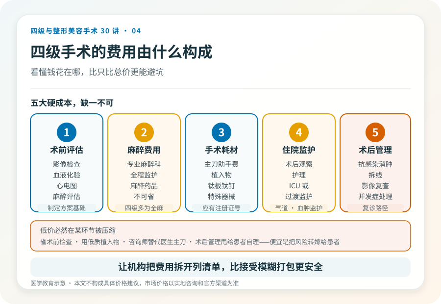
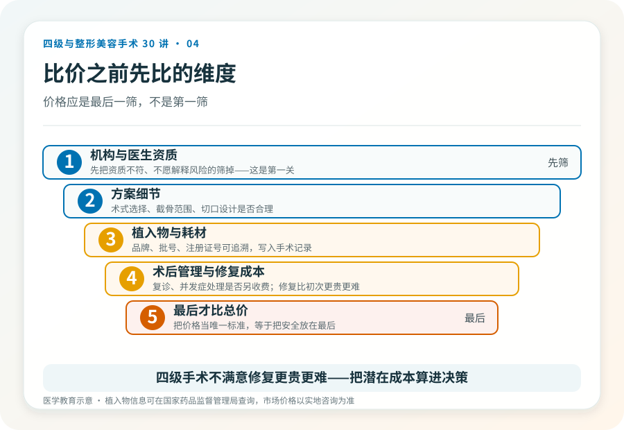

# 一台四级手术的“合理价格”长什么样：别只比总价

## 三个备选标题

1. 为什么四级手术差价能到几万？钱花在哪儿才合理
2. 整形报价单上的“打包价”，藏着哪些你没注意的成本
3. 便宜的四级手术和贵的差在哪：价值判断清单

## 封面介绍（100字以内）

四级手术的费用构成远不只是“手术费”。麻醉、住院、术前检查、植入物、术后管理都是硬成本。看懂价格构成，比比总价更能避坑。

## 分级标识

**手术分级：科普说明**（本文为费用科普）

## 正文

先说结论：**四级手术的费用差距，很多时候不是“贵就是宰”，而是反映了资质、麻醉、住院、植入物和术后管理的真实成本。**只比总价、挑最便宜的那家，往往是在风险最高的环节省了钱。看懂价格由哪些部分组成，比看一个打包数字更有意义。

### 一台四级手术的硬成本有哪些

理解费用，先看钱花在哪。一台规范的四级手术通常包含：

- **术前评估与检查**：影像（如颌面 CT、三维重建）、血液化验、心电图、必要时专科会诊。
- **麻醉费用**：四级手术多为全身麻醉，需要专业麻醉科医生、监护和药品，这是不可省的硬成本。
- **手术与耗材**：主刀与助手的手术费、植入物（如假体、钛板钛钉）、缝合材料、特殊器械。
- **住院与监护**：术后住院观察、护理、可能的 ICU 或过渡监护。
- **术后管理与复诊**：抗感染、消肿、拆线、影像复查、并发症处理。

把这些列出来就能看出：一个低得离谱的报价，必然在某个环节被压缩——要么省掉术前检查，要么用低质植入物，要么让“咨询师”替代医生主刀，要么把术后管理甩给患者自理。**便宜往往不是省钱，而是把风险转嫁给患者。**

### “打包价”要看清楚打包了什么

很多机构报“打包价”，听起来省心。问题在于打包内容是否完整。要问清：打包里是否包含术前影像和检查？麻醉是否单独收费？植入物是什么品牌、是否有批号可查？住院几天、超出怎么算？术后复诊和并发症处理是否另收费？

如果打包价里不包含麻醉、植入物或术后管理，所谓的“低价”只是在前期吸引你，后续一项项加回来。**让机构把费用拆开列清单，比接受一个模糊的打包数字更安全。**

### 植入物的差价，值得追问

假体、钛板、缝线等耗材是费用的大头之一，也是质量差异最明显的地方。合法的植入物应有国家药品监督管理局的注册证号，可追溯批号。同一类产品，进口与国产、不同品牌之间确实存在价格差异，但都应是可查询的合规产品。如果机构对植入物品牌、批号、注册证号含糊其辞，或拒绝写入手术记录，这是一个明显的风险信号——你无法事后证明体内放的是什么。

### 比价格之前，先比这些

合理的比价顺序是：先把资质不符、不愿解释风险的机构筛掉；在剩下的有资质机构之间，比较方案细节、植入物、术后管理和总价。把价格作为第一筛、甚至唯一标准，等同于把安全放在最后。

> 重组胶原等医美底层资产“具备高频、小额、低风险特性”的判断（《重组胶原或将成为新的医美价值投资》，2025-11-11，李滨医美之滨）**是文章中的观点**，它指向一个普遍逻辑：高客单、高风险项目与高频低风险项目的成本结构不同，前者不应被低频低价的营销逻辑套用。**当前市场价格信息需另行核验。**

### 几个关于钱的误区

- **“贵的一定好”**：不一定。高价也可能来自营销和地段，而非医疗质量。还是要回到资质和方案。
- **“案例多的便宜机构更划算”**：案例数无法核实，且四级手术的能力不能用数量简单衡量。
- **“能分期就是靠谱”**：分期是金融安排，不等于机构资质或手术安全。
- **“朋友推荐的就是好的”**：个体经验有参考价值，但不能替代资质核验和自己的面诊判断。

### 关于“修复成本”这件事

四级手术一旦不满意或出问题，修复往往比初次手术更贵、更难。把这部分潜在成本算进决策，比只看初次手术报价更现实。一个愿意坦诚讨论“如果效果不理想怎么办”的机构，通常比只承诺完美的更可信。

> 本文用于健康教育，不构成具体价格建议；市场价格请以实地咨询和官方渠道为准。

## 参考资料

- 国家药品监督管理局：医疗器械注册信息查询
  https://www.nmpa.gov.cn/
- 国家卫生健康委：医疗服务价格管理相关政策（以属地现行规定为准）
  http://www.nhc.gov.cn/
