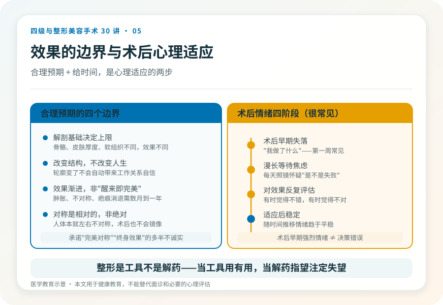

# 整形决策与心理适应：从想清楚到适应好

## 三个备选标题

1. 动四级手术前先问自己五个问题，术后还要熬过那段“后悔期”
2. 整形效果不等于换张脸：术前预期和术后心理适应一样重要
3. 决策、等待、适应：整形心理的三个阶段一次说清

## 封面介绍（100字以内）

整形手术的心理考验贯穿术前决策、术后等待和长期适应。合理预期比追求完美效果更能保护满意度——包括有时候，选择不做。

## 分级标识

**手术分级：科普说明**（决策与心理适应科普，适用于各级手术，对四级手术尤其重要）

## 正文

先说结论：**整形手术（尤其四级手术）的心理考验，不只在手术台上，而是贯穿术前决策、术后等待和长期适应的全过程。**最影响满意度的往往不是技术，而是预期是否合理、心理是否准备好、术后能否平稳适应。这一篇把“想清楚再做”和“做完好好适应”合起来讲，因为它们是同一件事的两面。

### 第一阶段：术前决策，先问自己五个问题

在面诊之前，安静地回答这五个问题，比看一百张案例图更有用：

1. **我的诉求是具体的结构问题，还是笼统的“不自信”？** 手术解决结构问题，解决不了人生困境。
2. **如果效果只达到预期的一半，我还能接受吗？** 不能接受，说明预期本身可能过高。
3. **我能承受多长的恢复期、多大的疤痕、可能的并发症和二次手术？** 这是承受力的真实底线。
4. **这是我自己想做的决定，还是为了某段关系、某个场合、某种压力？** 为他人而做的不可逆手术，事后容易后悔。
5. **如果今天不做，半年后我会怎样？** 如果答案影响不大，说明并不紧迫，值得再缓一缓。

这五个问题不是劝你不做，而是帮你分清“想做”和“该做”。

### 第二阶段：理解手术效果的边界

合理预期建立在理解这几个边界之上：

- **解剖基础决定上限**。同样的术式，在不同骨骼、皮肤厚度、软组织条件下效果不同。案例图是别人的解剖，不能直接套到自己身上。
- **手术改变结构，不改变气质和人生**。轮廓变了，不会自动带来工作、关系或自信的根本改变。
- **效果是渐进的，不是“醒来看镜子就完美”**。术后肿胀、不对称、疤痕都需要时间消退，最终稳定可能要半年到一年。
- **对称是相对的，不是绝对的**。人体本就左右不对称，术后也不会是镜像完美。

把这几个边界讲清楚的医生，比承诺“完美对称”“终身效果”的医生更值得信任——后者要么不诚实，要么对你的解剖没有真正评估。

### 哪些情况建议先缓一缓

- 正在经历重大生活变故（分手、失业、丧亲、严重冲突），情绪不稳定时做的不可逆决定，事后后悔率高。
- 对效果抱有“换脸式”期待，认为手术能解决外貌以外的问题。
- 未成年人，或对自身外貌判断尚不稳定的年轻人，尤其涉及不可逆的骨性手术。
- 存在体象障碍倾向——对微小的外貌缺陷过度关注、反复手术仍不满意。这种情况需要的是心理评估，而不是更多手术。
- 短期内频繁更换“想做的项目”，没有稳定的诉求。

这些不是道德判断，而是降低不可逆后悔的现实考量。在以上情境下，先咨询心理专业人士或推迟决策，往往是更负责任的选择。

### 把“可接受的最坏情况”想清楚

四级手术的并发症虽然不常见，但一旦发生可能较重：出血、感染、神经损伤、不对称、骨不愈合、植入物问题、需要二次手术。术前问自己：如果出现这些情况，我有时间、预算和心理资源去应对吗？如果答案是“完全承受不了”，那这台手术对你就不是合适的选择，无论技术多好。

**愿意和你认真讨论最坏情况的医生和机构，比回避这个话题的更安全。**

### 第三阶段：术后心理适应，熬过那段“后悔期”

手术结束才是心理考验的开始。很多人术后会经历类似的情绪阶段，**这些都是常见的，不是你“心理有问题”**：

- **术后早期的失落**：看到肿胀、淤青、不像自己的脸，会产生“我做了什么”的冲击。这种反应在术后第一周很常见。
- **漫长的等待焦虑**：恢复需要时间，每天照镜子看不到明显改善，会怀疑“是不是失败了”。
- **对效果的反复评估**：有时觉得不错，有时觉得不对，情绪随镜中影像起伏。
- **适应后的稳定**：随时间推移，多数人会逐渐适应新外观，情绪趋于平稳。

**理解这个过程的意义在于：术后早期的强烈情绪不等于决策错误。**给它时间，是心理适应的第一步。

### 恢复期的几个现实

- **肿胀消退需要时间**：面部手术的明显肿胀可能持续数周，完全消退到最终效果可能数月到一年。
- **不对称是过程性的**：术后早期左右不对称很多是肿胀不均所致，随恢复会改善。
- **疤痕会经历变化**：发红、增生、变淡，整个过程可能一年以上。
- **效果是渐进显现的**：不是“拆线即定型”。

**了解这些，能让你在恢复期不至于把正常的阶段性表现误判为失败。**

### 两端的心理落差

术后心理落差常落在两端：

- **“为什么没变化”**：期待大幅改变，结果只感到微妙差异。多见于保守的术式或预期过高。
- **“变化太大，不像自己”**：明显的改变带来身份认同冲击。多见于颌面等改变轮廓的手术，需要数月适应。

**这两种落差都说明术前的预期管理有多重要。**把期待建立在“改善具体问题”而非“换个人生”上，术后适应会平稳得多。

### 他人的反应与自我接纳

术后他人的反应可能带来压力：被看穿或评论的担忧、亲近的人不理解。应对建议：**你没有义务向所有人解释。**对亲近的人可以提前沟通；对无关的人，模糊回应是合理的。

更重要的是自我接纳与“够了”的认知：**改善到合理程度就停下来，而不是永远追求“再好一点”。**反复“再修一点”可能滑向过度整形和不满足。整形是工具，不是解药——把它当工具用，它有用；把它当解药指望，几乎注定失望。

如果发现自己陷入“永远不满意”“总想再改”，这可能是心理信号（如体象障碍倾向），需要的不是更多手术，而是专业心理评估和支持。

### 什么时候需要寻求心理支持

出现以下情况，建议寻求心理专业人士的帮助：

- 术后长时间（数月）情绪低落、焦虑，影响日常生活。
- 对效果持续强烈不满，反复要求修整但医生认为无必要。
- 对外貌的某个细节过度关注，影响社交、工作。
- 出现回避社交、自我封闭。
- 有自伤或绝望念头（这种情况需要立即寻求帮助）。

**寻求心理支持不是软弱，而是对自己负责。**整形决策涉及身体形象和心理状态，心理专业人士的介入是合理且有益的。

### 一个实用建议：写决策与恢复日记

从第一次面诊到术后恢复，用一段时间记录：每天的感受、有没有动摇、外界影响了什么、恢复的进展。回头读这份记录，能帮你区分“经过冷静思考的决定”和“被某次面诊或优惠推动的冲动”，也能在术后焦虑时看到恢复的真实轨迹。四级手术值得这样的耐心。

> 本文用于健康教育，不能替代面诊和必要的心理评估。

## 参考资料

- American Society of Plastic Surgeons: Patient safety & psychological considerations
  https://www.plasticsurgery.org/patient-safety
- 中华医学会整形外科学分会、精神医学分会：相关诊疗共识（以现行版本为准）
  https://www.cma.org.cn/
