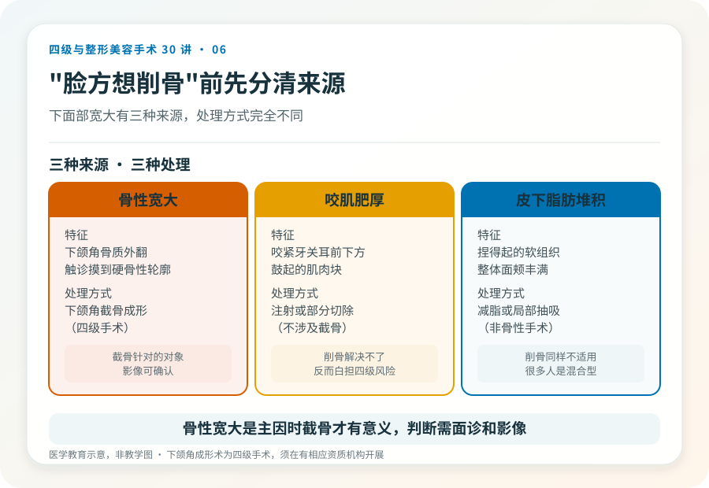
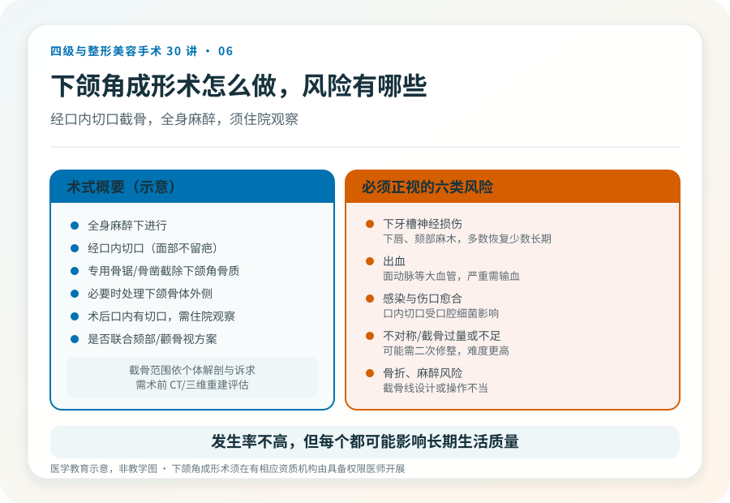
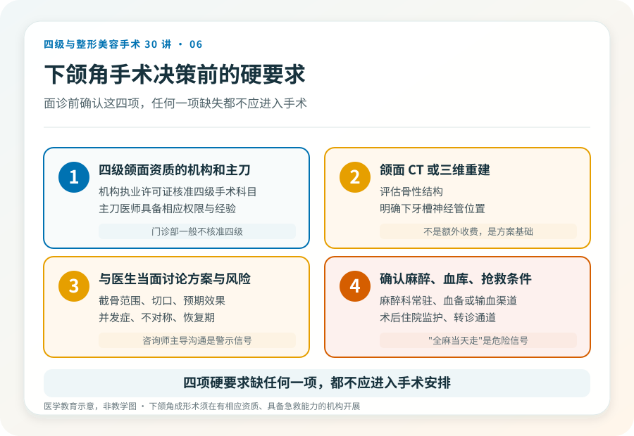

# 削下颌角是四级手术：风险和决策一次说清

## 三个备选标题

1. “脸方想削骨”之前：下颌角成形术的真实风险
2. 下颌角截骨不是“瘦脸捷径”：四级手术该懂的几件事
3. 削骨能改脸型多少？看解剖、看风险，而不是看案例

## 封面介绍（100字以内）

下颌角成形术（削骨）是四级手术，涉及骨质截除、全身麻醉和重要血管神经。它改变的是骨性轮廓，不是“瘦脸”的全部答案。

## 分级标识

**手术分级：四级**

## 正文

先说结论：**下颌角成形术（俗称“削下颌角”“截骨”）是四级美容手术，通过截除部分下颌角骨质改变下面部宽度。**它涉及骨质操作、全身麻醉、下牙槽神经和面动脉等重要结构，风险和对机构、医生资质的要求都高。把它理解成一种“瘦脸项目”是常见误解——它解决的是骨性宽大，不是咬肌或脂肪造成的脸宽。

### 先分清你的“脸宽”是哪种

下面部宽大有三种常见来源，处理方式完全不同：

- **骨性宽大**：下颌角骨质外翻或后天增生，触诊能摸到硬的骨性轮廓。这是下颌角手术针对的对象。
- **咬肌肥厚**：咬紧牙关时耳前下方鼓起的肌肉块。处理以注射或部分切除为主，不涉及截骨。
- **皮下脂肪堆积**：捏得起的软组织。以减脂或局部抽吸为主。

很多人是混合型。**只有在骨性宽大是主要因素时，截骨才有意义**；如果主要问题是咬肌或脂肪，削骨不仅解决不了，还会白白承担四级手术的风险。判断属于哪种，需要面诊触诊和影像，不是照镜子看自拍。

### 手术大致怎么做

下颌角成形术通常在全身麻醉下，经口内切口（避免面部留疤），用专用的骨锯或骨凿截除部分下颌角骨质，必要时处理下颌骨体外侧。术后口内有切口，需住院观察。具体截骨范围、是否联合颏部或颧骨手术，取决于个体解剖和诉求。

> 据《联合丽格第一医疗美容医院是如何获得四级手术资质的》（2020-06-12，李滨医美之滨），颌面整形中心在获得四级资质后成为当地能合法开展下颌角等颌面手术的少数机构之一。**这是文章中的观点；当前各地能开展四级颌面手术的机构与资质以属地核验为准。**

### 几个必须正视的风险

- **下牙槽神经损伤**：下牙槽神经走行于下颌骨内，截骨可能伤及，表现为下唇、颏部麻木，多数可恢复，但少数长期不恢复。
- **出血**：下颌区域有面动脉等大血管，术中有出血风险，严重时需输血或紧急处理——这也是为什么必须有血库和抢救条件。
- **感染与伤口愈合**：口内切口易受口腔细菌影响，需严格无菌和术后口腔护理。
- **不对称或截骨过量/不足**：效果与预期不符，可能需要二次修整，而二次手术难度和风险都更高。
- **骨折**：截骨线设计或操作不当可能导致非预期骨折。
- **麻醉相关风险**：全身麻醉本身有一定风险，需要专业麻醉科和监护。

这些风险发生率不高，但每一个都是真实的、可能影响长期生活质量的。把它们当成“概率数字”轻描淡写，是对自己不负责。

### 哪些人不适合做

- 下颌骨发育未完成的未成年人。
- 凝血功能异常、未控制的慢性病、严重牙周或口腔感染期。
- 对效果抱有“换脸”期待，或对疤痕、不对称完全不能接受。
- 心理预期不稳定，或正处于重大生活压力期。

### 决策前的硬要求

如果决定面诊下颌角手术，至少做到：选择有四级颌面手术资质的机构和主刀医生；做颌面 CT 或三维重建评估骨性结构和神经管位置；与医生当面讨论截骨范围、风险和预期；确认机构具备麻醉、血库和抢救条件。**任何一项缺失，都不应该进入手术安排。**

下颌角成形能显著改善下面部轮廓，但它是四级手术，不是普通美容项目。理解这一点，是安全决策的第一步。

> 本文用于健康教育，不能替代面诊和个体化评估；下颌角成形术须在有相应资质的医疗机构由具备权限的医师开展。

## 参考资料

- 中华医学会整形外科学分会：颌面整形相关学术资料
  https://www.cma.org.cn/
- American Society of Plastic Surgeons: Facial bone contouring information
  https://www.plasticsurgery.org/
