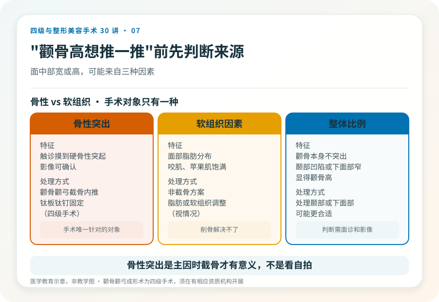
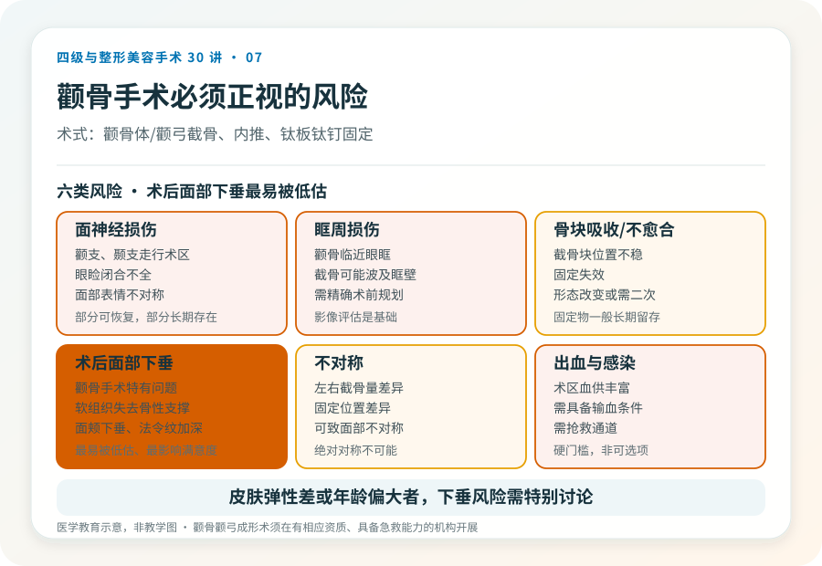
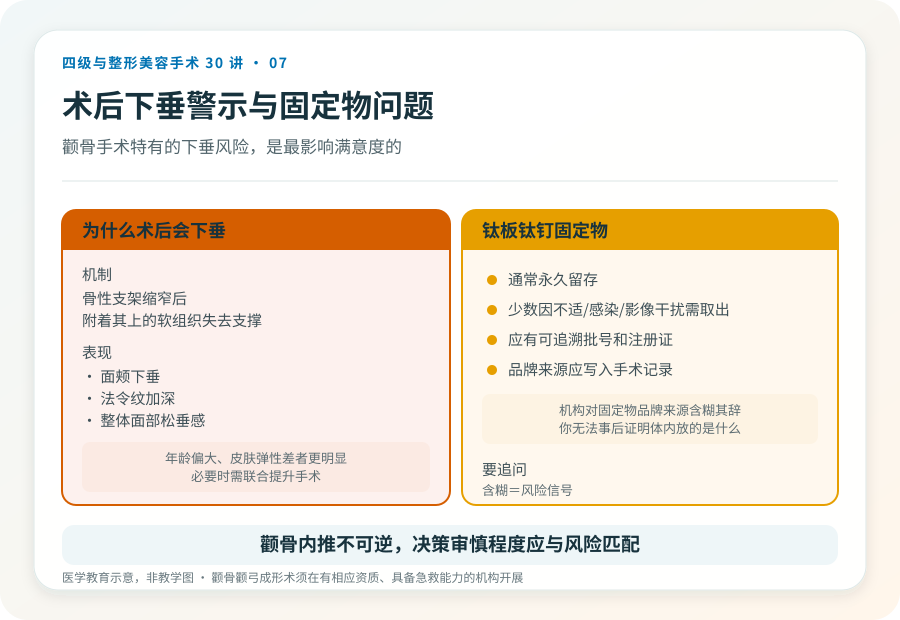

# 颧骨内推不是“瘦脸”：颧骨颧弓成形术的风险与决策

## 三个备选标题

1. “颧骨高想推一推”：四级手术之前先看清风险
2. 颧骨颧弓截骨能改多宽？看骨骼、看神经，不只看案例
3. 缩颧骨是四级手术：不可逆、可能下垂、修复难

## 封面介绍（100字以内）

颧骨颧弓成形术（颧骨内推/降低）是四级手术，通过截骨缩窄颧骨颧弓宽度。它涉及骨质、重要血管神经，术后面部下垂和不对称风险需正视。

## 分级标识

**手术分级：四级**

## 正文

先说结论：**颧骨颧弓成形术（俗称“颧骨内推”“缩颧骨”）是四级美容手术，通过截骨并重新固定来缩窄面中部宽度。**它涉及颧骨体、颧弓的骨质操作，临近眶周、面神经和颞下颌关节，风险与下颌角手术同属最高级别。把它当作“瘦脸项目”是误解——它改的是骨性轮廓，且术后面部软组织下垂是需要严肃对待的问题。

### 先判断“颧骨高”是不是骨性的

面中部宽或高的感觉，可能来自：

- **骨性颧骨颧弓突出**：触诊能摸到硬的骨性突起，影像可确认。这是手术针对的对象。
- **软组织因素**：面部脂肪分布、咬肌、苹果肌的饱满度都会影响视觉上的“颧骨高”。
- **整体比例**：有些人颧骨本身不算突出，但因下面部窄或太阳穴凹陷显得颧骨高。这种情况处理颞部或下面部可能更合适。

只有在骨性突出是主因时，截骨才有意义。判断需要面诊和影像，不是看自拍。

### 手术大致怎么做

颧骨颧弓成形通常在全身麻醉下进行，常用切口包括口内和耳前/颞部发际内。术式大致是：在颧骨体和颧弓处截骨，将骨块向内、向后推移以缩窄，再用钛板钛钉固定。是否联合下颌角、颏部手术，取决于整体方案。术后需住院观察，固定物一般长期留存。

### 几个必须正视的风险

- **面神经损伤**：面神经颧支、颞支走行于术区，损伤可能导致眼睑闭合不全、面部表情不对称，部分可恢复，部分长期存在。
- **眶周损伤**：颧骨临近眼眶，截骨可能波及眶壁。
- **骨块吸收或不愈合、固定失效**：截骨后骨块位置不稳定或固定失败，可能导致形态改变或需要二次手术。
- **术后面部下垂**：这是颧骨手术特有的重要问题。骨性支架缩窄后，附着其上的软组织失去支撑，可能出现面颊下垂、法令纹加深，尤其年龄偏大或皮肤松弛者更明显。
- **不对称**：左右截骨量、固定位置差异可致不对称。
- **出血与感染**：术区血供丰富，需具备输血和抢救条件。

这些风险里，**面部下垂是最容易被术前低估、术后最影响满意度的**。如果你的皮肤弹性差、年龄偏大、或对术后面部松垂完全不能接受，需要和医生认真讨论，甚至重新评估是否适合截骨。

### 固定物的问题

颧骨手术通常使用钛板钛钉固定截骨块。这些固定物一般是永久留存，少数情况下可能因不适、感染或影像干扰需要二次取出。植入物应有可追溯的批号和注册证，并写入手术记录。**如果机构对固定物的品牌和来源含糊其辞，要追问。**

### 哪些人不适合做

- 颧骨发育未完成的未成年人。
- 面部软组织明显松弛、皮肤弹性差，术后下垂风险高者（除非同时做提升）。
- 凝血异常、未控制的慢性病、术区感染期。
- 对“对称”“无痕”抱有不切实际期待者。

### 决策前的硬要求

面诊颧骨手术，至少做到：选择有四级颌面资质的机构和主刀；做 CT 或三维重建评估骨结构和神经；当面讨论截骨范围、固定方式、术后面部下垂的预期和应对；确认机构的麻醉、血库和抢救条件。颧骨内推能显著缩窄面中部，但它是不可逆的四级手术，决策的审慎程度应与风险匹配。

> 本文用于健康教育，不能替代面诊和个体化评估；颧骨颧弓成形术须在有相应资质的医疗机构由具备权限的医师开展。

## 参考资料

- 中华医学会整形外科学分会：颌面整形相关学术资料
  https://www.cma.org.cn/
- American Society of Plastic Surgeons: Facial bone contouring information
  https://www.plasticsurgery.org/
