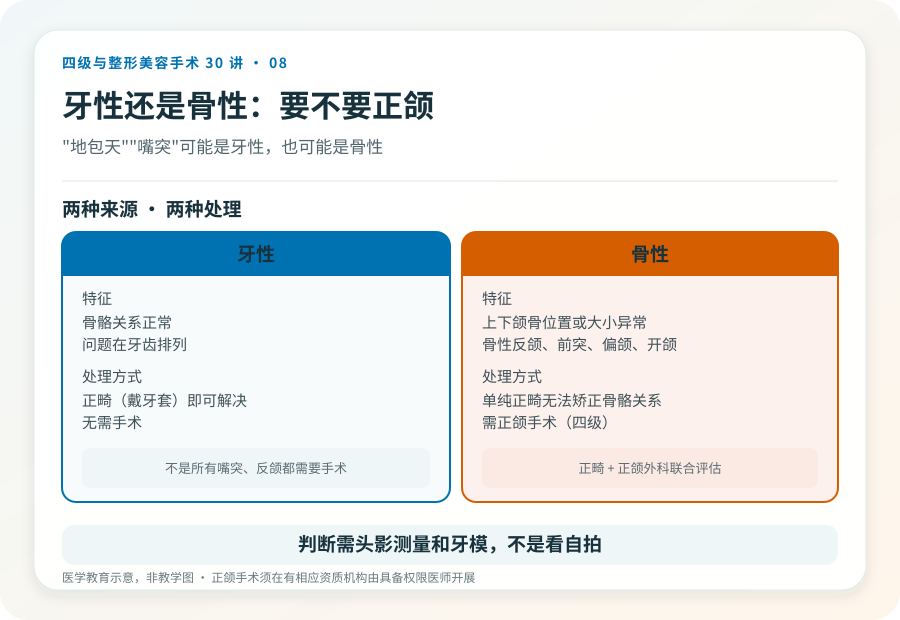
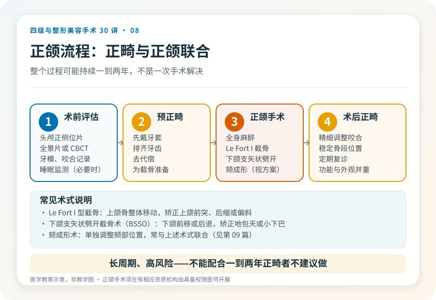
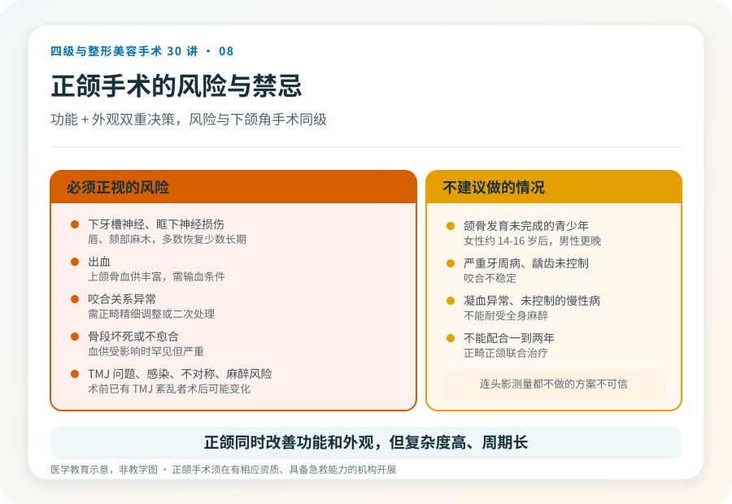

# 颌面骨性问题的四级手术：上下颌骨与正颌

## 三个备选标题

1. “地包天”“天包地”是骨性问题时，正颌手术怎么做
2. 正颌不只是为了好看：咬合、功能与四级手术风险
3. 上下颌骨手术：当牙齿矫正解决不了骨性问题时

## 封面介绍（100字以内）

骨性颌面畸形（骨性反颌、偏颌、开颌等）常需上下颌骨手术（正颌）矫正。这是四级手术，兼顾功能与外观，风险高、恢复长。

## 分级标识

**手术分级：四级**

## 正文

先说结论：**上下颌骨手术（正颌手术）是四级手术，用于矫正骨性的颌面畸形，如骨性反颌（地包天）、骨性上颌前突（天包地）、偏颌、开颌等。**它同时关乎咬合功能和面部外观，通常需要正畸与正颌联合治疗，恢复期长、风险高。把它理解成“美容项目”会严重低估它的复杂度。

### 先分清骨性还是牙性

“地包天”“嘴突”可能是牙性，也可能是骨性：

- **牙性**：骨骼关系正常，问题在牙齿排列，正畸（戴牙套）能解决。
- **骨性**：上下颌骨本身的位置或大小异常，单纯正畸无法矫正骨骼关系，需要正颌手术。

判断需要正畸医生和正颌外科医生联合评估，结合头影测量和牙模。**不是所有嘴突、反颌都需要手术**，明确是骨性、且程度足以影响功能或外观，才进入手术考虑。

### 手术大致怎么做

正颌手术通常在全身麻醉下进行，由口腔颌面外科或整形外科医生主刀。常见术式包括：

- **Le Fort I 型截骨**：用于上颌骨的整体移动，矫正上颌前突、后缩或偏斜。
- **下颌支矢状劈开截骨术（BSSO）**：用于下颌骨的整体前移或后退，矫正下颌前突（地包天）或后缩（小下巴）。
- **颏成形术**：单独调整颏部（下巴）的位置，常与上述术式联合。

术前通常需要预正畸（先戴牙套排齐牙齿、去代偿），术后再精细调整咬合。**整个过程可能持续一到两年，不是一次手术解决所有事。**

### 为什么它常常是“功能 + 外观”的双重决策

骨性颌面畸形除了外观，还可能影响咬合、咀嚼、发音、颞下颌关节，甚至呼吸（严重下颌后缩与睡眠呼吸暂停有关）。所以正颌的决策不只是“好不好看”，还包括功能改善。这恰恰说明为什么它需要正畸、正颌、有时还有耳鼻喉或睡眠医学的多学科协作。

### 几个必须正视的风险

- **下牙槽神经、眶下神经损伤**：截骨可能波及走行于颌骨内的神经，表现为唇、颏部麻木，多数可恢复，少数长期存在。
- **出血**：上颌骨血供丰富，术中有较明显出血风险，需具备输血条件。
- **咬合关系异常**：术后咬合调整不到位，可能影响咀嚼，需要正畸精细调整或二次处理。
- **骨段坏死或不愈合**：截骨后骨段血供受影响时罕见但严重。
- **颞下颌关节问题**：术前已有 TMJ 紊乱者，术后可能变化。
- **感染、伤口愈合问题**。
- **不对称或效果与预期不符**，可能需要修整。
- **麻醉相关风险**。

### 术前评估为什么特别重要

正颌术前通常需要：头颅正侧位片、全景片或 CBCT、牙模、咬合记录、必要的睡眠监测和全科评估。这些不是“额外收费”，而是制定截骨方案的基础。一个连头影测量都不做的“正颌方案”，不值得信任。

### 哪些情况不建议做

- 颌骨发育未完成的青少年（女性通常约 14–16 岁后、男性更晚，具体由医生评估）。
- 严重牙周病、龋齿未控制，咬合不稳定。
- 凝血异常、未控制的慢性病、不能耐受全身麻醉者。
- 不能配合长达一到两年的正畸正颌联合治疗者。

正颌能同时改善功能和外观，但它是一个长周期、高风险的四级手术。理解它的复杂度，是合理决策的前提。

> 本文用于健康教育，不能替代面诊和个体化评估；正颌手术须在有相应资质的医疗机构由具备权限的医师开展。

## 参考资料

- 中华医学会口腔颌面外科相关学术资料
  https://www.cma.org.cn/
- American Association of Oral and Maxillofacial Surgeons: Orthognathic surgery
  https://myoms.org/
