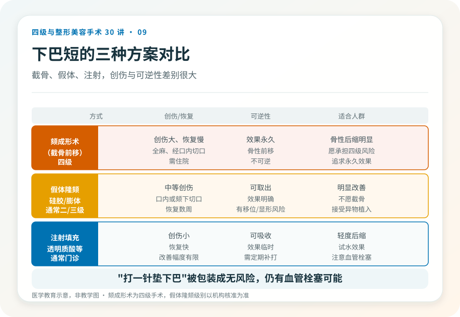
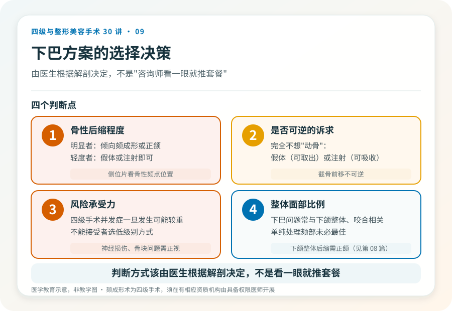

# 下巴短小或后缩：颏成形术和假体隆颏怎么选

## 三个备选标题

1. “下巴短”该截骨还是放假体？先看骨性还是软组织
2. 颏成形术是四级手术：和注射隆颏不是一回事
3. 下巴整形的三条路：截骨、假体、注射，决策清单

## 封面介绍（100字以内）

下巴短小或后缩的改善方式有截骨前移（颏成形）、假体植入和注射填充。它们创伤、风险、可逆性差别很大，选择前先看清自己的解剖。

## 分级标识

**手术分级：颏成形术为四级；假体隆颏通常为二级或三级（视术式与麻醉），以机构核准为准**

## 正文

先说结论：**“下巴短”“下巴后缩”的改善方式不止一种，它们分属不同手术级别，创伤和可逆性差别很大。**颏成形术（截骨前移）是四级手术，假体隆颏通常为二级或三级，注射填充多为门诊操作。选哪种，取决于骨性程度、诉求和风险承受力，而不是“哪个看起来效果好”。

### 先判断下巴问题的性质

下巴短小或后缩可能是：

- **骨性颏部后缩/发育不足**：下颌骨颏部本身发育不足，侧位片能看到骨性颏点靠后。截骨前移（颏成形）针对这种情况。
- **软组织因素**：颏部软组织薄、肌肉紧张，或整体下面部比例问题。
- **咬合相关**：下颌整体后缩常伴骨性错颌，需要正颌而非单纯颏部手术（见第 08 篇）。

判断需要面诊和侧位影像。**骨性后缩明显的，单纯注射或小假体往往效果有限；而轻度问题，截骨可能过度。**

### 三种主要方式对比

- **颏成形术（截骨前移）——四级**：在全身麻醉下，经口内切口将颏部骨质水平截断前移并固定。效果稳定、永久，但创伤大、恢复慢、有神经损伤和骨块问题风险。适合骨性后缩明显者。
- **假体隆颏——通常二级或三级**：经口内或颏下切口植入硅胶或膨体假体。效果明确、可取出，但有感染、移位、假体显形等风险。适合希望明显改善但不愿截骨者。
- **注射填充（如透明质酸）——通常门诊操作**：创伤小、可逆，但效果临时、改善幅度有限，适合轻度问题或试水效果。注意面部血管栓塞风险（见第 27 篇）。

**注意：单纯“打一针垫下巴”被一些渠道包装成“无风险”，但它仍属医疗操作，面部血管并发症一旦发生可能严重（如失明）。**材料、层次和操作者资质同样重要。

### 颏成形术的主要风险

作为四级手术，颏成形的风险包括：

- **下牙槽神经/颏神经损伤**：截骨可能伤及颏神经，致下唇、颏部麻木，多数可恢复，少数长期存在。
- **骨块吸收、不愈合或固定问题**：前移的骨块可能部分吸收或固定失效，影响形态。
- **不对称、截骨量不当**：效果与预期不符，可能需修整。
- **软组织下垂**：截骨前移后附着软组织的变化。
- **出血、感染、麻醉风险**。

### 假体隆颏的主要风险

- **感染与排异**：口内切口感染风险高于体外切口；假体作为异物有排异可能。
- **移位、显形**：假体位置不稳或过浅，可能触及显形、轮廓不自然。
- **远期问题**：骨吸收、假体老化、需要更换或取出。
- **瘢痕**：颏下切口会留可见疤痕，口内切口则隐蔽。

### 选择时的几个判断点

- **骨性后缩程度**：明显者倾向颏成形或正颌，轻度者假体或注射即可。
- **是否可逆的诉求**：完全不想“动骨”的，假体（可取出）或注射（可吸收）更合适。
- **风险承受力**：四级手术的并发症一旦发生可能较重，不能接受者选低级别方式。
- **整体面部比例**：下巴问题常与下颌整体、咬合相关，单纯处理颏部未必是最佳方案。

### 一个常见误区

把“下巴短”等同于“打一针就行”。注射隆颏对轻度后缩有效，但对骨性明显后缩者效果有限，且面部注射有血管栓塞风险。**判断方式该由医生根据解剖决定，而不是由“咨询师看一眼就推荐套餐”决定。**

> 本文用于健康教育，不能替代面诊和个体化评估；颏成形术须在有相应资质的医疗机构由具备权限的医师开展。

## 参考资料

- 中华医学会整形外科学分会：颏部整形相关学术资料
  https://www.cma.org.cn/
- American Society of Plastic Surgeons: Chin surgery information
  https://www.plasticsurgery.org/
